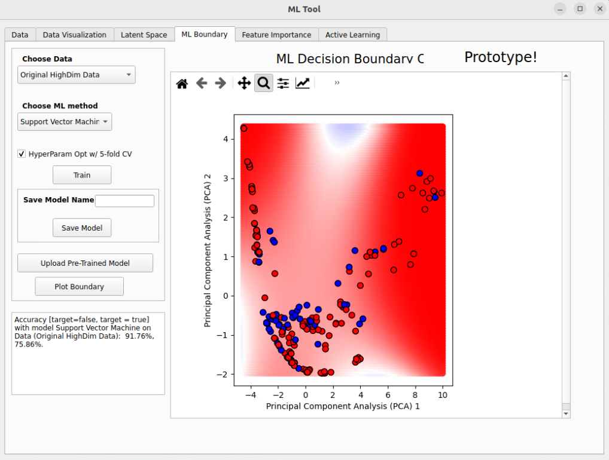
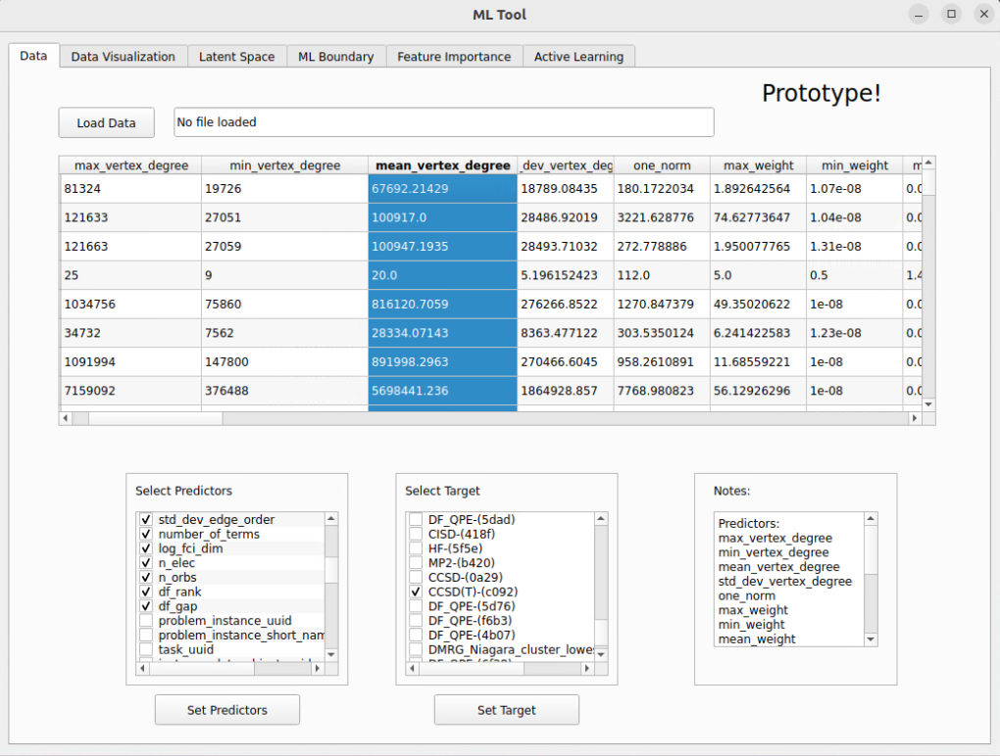

# BubbleML



BubbleML is an interactive graphical user interface (GUI) that allows you to explore the latent space of Hamiltonians and solver coverage/performance.  BubbleML is a prototype and not fully integrated with `src/qb_gsee_benchmark`.  For official results, see the results generated by `src/qb_gsee_benchmark` in the [`standard_report`](../../standard_report/README.md).

 
## Installation and use in Ubuntu Linux:

First install the `qb_gsee_benchmark` package per the instructions in
the main [`README`](../../README.md).  (This will install all the *other* necessary Python
packages.)

Then you will need to install `python3-pyqt5` by
```bash
sudo apt install python3-pyqt5
```

## Running BubbleML

You are about to start the BubbleML graphical user interface, therefore you must be accessing your Ubuntu Linux host from a console/desktop session or otherwise have some Xterm session properly configured.  (I.e., you can't use the BubbleML GUI from an SSH session or other command line interface.)

```bash
cd BubbleML/UI/
python3 main.py
```

## Input data

The data for BubbleML is the nearby `data_for_BubbleML.csv` file.  Note that this file is 
automatically updated/generated each time the results are updated with `/scripts/update_all_results.py`.

When loaded, you will have to select/set the features from the data by checkboxes to use.  Note that there is some tracking
data like UUIDs that you do NOT want to use for any ML predictions.

You will also select/set the "target", which is the solver you want to analyze.  In this example, we choose CCSD(T).




## License

Copyright 2025 HRL Laboratories, LLC. 

Licensed under the Apache License, Version 2.0 (the "License");
you may not use this file except in compliance with the License.
You may obtain a copy of the License at

http://www.apache.org/licenses/LICENSE-2.0

Unless required by applicable law or agreed to in writing, software
distributed under the License is distributed on an "AS IS" BASIS,
WITHOUT WARRANTIES OR CONDITIONS OF ANY KIND, either express or implied.
See the License for the specific language governing permissions and
limitations under the License.
