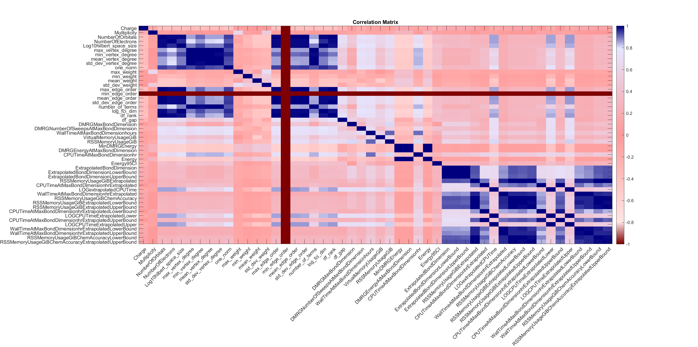

# DMRG Compute Time Analysis

We ran extensive DMRG calculations over the course of the program.  This section provides a summary of the compute times which are available in 
[`DMRG_compute_time_for_homogeneous_catalysis_instances.xlsx`](DMRG_compute_time_for_homogeneous_catalysis_instances.xlsx).  The subset of Hamiltonians analyzed from the set of problem instances described in the related DARPA Quantum Benchmarking publication "Feasibility of accelerating homogeneous catalyst discovery with fault-tolerant quantum computers" [https://doi.org/10.48550/arXiv.2406.06335](https://doi.org/10.48550/arXiv.2406.06335).

The worksheet in this folder summarizes the DMRG parameters and compute times related to prosecuting those instances.  The worksheet in this folder is a *streamlined* version of the worksheet that underpins the cost ("utility") of solving the instances: [`scripts/GSEE-HC_utility_estimates_all_instances_task_uuids_v2.csv`](../scripts/GSEE-HC_utility_estimates_all_instances_task_uuids_v2.csv) in that it only highlights compute times rather than the "utility" of solving an instance.

As a reminder, a `problem_instance` may contain several `tasks`.  Each `task` is related to exactly one Hamiltonian.  The `problem_instances` and `tasks` are identified by UUIDs.  The `task` contains information about the related Hamiltonian, especially the URL to the FCIDUMP file for the Hamiltonian.   

