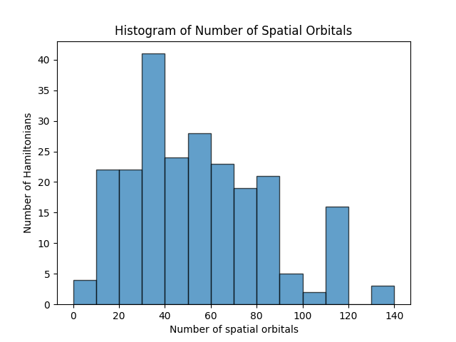
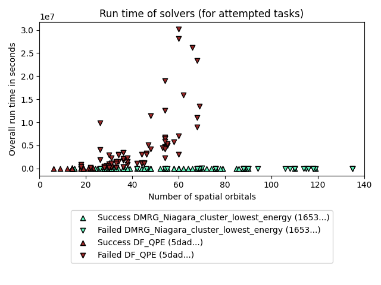
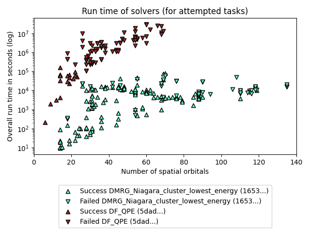
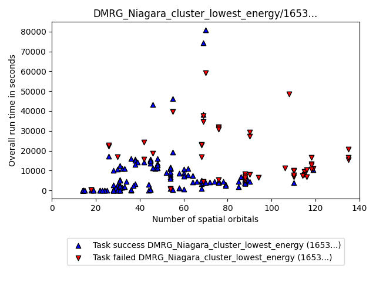
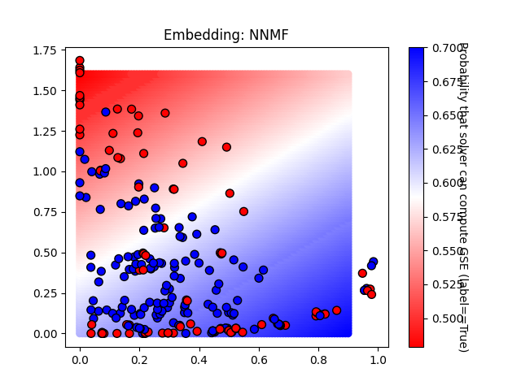
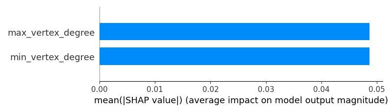
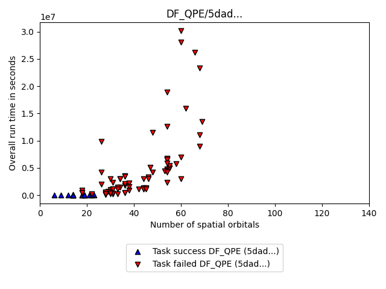
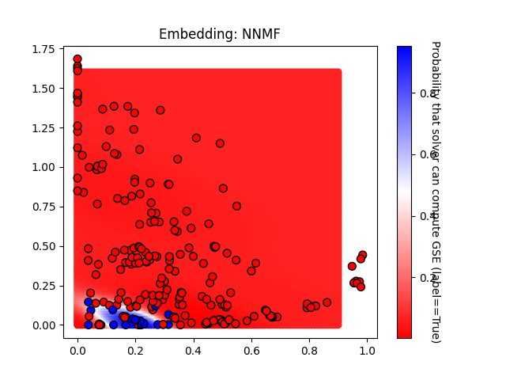
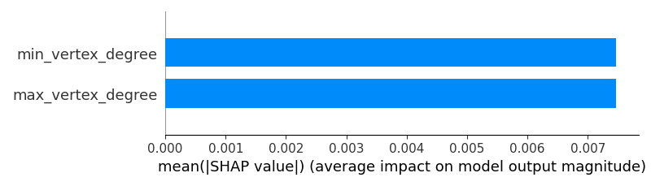

# GSEE Benchmark Standard Report

Report created on 2024-12-30-14-26

[https://github.com/isi-usc-edu/qb-gsee-benchmark](https://github.com/isi-usc-edu/qb-gsee-benchmark)

Input data: `aggregated_solver_labels.csv`, last modified Mon Dec 30 10:32:50 2024

Input data: `Hamiltonian_features.csv`, last modified Mon Dec 16 11:50:19 2024

WARNING!  We only have features calculated for 229/230 Hamiltonians. This report is based on partial results!

Latest creation time for a `problem_instance.json` file: Fri Dec 13 23:09:21 2024

Latest creation time for a `performance_metrics.json` file: Mon Dec 30 12:05:13 2024

Latest creation time for a `solution.json` file: Mon Dec 30 10:32:50 2024

## Problem Instance Summary Statistics

number of `problem_instances`: 82

`problem_instance.json` with the most tasks: 16 (mo_n2_pincer/8a3787cc-d3d0-42a8-d9a9-7de2aed45208)

number of Hamiltonians (i.e., tasks): 230

minimum number of orbitals: 6

median number of orbitals: 53.5

maximum number of orbitals: 135

## Solver Summary Statistics

number of unique participating solvers: 2

### Solver DMRG_Niagara_cluster_lowest_energy, 16537433-9f4c-4eae-a65d-787dc3b35b59

solver_short_name: DMRG_Niagara_cluster_lowest_energy

performance_metrics_uuid: 4fc59937-7062-441c-8469-7971ecd6d5c9

creation_timestamp: 2024-12-30T14:53:42.218159+00:00

number_of_problem_instances: 82

number_of_problem_instances_attempted: 76

number_of_problem_instances_solved: 43

number_of_tasks: 230

number_of_tasks_attempted: 192

number_of_tasks_solved: 142

number_of_tasks_solved_within_run_time_limit: 192

number_of_tasks_solved_within_accuracy_threshold: 142

max_run_time_of_attempted_tasks: 80820.729907066

sum_of_run_time_of_attempted_tasks: 1824772.0337238186

solvability_ratio: 0.0

f1_score: [0.7558139534883721, 0.8531468531468531]

ml_metrics_calculator_version: 1

### Solver DF_QPE, 5dad4064-cd11-412f-85cb-d722afe3b3de

solver_short_name: DF_QPE

performance_metrics_uuid: 97a58710-8702-4721-8971-288144232e2f

creation_timestamp: 2024-12-30T14:53:43.965750+00:00

number_of_problem_instances: 82

number_of_problem_instances_attempted: 13

number_of_problem_instances_solved: 2

number_of_tasks: 230

number_of_tasks_attempted: 99

number_of_tasks_solved: 19

number_of_tasks_solved_within_run_time_limit: 19

number_of_tasks_solved_within_accuracy_threshold: 102

max_run_time_of_attempted_tasks: 30188593.464838002

sum_of_run_time_of_attempted_tasks: 374908704.304665

solvability_ratio: 0.0134

f1_score: [0.9976133651551312, 0.9743589743589743]

ml_metrics_calculator_version: 1

