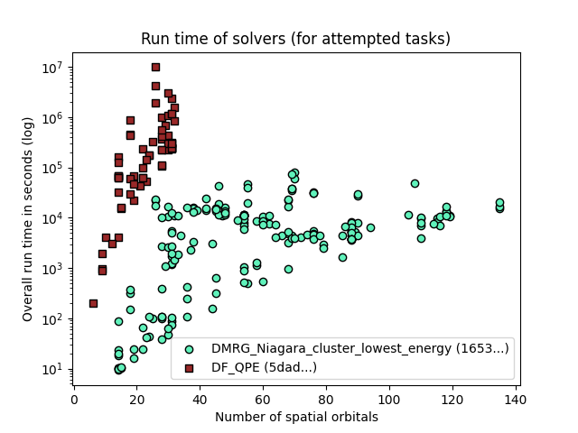

# GSEE Benchmark Standard Report

Report created on 2024-12-18-12-11

[https://github.com/isi-usc-edu/qb-gsee-benchmark](https://github.com/isi-usc-edu/qb-gsee-benchmark)

Input data: aggregated_solver_labels_2024-12-18-10-18.csv, last modified Wed Dec 18 11:19:33 2024

Input data: Hamiltonian_features.csv, last modified Mon Dec 16 09:53:12 2024

WARNING!  We only have features calculated for 229/230 Hamiltonians. This report is based on partial results!

## Problem Instance Summary Statistics

number of `problem_instances`: 82

`problem_instance.json` with the most tasks: 16 (mo_n2_pincer/8a3787cc-d3d0-42a8-d9a9-7de2aed45208)

number of Hamiltonians (i.e., tasks): 230

minimum number of orbitals: 6

median number of orbitals: 53.5

maximum number of orbitals: 135

## Solver Summary Statistics

number of unique participating solvers: 2

### Solver DMRG_Niagara_cluster_lowest_energy, 16537433-9f4c-4eae-a65d-787dc3b35b59

solver_short_name: DMRG_Niagara_cluster_lowest_energy

performance_metrics_uuid: 9fa6c773-01b3-4723-afa0-5558e91fddaa

creation_timestamp: 2024-12-18T15:38:21.126384+00:00

number_of_problem_instances: 82

number_of_problem_instances_attempted: 76

number_of_problem_instances_solved: 43

number_of_tasks: 230

number_of_tasks_attempted: 192

number_of_tasks_solved: 142

number_of_tasks_solved_within_run_time_limit: 192

number_of_tasks_solved_within_accuracy_threshold: 142

max_run_time_of_attempted_tasks: 80820.729907066

sum_of_run_time_of_attempted_tasks: 1824772.0337238186

solvability_ratio: 0.0

f1_score: [0.7558139534883721, 0.8531468531468531]

ml_metrics_calculator_version: 1

TODO:  put some charts in here!

### Solver DF_QPE, 5dad4064-cd11-412f-85cb-d722afe3b3de

solver_short_name: DF_QPE

performance_metrics_uuid: e9459073-db4a-4ca5-a6c4-746a62762cb9

creation_timestamp: 2024-12-18T15:38:21.799198+00:00

number_of_problem_instances: 82

number_of_problem_instances_attempted: 9

number_of_problem_instances_solved: 3

number_of_tasks: 230

number_of_tasks_attempted: 65

number_of_tasks_solved: 26

number_of_tasks_solved_within_run_time_limit: 26

number_of_tasks_solved_within_accuracy_threshold: 65

max_run_time_of_attempted_tasks: 9900914.966049999

sum_of_run_time_of_attempted_tasks: 37957820.57215899

solvability_ratio: 0.009

f1_score: [0.995049504950495, 0.9629629629629629]

ml_metrics_calculator_version: 1

TODO:  put some charts in here!

