# GSEE Benchmark Standard Report

Report based on data from 2025-01-28T21:50:06.833854+00:00

[https://github.com/isi-usc-edu/qb-gsee-benchmark](https://github.com/isi-usc-edu/qb-gsee-benchmark)

Input data: `Hamiltonian_features.csv`, last modified Tue Jan 28 11:45:36 2025

Input data: `GSEE-HC_utility_estimates_all_instances_task_uuids_v2.csv`, last modified Thu Jan  9 12:11:19 2025

Latest creation time for a `problem_instance.json` file: Mon Jan 27 11:42:37 2025

Latest creation time for a `solution.json` file: Tue Jan 28 11:45:36 2025

# Problem Instance Summary Statistics

number of `problem_instances`: 84.

`problem_instance.json` with the most tasks: 30 (hubbard_square/614c4444-a31a-4348-b24d-01040208651c)

number of Hamiltonians (i.e., tasks) we have features calculated for: 276

minimum number of orbitals: 6

median number of orbitals: 42.0

maximum number of orbitals: 135

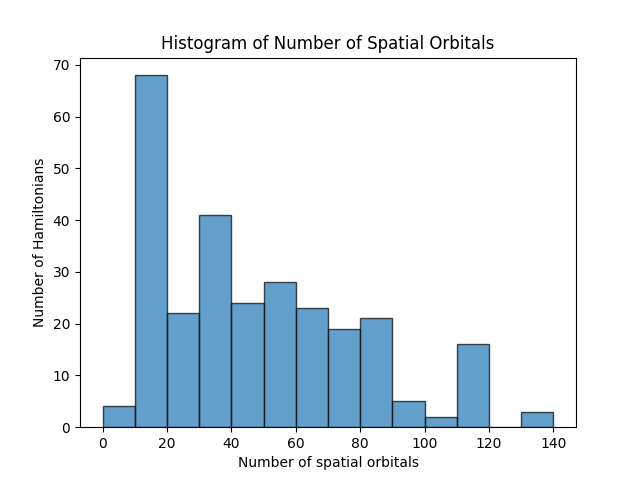

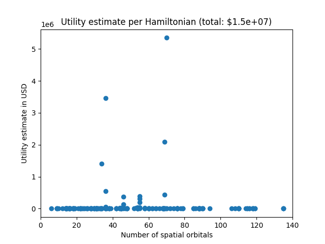

# Solver Summary Statistics

number of unique participating solvers: 16

Solver: SHCI_opt/2dde727e-a881-44fa-aabf-bba6248e4baf, ML Solvability Ratio: 1.0, F1 Score: [0.83333333 0.99342105]

Solver: SHCI_pt_1e-4/4ed500f1-0650-41e3-af00-e4d0359394b4, ML Solvability Ratio: 0.9859, F1 Score: [0.71428571 0.97222222]

Solver: SHCI_var_1e-4/7e730dfb-57ee-480b-a8a1-4b73f5f07c54, ML Solvability Ratio: 0.8794, F1 Score: [0.99212598 0.99470899]

Solver: SHCI_pt_2e-4/ad964781-302e-4728-a26d-39918e0a6cdb, ML Solvability Ratio: 1.0, F1 Score: [0.64516129 0.96140351]

Solver: SHCI_pt_2e-5/c71b90bd-3250-4c0c-b4e7-fc9878f141f6, ML Solvability Ratio: 1.0, F1 Score: [0.375      0.96666667]

Solver: SHCI_pt_5e-5/d626506c-7aae-4ad6-802a-b29af5f2bb93, ML Solvability Ratio: 1.0, F1 Score: [0.9375     0.99295775]

Solver: SHCI_var_2e-4/0db183e3-a86d-491b-9125-599556e37c7a, ML Solvability Ratio: 0.0833, F1 Score: [0.95364238 0.95757576]

Solver: SHCI_var_2e-5/86bfe50c-9342-4d54-bb68-abc8abd95688, ML Solvability Ratio: 0.3942, F1 Score: [0.8627451  0.97358491]

Solver: SHCI_var_5e-5/01949b95-c427-4693-9134-01f47f688c09, ML Solvability Ratio: 0.3549, F1 Score: [0.83950617 0.94468085]

Solver: DF_QPE/5dad4064-cd11-412f-85cb-d722afe3b3de, Model could not be calculated.

Solver: CISD/418f060e-496b-4024-8d2d-9b1f8791e76d, ML Solvability Ratio: 0.003, F1 Score: [0.97826087 0.85      ]

Solver: CCSD(T)/c09217e6-d0f7-4b0f-81c4-79210b7ac878, ML Solvability Ratio: 0.8102, F1 Score: [0.86956522 0.86451613]

Solver: HF/5f5e617a-19c2-4d82-bebc-b2d6b3dcb012, ML Solvability Ratio: 0.0, F1 Score: [0.98675497 0.71428571]

Solver: MP2/b420358b-5def-41e6-8c5d-b9d93b6aecd2, ML Solvability Ratio: 0.0, F1 Score: [0.98675497 0.71428571]

Solver: CCSD/0a29e54f-bef9-4d19-bafa-d94b1c4b37aa, ML Solvability Ratio: 0.0197, F1 Score: [0.98867925 0.94117647]

Solver: DMRG_Niagara_cluster_lowest_energy/16537433-9f4c-4eae-a65d-787dc3b35b59, ML Solvability Ratio: 0.6106, F1 Score: [0.96629213 0.98678414]

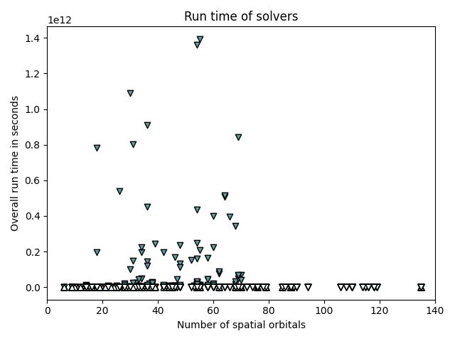

NOTE: only `attempted` tasks are plotted on the chart.  Triangle up/down indicates solved/unsolved.

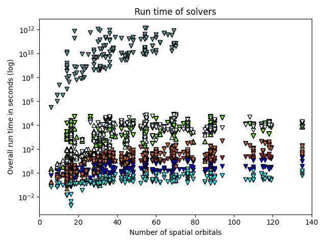

NOTE: only `attempted` tasks are plotted on the chart.  Triangle up/down indicates solved/unsolved.

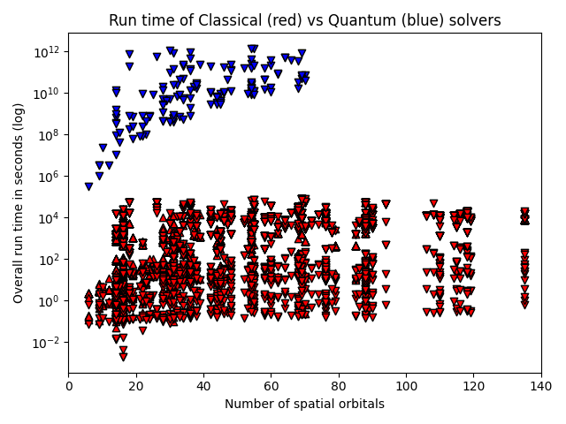

NOTE: only `attempted` tasks are plotted on the chart.  Triangle up/down indicates solved/unsolved.

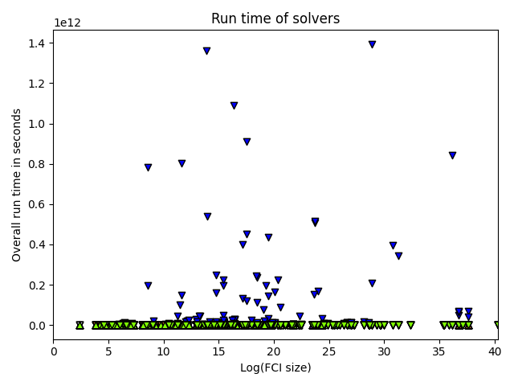

NOTE: only `attempted` tasks are plotted on the chart.  Triangle up/down indicates solved/unsolved.

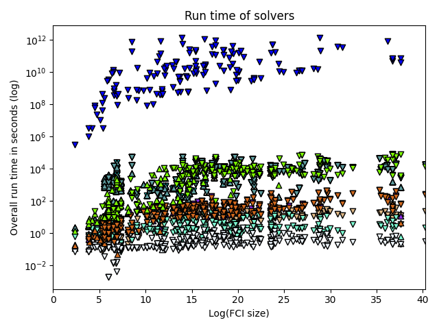

NOTE: only `attempted` tasks are plotted on the chart.  Triangle up/down indicates solved/unsolved.

## Solver SHCI_opt, 2dde727e-a881-44fa-aabf-bba6248e4baf

solver_uuid:2dde727e-a881-44fa-aabf-bba6248e4baf

solver_short_name:SHCI_opt

compute_hardware_type:classical_computer

classical_hardware_details:{'computing_environment_name': 'LCRC Improv (per node)', 'cpu_description': '2x AMD EPYC 7713 64C', 'ram_available_gb': '256GB', 'clock_speed': '2 GHz', 'total_num_cores': 128}

algorithm_details:SHCI with optimized orbitals followed by SHCI+PT

software_details:SHCI Arrow Code (https://github.com/QMC-Cornell/shci).

performance_metrics_uuid: 0503c522-5530-488b-b5d3-3a26b4544d21

creation_timestamp: 2025-01-28T21:50:06.833854+00:00

number_of_problem_instances: 84

number_of_problem_instances_attempted: 80

number_of_problem_instances_solved: 33

number_of_tasks: 276

number_of_tasks_attempted: 265

number_of_tasks_solved: 153

number_of_tasks_solved_within_run_time_limit: 265

number_of_tasks_solved_within_accuracy_threshold: 153

max_run_time_of_attempted_tasks: 57334.2

sum_of_run_time_of_attempted_tasks: 1553340.6179999998

solvability_ratio: 1.0

f1_score: [0.8333333333333334, 0.993421052631579]

ml_metrics_calculator_version: 1

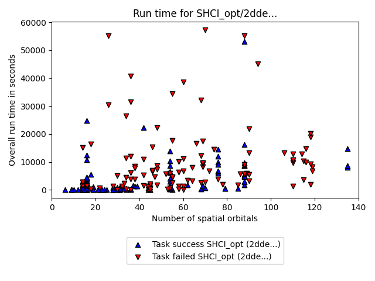

Note: plot only contains `attempted` tasks.

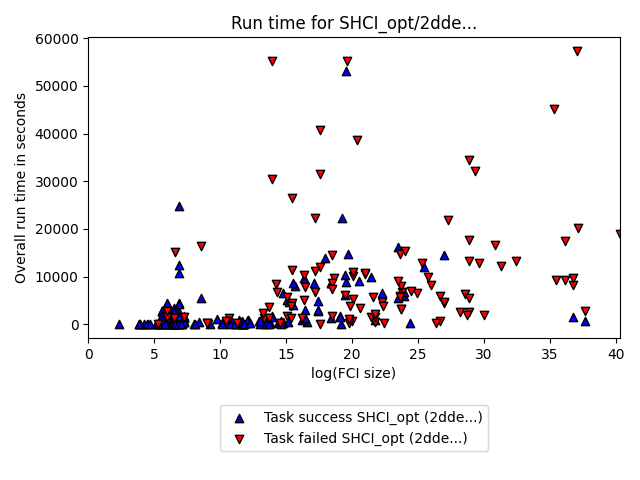

Note: plot only contains `attempted` tasks.

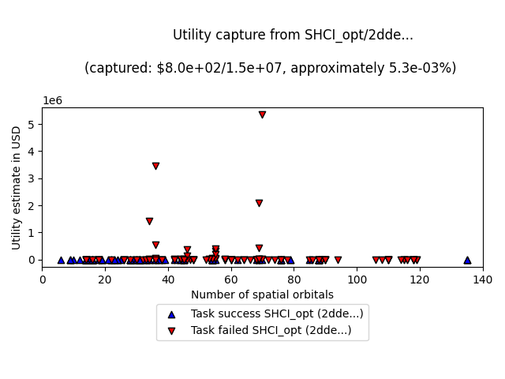

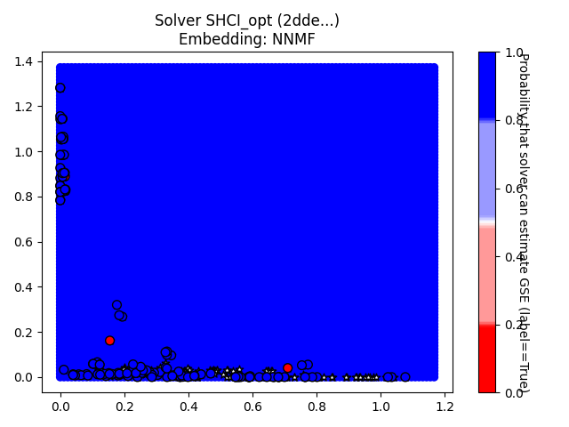

Note: `attempted` may be `True` or `False`.  Tasks with a `reference_energy` can be labeled as solved or failed-to-solve. A task with a `reference_energy` that was NOT `attempted` is labeled as a failed-to-solve.  White stars indicate Hamiltonians for which we do not have a `reference_energy`.

## Solver SHCI_pt_1e-4, 4ed500f1-0650-41e3-af00-e4d0359394b4

solver_uuid:4ed500f1-0650-41e3-af00-e4d0359394b4

solver_short_name:SHCI_pt_1e-4

compute_hardware_type:classical_computer

classical_hardware_details:{'computing_environment_name': 'LCRC Improv (per node)', 'cpu_description': '2x AMD EPYC 7713 64C', 'ram_available_gb': '256GB', 'clock_speed': '2 GHz', 'total_num_cores': 128}

algorithm_details:SHCI with eps_var 1e-4 + PT

software_details:SHCI Arrow Code (https://github.com/QMC-Cornell/shci).

performance_metrics_uuid: 705809bf-aa08-4c34-942a-1164cf5861d8

creation_timestamp: 2025-01-28T21:50:06.833854+00:00

number_of_problem_instances: 84

number_of_problem_instances_attempted: 83

number_of_problem_instances_solved: 22

number_of_tasks: 276

number_of_tasks_attempted: 275

number_of_tasks_solved: 140

number_of_tasks_solved_within_run_time_limit: 275

number_of_tasks_solved_within_accuracy_threshold: 140

max_run_time_of_attempted_tasks: 77244.15200000002

sum_of_run_time_of_attempted_tasks: 1863349.633000001

solvability_ratio: 0.9859

f1_score: [0.7142857142857143, 0.9722222222222222]

ml_metrics_calculator_version: 1

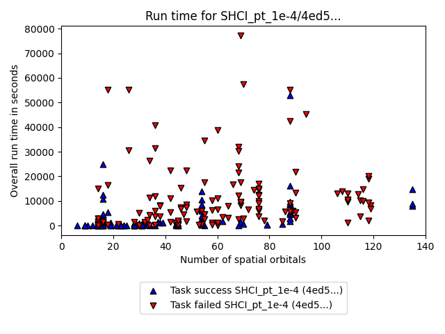

Note: plot only contains `attempted` tasks.

Note: plot only contains `attempted` tasks.

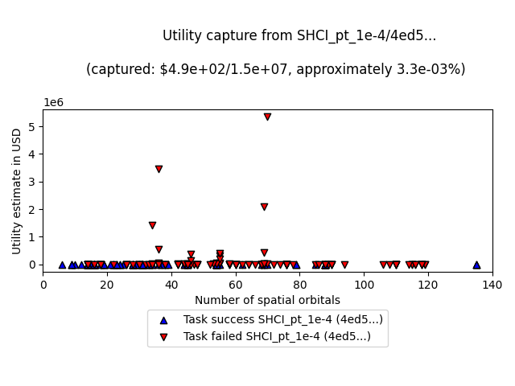

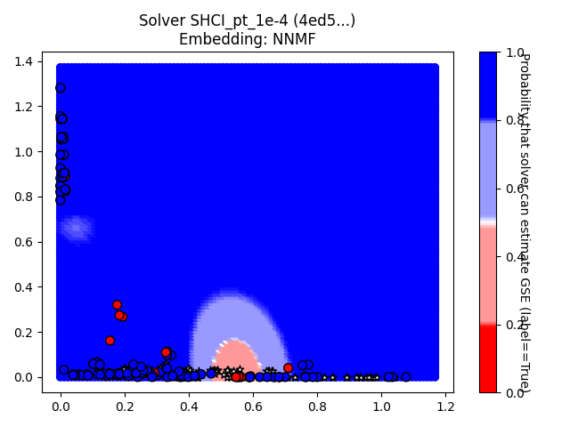

Note: `attempted` may be `True` or `False`.  Tasks with a `reference_energy` can be labeled as solved or failed-to-solve. A task with a `reference_energy` that was NOT `attempted` is labeled as a failed-to-solve.  White stars indicate Hamiltonians for which we do not have a `reference_energy`.

## Solver SHCI_var_1e-4, 7e730dfb-57ee-480b-a8a1-4b73f5f07c54

solver_uuid:7e730dfb-57ee-480b-a8a1-4b73f5f07c54

solver_short_name:SHCI_var_1e-4

compute_hardware_type:classical_computer

classical_hardware_details:{'computing_environment_name': 'LCRC Improv (per node)', 'cpu_description': '2x AMD EPYC 7713 64C', 'ram_available_gb': '256GB', 'clock_speed': '2 GHz', 'total_num_cores': 128}

algorithm_details:SHCI with eps_var 1e-4

software_details:SHCI Arrow Code (https://github.com/QMC-Cornell/shci).

performance_metrics_uuid: f6651392-bd78-4907-bffc-502553f28bfd

creation_timestamp: 2025-01-28T21:50:06.833854+00:00

number_of_problem_instances: 84

number_of_problem_instances_attempted: 83

number_of_problem_instances_solved: 13

number_of_tasks: 276

number_of_tasks_attempted: 275

number_of_tasks_solved: 95

number_of_tasks_solved_within_run_time_limit: 275

number_of_tasks_solved_within_accuracy_threshold: 95

max_run_time_of_attempted_tasks: 77244.15200000002

sum_of_run_time_of_attempted_tasks: 1863349.633000001

solvability_ratio: 0.8794

f1_score: [0.9921259842519685, 0.9947089947089947]

ml_metrics_calculator_version: 1

Note: plot only contains `attempted` tasks.

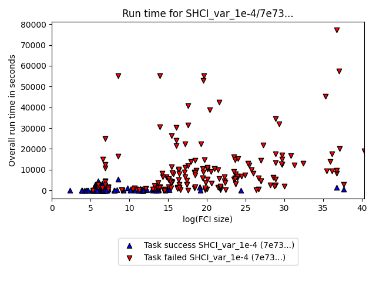

Note: plot only contains `attempted` tasks.

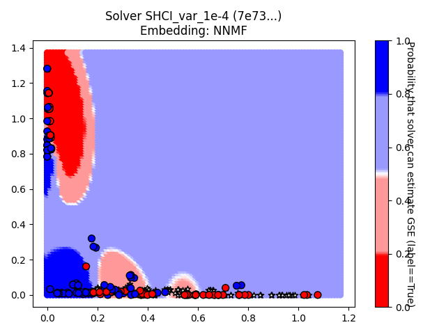

Note: `attempted` may be `True` or `False`.  Tasks with a `reference_energy` can be labeled as solved or failed-to-solve. A task with a `reference_energy` that was NOT `attempted` is labeled as a failed-to-solve.  White stars indicate Hamiltonians for which we do not have a `reference_energy`.

## Solver SHCI_pt_2e-4, ad964781-302e-4728-a26d-39918e0a6cdb

solver_uuid:ad964781-302e-4728-a26d-39918e0a6cdb

solver_short_name:SHCI_pt_2e-4

compute_hardware_type:classical_computer

classical_hardware_details:{'computing_environment_name': 'LCRC Improv (per node)', 'cpu_description': '2x AMD EPYC 7713 64C', 'ram_available_gb': '256GB', 'clock_speed': '2 GHz', 'total_num_cores': 128}

algorithm_details:SHCI with eps_var 2e-4 + PT

software_details:SHCI Arrow Code (https://github.com/QMC-Cornell/shci).

performance_metrics_uuid: f29b193d-5cdc-4078-9bbb-5e12187184e1

creation_timestamp: 2025-01-28T21:50:06.833854+00:00

number_of_problem_instances: 84

number_of_problem_instances_attempted: 83

number_of_problem_instances_solved: 22

number_of_tasks: 276

number_of_tasks_attempted: 275

number_of_tasks_solved: 137

number_of_tasks_solved_within_run_time_limit: 275

number_of_tasks_solved_within_accuracy_threshold: 137

max_run_time_of_attempted_tasks: 77244.15200000002

sum_of_run_time_of_attempted_tasks: 1863349.633000001

solvability_ratio: 1.0

f1_score: [0.6451612903225806, 0.9614035087719298]

ml_metrics_calculator_version: 1

Note: plot only contains `attempted` tasks.

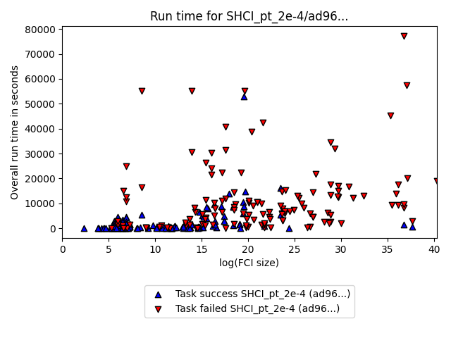

Note: plot only contains `attempted` tasks.

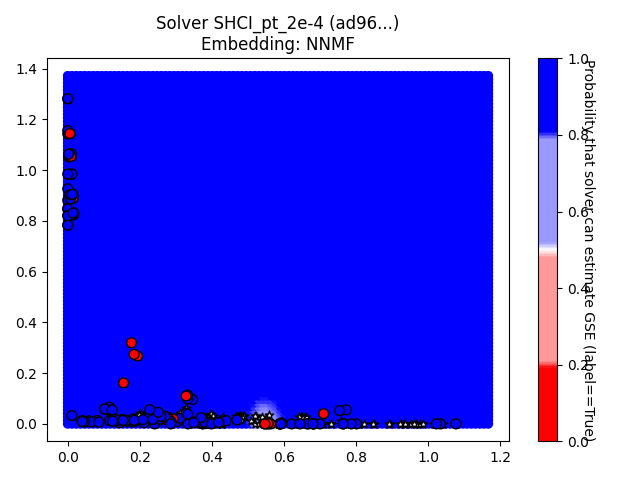

Note: `attempted` may be `True` or `False`.  Tasks with a `reference_energy` can be labeled as solved or failed-to-solve. A task with a `reference_energy` that was NOT `attempted` is labeled as a failed-to-solve.  White stars indicate Hamiltonians for which we do not have a `reference_energy`.

## Solver SHCI_pt_2e-5, c71b90bd-3250-4c0c-b4e7-fc9878f141f6

solver_uuid:c71b90bd-3250-4c0c-b4e7-fc9878f141f6

solver_short_name:SHCI_pt_2e-5

compute_hardware_type:classical_computer

classical_hardware_details:{'computing_environment_name': 'LCRC Improv (per node)', 'cpu_description': '2x AMD EPYC 7713 64C', 'ram_available_gb': '256GB', 'clock_speed': '2 GHz', 'total_num_cores': 128}

algorithm_details:SHCI with eps_var 2e-5 + PT

software_details:SHCI Arrow Code (https://github.com/QMC-Cornell/shci).

performance_metrics_uuid: 7be4c9eb-e050-4a17-9162-2472de6b20ea

creation_timestamp: 2025-01-28T21:50:06.833854+00:00

number_of_problem_instances: 84

number_of_problem_instances_attempted: 83

number_of_problem_instances_solved: 26

number_of_tasks: 276

number_of_tasks_attempted: 275

number_of_tasks_solved: 145

number_of_tasks_solved_within_run_time_limit: 275

number_of_tasks_solved_within_accuracy_threshold: 145

max_run_time_of_attempted_tasks: 77244.15200000002

sum_of_run_time_of_attempted_tasks: 1863349.633000001

solvability_ratio: 1.0

f1_score: [0.375, 0.9666666666666667]

ml_metrics_calculator_version: 1

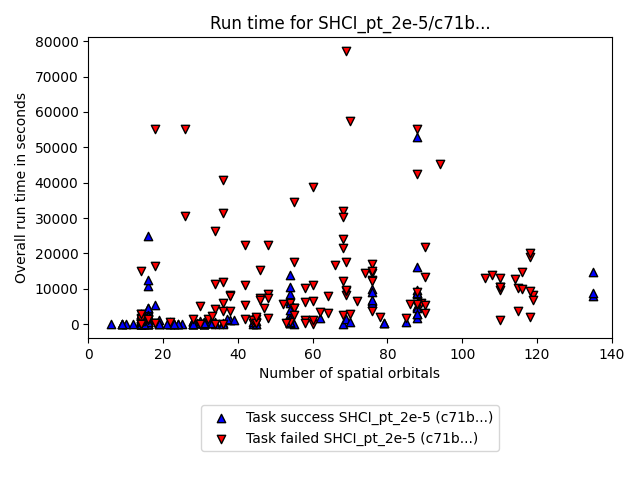

Note: plot only contains `attempted` tasks.

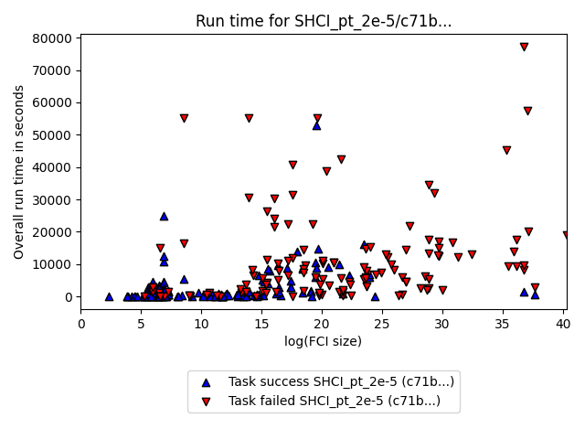

Note: plot only contains `attempted` tasks.

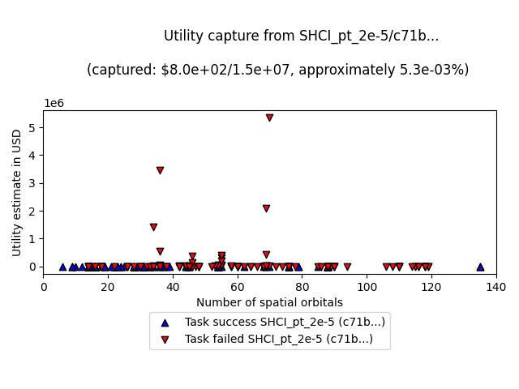

Note: `attempted` may be `True` or `False`.  Tasks with a `reference_energy` can be labeled as solved or failed-to-solve. A task with a `reference_energy` that was NOT `attempted` is labeled as a failed-to-solve.  White stars indicate Hamiltonians for which we do not have a `reference_energy`.

## Solver SHCI_pt_5e-5, d626506c-7aae-4ad6-802a-b29af5f2bb93

solver_uuid:d626506c-7aae-4ad6-802a-b29af5f2bb93

solver_short_name:SHCI_pt_5e-5

compute_hardware_type:classical_computer

classical_hardware_details:{'computing_environment_name': 'LCRC Improv (per node)', 'cpu_description': '2x AMD EPYC 7713 64C', 'ram_available_gb': '256GB', 'clock_speed': '2 GHz', 'total_num_cores': 128}

algorithm_details:SHCI with eps_var 5e-5 + PT

software_details:SHCI Arrow Code (https://github.com/QMC-Cornell/shci).

performance_metrics_uuid: a5691c59-71c7-4631-82ac-202f187e92b0

creation_timestamp: 2025-01-28T21:50:06.833854+00:00

number_of_problem_instances: 84

number_of_problem_instances_attempted: 83

number_of_problem_instances_solved: 24

number_of_tasks: 276

number_of_tasks_attempted: 275

number_of_tasks_solved: 143

number_of_tasks_solved_within_run_time_limit: 275

number_of_tasks_solved_within_accuracy_threshold: 143

max_run_time_of_attempted_tasks: 77244.15200000002

sum_of_run_time_of_attempted_tasks: 1863349.633000001

solvability_ratio: 1.0

f1_score: [0.9375, 0.9929577464788732]

ml_metrics_calculator_version: 1

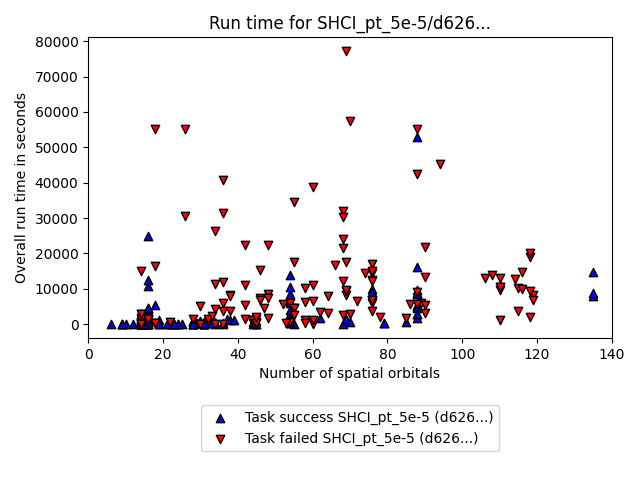

Note: plot only contains `attempted` tasks.

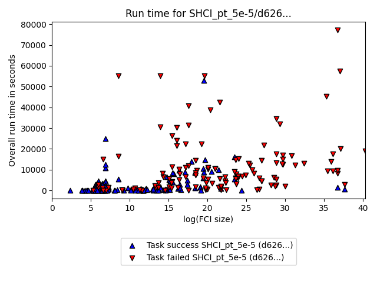

Note: plot only contains `attempted` tasks.

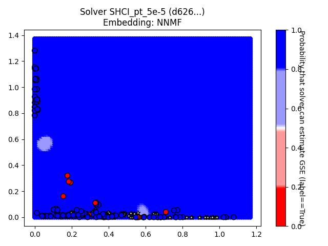

Note: `attempted` may be `True` or `False`.  Tasks with a `reference_energy` can be labeled as solved or failed-to-solve. A task with a `reference_energy` that was NOT `attempted` is labeled as a failed-to-solve.  White stars indicate Hamiltonians for which we do not have a `reference_energy`.

## Solver SHCI_var_2e-4, 0db183e3-a86d-491b-9125-599556e37c7a

solver_uuid:0db183e3-a86d-491b-9125-599556e37c7a

solver_short_name:SHCI_var_2e-4

compute_hardware_type:classical_computer

classical_hardware_details:{'computing_environment_name': 'LCRC Improv (per node)', 'cpu_description': '2x AMD EPYC 7713 64C', 'ram_available_gb': '256GB', 'clock_speed': '2 GHz', 'total_num_cores': 128}

algorithm_details:SHCI with eps_var 2e-4

software_details:SHCI Arrow Code (https://github.com/QMC-Cornell/shci).

performance_metrics_uuid: 9315c8ca-3e06-4795-b27a-cb483f5977ea

creation_timestamp: 2025-01-28T21:50:06.833854+00:00

number_of_problem_instances: 84

number_of_problem_instances_attempted: 83

number_of_problem_instances_solved: 13

number_of_tasks: 276

number_of_tasks_attempted: 275

number_of_tasks_solved: 84

number_of_tasks_solved_within_run_time_limit: 275

number_of_tasks_solved_within_accuracy_threshold: 84

max_run_time_of_attempted_tasks: 77244.15200000002

sum_of_run_time_of_attempted_tasks: 1863349.633000001

solvability_ratio: 0.0833

f1_score: [0.9536423841059603, 0.9575757575757575]

ml_metrics_calculator_version: 1

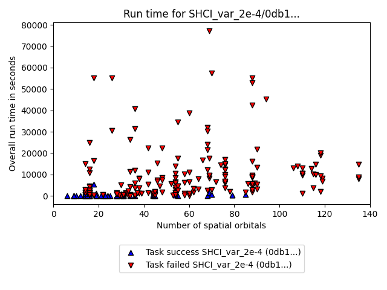

Note: plot only contains `attempted` tasks.

Note: plot only contains `attempted` tasks.

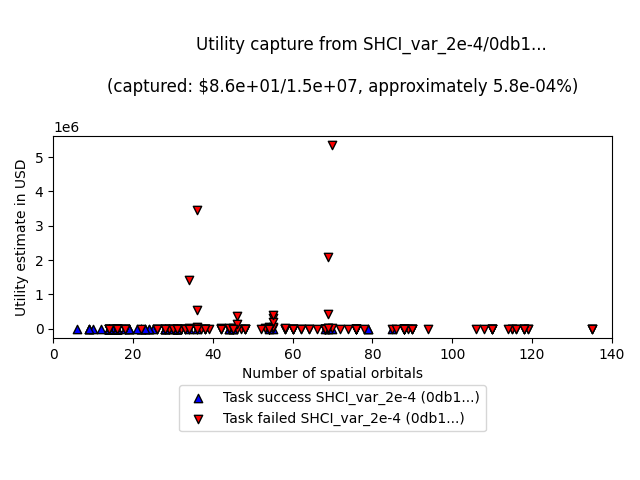

Note: `attempted` may be `True` or `False`.  Tasks with a `reference_energy` can be labeled as solved or failed-to-solve. A task with a `reference_energy` that was NOT `attempted` is labeled as a failed-to-solve.  White stars indicate Hamiltonians for which we do not have a `reference_energy`.

## Solver SHCI_var_2e-5, 86bfe50c-9342-4d54-bb68-abc8abd95688

solver_uuid:86bfe50c-9342-4d54-bb68-abc8abd95688

solver_short_name:SHCI_var_2e-5

compute_hardware_type:classical_computer

classical_hardware_details:{'computing_environment_name': 'LCRC Improv (per node)', 'cpu_description': '2x AMD EPYC 7713 64C', 'ram_available_gb': '256GB', 'clock_speed': '2 GHz', 'total_num_cores': 128}

algorithm_details:SHCI with eps_var 2e-5

software_details:SHCI Arrow Code (https://github.com/QMC-Cornell/shci).

performance_metrics_uuid: 7643a400-ea13-40b9-ad74-561667281b66

creation_timestamp: 2025-01-28T21:50:06.833854+00:00

number_of_problem_instances: 84

number_of_problem_instances_attempted: 83

number_of_problem_instances_solved: 18

number_of_tasks: 276

number_of_tasks_attempted: 275

number_of_tasks_solved: 133

number_of_tasks_solved_within_run_time_limit: 275

number_of_tasks_solved_within_accuracy_threshold: 133

max_run_time_of_attempted_tasks: 77244.15200000002

sum_of_run_time_of_attempted_tasks: 1863349.633000001

solvability_ratio: 0.3942

f1_score: [0.8627450980392157, 0.9735849056603774]

ml_metrics_calculator_version: 1

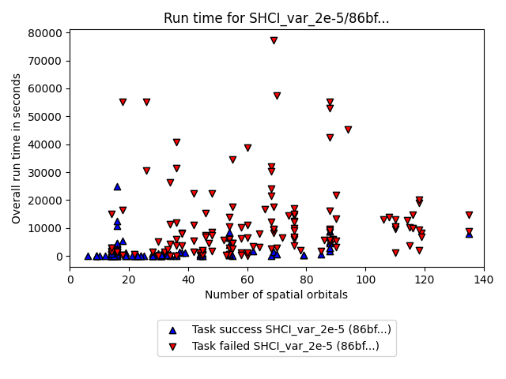

Note: plot only contains `attempted` tasks.

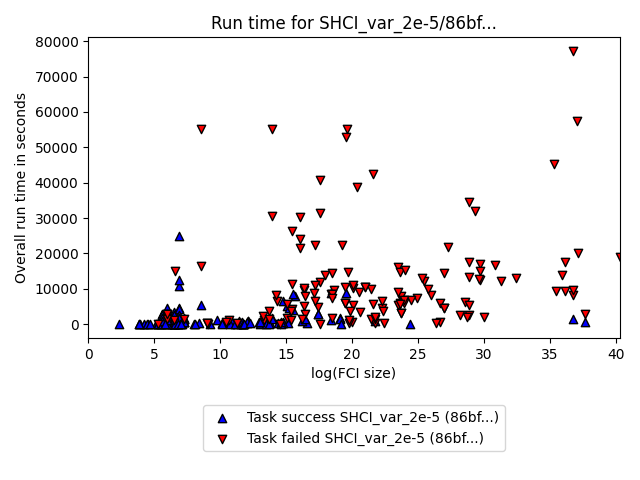

Note: plot only contains `attempted` tasks.

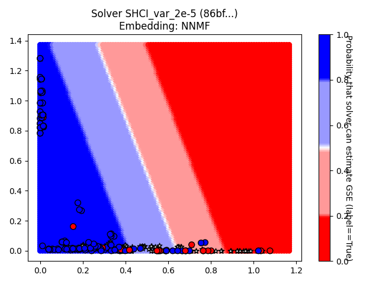

Note: `attempted` may be `True` or `False`.  Tasks with a `reference_energy` can be labeled as solved or failed-to-solve. A task with a `reference_energy` that was NOT `attempted` is labeled as a failed-to-solve.  White stars indicate Hamiltonians for which we do not have a `reference_energy`.

## Solver SHCI_var_5e-5, 01949b95-c427-4693-9134-01f47f688c09

solver_uuid:01949b95-c427-4693-9134-01f47f688c09

solver_short_name:SHCI_var_5e-5

compute_hardware_type:classical_computer

classical_hardware_details:{'computing_environment_name': 'LCRC Improv (per node)', 'cpu_description': '2x AMD EPYC 7713 64C', 'ram_available_gb': '256GB', 'clock_speed': '2 GHz', 'total_num_cores': 128}

algorithm_details:SHCI with eps_var 5e-5

software_details:SHCI Arrow Code (https://github.com/QMC-Cornell/shci).

performance_metrics_uuid: 2eccdee5-615c-4be6-977b-5e6e18702f4e

creation_timestamp: 2025-01-28T21:50:06.833854+00:00

number_of_problem_instances: 84

number_of_problem_instances_attempted: 83

number_of_problem_instances_solved: 14

number_of_tasks: 276

number_of_tasks_attempted: 275

number_of_tasks_solved: 120

number_of_tasks_solved_within_run_time_limit: 275

number_of_tasks_solved_within_accuracy_threshold: 120

max_run_time_of_attempted_tasks: 77244.15200000002

sum_of_run_time_of_attempted_tasks: 1863349.633000001

solvability_ratio: 0.3549

f1_score: [0.8395061728395061, 0.9446808510638298]

ml_metrics_calculator_version: 1

Note: plot only contains `attempted` tasks.

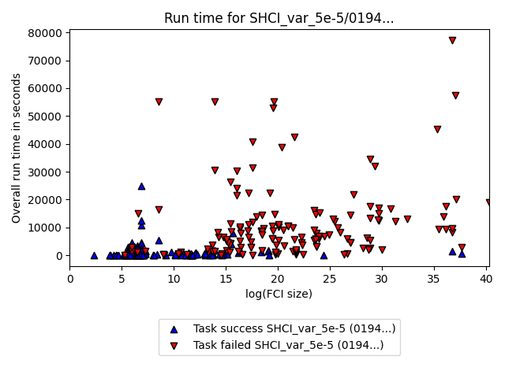

Note: plot only contains `attempted` tasks.

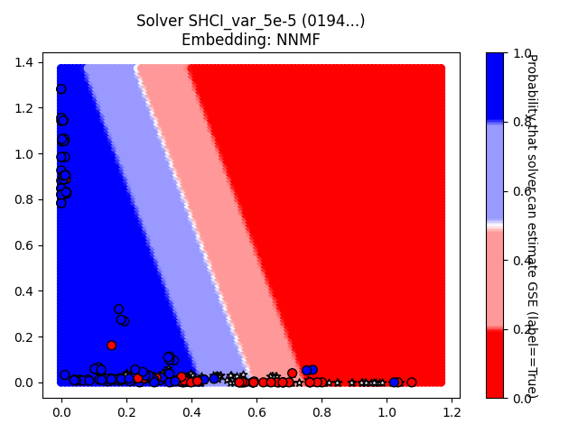

Note: `attempted` may be `True` or `False`.  Tasks with a `reference_energy` can be labeled as solved or failed-to-solve. A task with a `reference_energy` that was NOT `attempted` is labeled as a failed-to-solve.  White stars indicate Hamiltonians for which we do not have a `reference_energy`.

## Solver DF_QPE, 5dad4064-cd11-412f-85cb-d722afe3b3de

solver_uuid:5dad4064-cd11-412f-85cb-d722afe3b3de

solver_short_name:DF_QPE

compute_hardware_type:quantum_computer

algorithm_details:{'algorithm_description': 'Double factorized QPE resource estimates based on methodology of arXiv:2406.06335. Note that the truncation error is not included in the error bounds and that the SCF compute time is not included in the preprocessing time. Ground-state overlap is taken to be that estimated for the dominant CSF as estimated by DMRG and that this DMRG runtime is not included in the classical compute costs.', 'algorithm_parameters': {'overlap_csv': 'overlaps.csv', 'sf_threshold': 1e-12, 'df_threshold': 0.001, 'max_orbitals': 70}}

software_details:[{'software_name': 'pyLIQTR', 'software_version': '1.3.4'}, {'software_name': 'qb-gsee-benchmark', 'software_version': '0.1.0a2.dev193+g879c00d'}, {'software_name': 'Python', 'software_version': '3.10.12 (main, Nov  6 2024, 20:22:13) [GCC 11.4.0]'}, {'software_name': 'qualtran', 'software_version': '0.4.0'}]

quantum_hardware_details:{'quantum_hardware_description': 'Optimistic superconducting hardware model based on that described in https://arxiv.org/abs/2011.03494.', 'quantum_hardware_parameters': {'num_factories': 4, 'physical_error_rate': 0.0001, 'cycle_time_microseconds': 1}}

logical_resource_estimate_solution_uuid:fc17e113-d2e0-49ab-955a-6fc08c6eb2f9

logical_resource_estimate_solver_uuid:f2d73e1f-3058-43c4-a634-b6c267c84ff1

performance_metrics_uuid: dfb6f14e-3619-4557-9e95-d22067ccef5c

creation_timestamp: 2025-01-28T21:50:06.833854+00:00

number_of_problem_instances: 84

number_of_problem_instances_attempted: 22

number_of_problem_instances_solved: 0

number_of_tasks: 276

number_of_tasks_attempted: 154

number_of_tasks_solved: 0

number_of_tasks_solved_within_run_time_limit: 0

number_of_tasks_solved_within_accuracy_threshold: 154

max_run_time_of_attempted_tasks: 1394068547267.4111

sum_of_run_time_of_attempted_tasks: 15652541022388.93

solvability_ratio: None

f1_score: None

ml_metrics_calculator_version: 1

comment: All labels were either all `True` or all `False` and we cannot create an ML model with only one class.

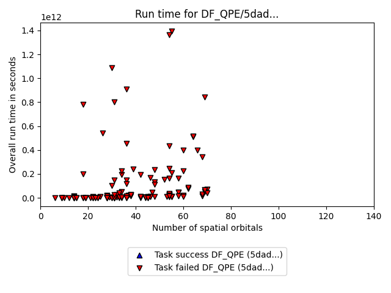

Note: plot only contains `attempted` tasks.

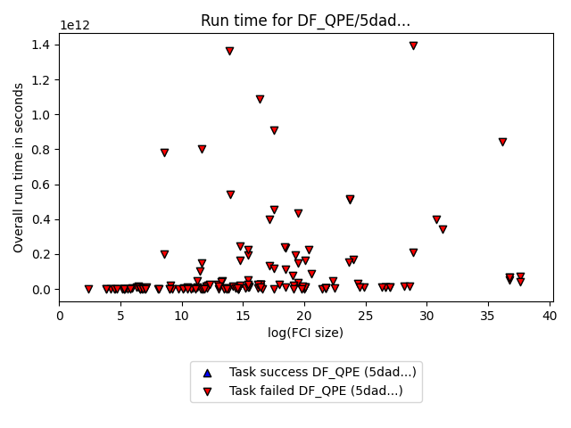

Note: plot only contains `attempted` tasks.

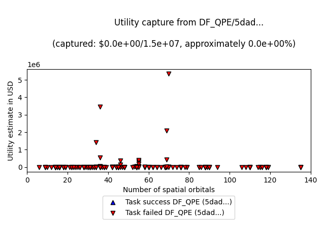

Note: `attempted` may be `True` or `False`.  Tasks with a `reference_energy` can be labeled as solved or failed-to-solve. A task with a `reference_energy` that was NOT `attempted` is labeled as a failed-to-solve.  White stars indicate Hamiltonians for which we do not have a `reference_energy`.

## Solver CISD, 418f060e-496b-4024-8d2d-9b1f8791e76d

solver_uuid:418f060e-496b-4024-8d2d-9b1f8791e76d

solver_short_name:CISD

compute_hardware_type:classical_computer

classical_hardware_details:{'computing_environment_name': 'LCRC Improv (per node)', 'cpu_description': '2x AMD EPYC 7713 64C', 'ram_available_gb': '256GB', 'clock_speed': '2 GHz', 'total_num_cores': 128}

algorithm_details:CISD

software_details:pyscf (https://github.com/pyscf/pyscf).

performance_metrics_uuid: 7fb33e1e-6fb9-4789-9936-ce8b272fbae7

creation_timestamp: 2025-01-28T21:50:06.833854+00:00

number_of_problem_instances: 84

number_of_problem_instances_attempted: 84

number_of_problem_instances_solved: 9

number_of_tasks: 276

number_of_tasks_attempted: 276

number_of_tasks_solved: 17

number_of_tasks_solved_within_run_time_limit: 276

number_of_tasks_solved_within_accuracy_threshold: 17

max_run_time_of_attempted_tasks: 62.58296537399292

sum_of_run_time_of_attempted_tasks: 2929.870177745819

solvability_ratio: 0.003

f1_score: [0.9782608695652174, 0.85]

ml_metrics_calculator_version: 1

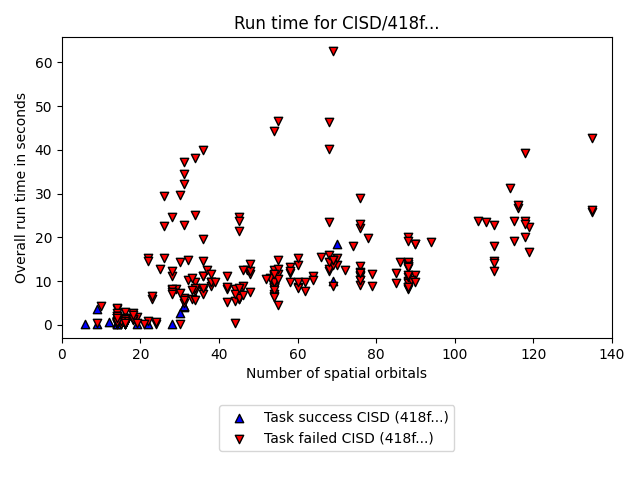

Note: plot only contains `attempted` tasks.

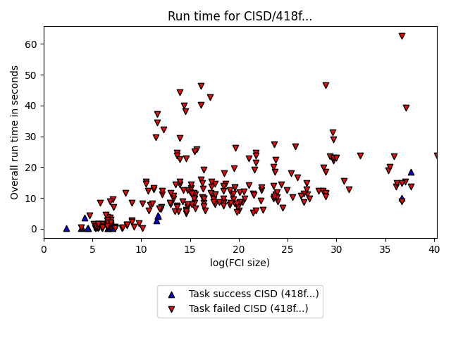

Note: plot only contains `attempted` tasks.

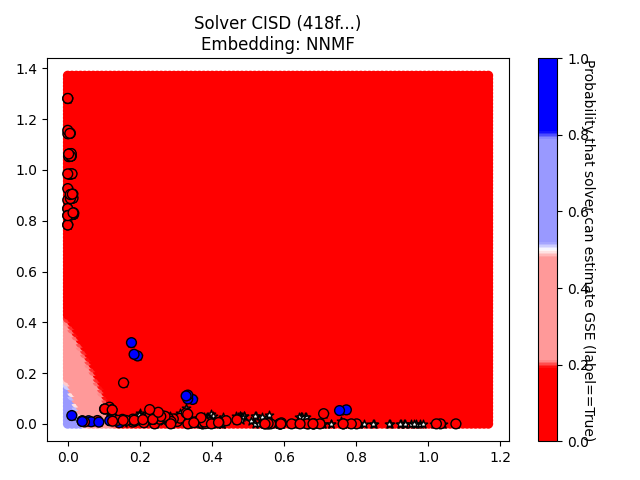

Note: `attempted` may be `True` or `False`.  Tasks with a `reference_energy` can be labeled as solved or failed-to-solve. A task with a `reference_energy` that was NOT `attempted` is labeled as a failed-to-solve.  White stars indicate Hamiltonians for which we do not have a `reference_energy`.

## Solver CCSD(T), c09217e6-d0f7-4b0f-81c4-79210b7ac878

solver_uuid:c09217e6-d0f7-4b0f-81c4-79210b7ac878

solver_short_name:CCSD(T)

compute_hardware_type:classical_computer

classical_hardware_details:{'computing_environment_name': 'LCRC Improv (per node)', 'cpu_description': '2x AMD EPYC 7713 64C', 'ram_available_gb': '256GB', 'clock_speed': '2 GHz', 'total_num_cores': 128}

algorithm_details:CCSD(T)

software_details:pyscf (https://github.com/pyscf/pyscf).

performance_metrics_uuid: 12e14154-4351-464f-a933-e85f088cfe47

creation_timestamp: 2025-01-28T21:50:06.833854+00:00

number_of_problem_instances: 84

number_of_problem_instances_attempted: 79

number_of_problem_instances_solved: 19

number_of_tasks: 276

number_of_tasks_attempted: 264

number_of_tasks_solved: 71

number_of_tasks_solved_within_run_time_limit: 264

number_of_tasks_solved_within_accuracy_threshold: 71

max_run_time_of_attempted_tasks: 493.4080808162689

sum_of_run_time_of_attempted_tasks: 13199.317583084106

solvability_ratio: 0.8102

f1_score: [0.8695652173913043, 0.864516129032258]

ml_metrics_calculator_version: 1

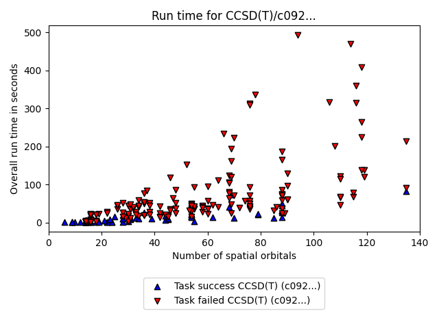

Note: plot only contains `attempted` tasks.

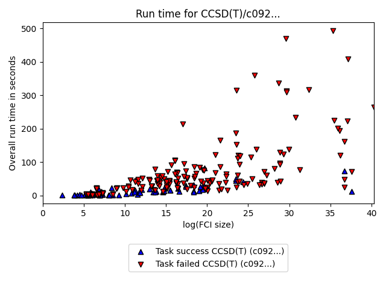

Note: plot only contains `attempted` tasks.

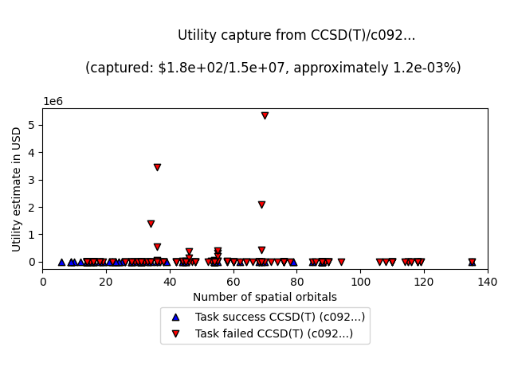

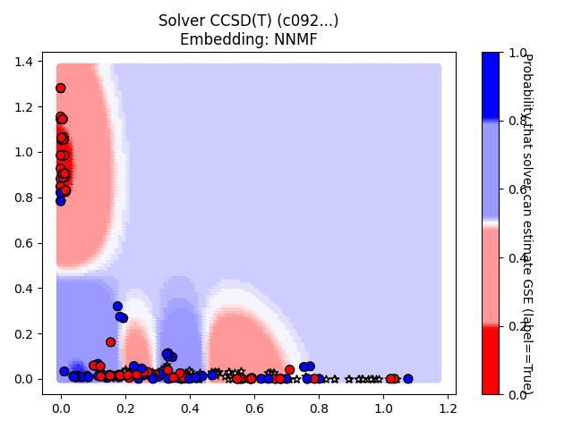

Note: `attempted` may be `True` or `False`.  Tasks with a `reference_energy` can be labeled as solved or failed-to-solve. A task with a `reference_energy` that was NOT `attempted` is labeled as a failed-to-solve.  White stars indicate Hamiltonians for which we do not have a `reference_energy`.

## Solver HF, 5f5e617a-19c2-4d82-bebc-b2d6b3dcb012

solver_uuid:5f5e617a-19c2-4d82-bebc-b2d6b3dcb012

solver_short_name:HF

compute_hardware_type:classical_computer

classical_hardware_details:{'computing_environment_name': 'LCRC Improv (per node)', 'cpu_description': '2x AMD EPYC 7713 64C', 'ram_available_gb': '256GB', 'clock_speed': '2 GHz', 'total_num_cores': 128}

algorithm_details:Hartree Fock

software_details:pyscf (https://github.com/pyscf/pyscf).

performance_metrics_uuid: 3abe001b-2d7c-4661-9a22-e418c72af383

creation_timestamp: 2025-01-28T21:50:06.833854+00:00

number_of_problem_instances: 84

number_of_problem_instances_attempted: 84

number_of_problem_instances_solved: 5

number_of_tasks: 276

number_of_tasks_attempted: 276

number_of_tasks_solved: 5

number_of_tasks_solved_within_run_time_limit: 276

number_of_tasks_solved_within_accuracy_threshold: 5

max_run_time_of_attempted_tasks: 20.338801622390747

sum_of_run_time_of_attempted_tasks: 906.4860525131226

solvability_ratio: 0.0

f1_score: [0.9867549668874173, 0.7142857142857143]

ml_metrics_calculator_version: 1

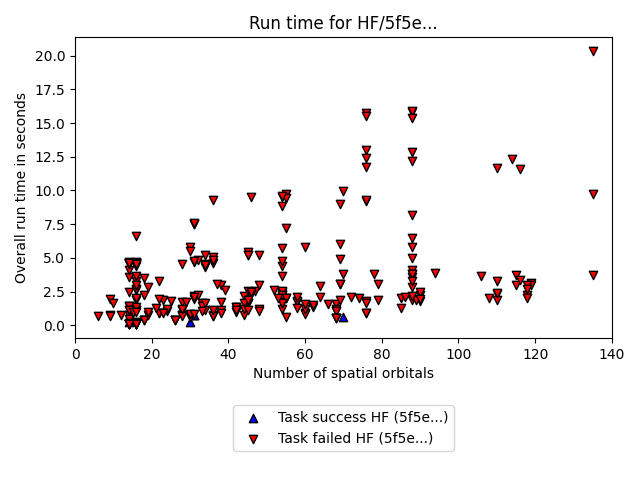

Note: plot only contains `attempted` tasks.

Note: plot only contains `attempted` tasks.

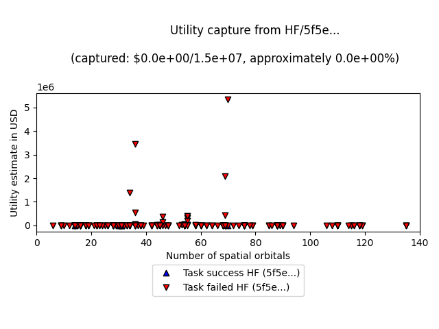

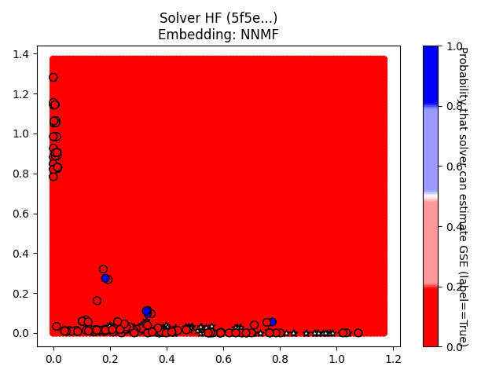

Note: `attempted` may be `True` or `False`.  Tasks with a `reference_energy` can be labeled as solved or failed-to-solve. A task with a `reference_energy` that was NOT `attempted` is labeled as a failed-to-solve.  White stars indicate Hamiltonians for which we do not have a `reference_energy`.

## Solver MP2, b420358b-5def-41e6-8c5d-b9d93b6aecd2

solver_uuid:b420358b-5def-41e6-8c5d-b9d93b6aecd2

solver_short_name:MP2

compute_hardware_type:classical_computer

classical_hardware_details:{'computing_environment_name': 'LCRC Improv (per node)', 'cpu_description': '2x AMD EPYC 7713 64C', 'ram_available_gb': '256GB', 'clock_speed': '2 GHz', 'total_num_cores': 128}

algorithm_details:MP2

software_details:pyscf (https://github.com/pyscf/pyscf).

performance_metrics_uuid: d1774265-c873-46bf-b518-670a2a9a9b77

creation_timestamp: 2025-01-28T21:50:06.833854+00:00

number_of_problem_instances: 84

number_of_problem_instances_attempted: 81

number_of_problem_instances_solved: 5

number_of_tasks: 276

number_of_tasks_attempted: 268

number_of_tasks_solved: 5

number_of_tasks_solved_within_run_time_limit: 268

number_of_tasks_solved_within_accuracy_threshold: 5

max_run_time_of_attempted_tasks: 2.230440139770508

sum_of_run_time_of_attempted_tasks: 94.7442626953125

solvability_ratio: 0.0

f1_score: [0.9867549668874173, 0.7142857142857143]

ml_metrics_calculator_version: 1

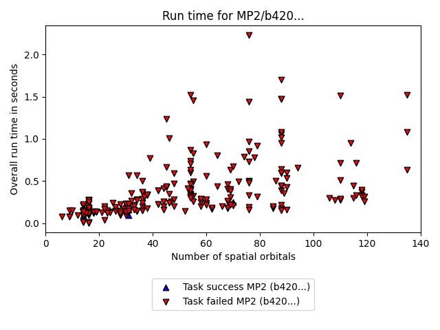

Note: plot only contains `attempted` tasks.

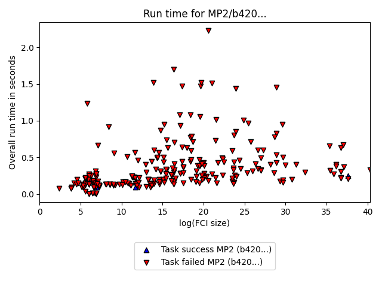

Note: plot only contains `attempted` tasks.

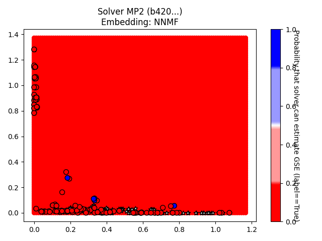

Note: `attempted` may be `True` or `False`.  Tasks with a `reference_energy` can be labeled as solved or failed-to-solve. A task with a `reference_energy` that was NOT `attempted` is labeled as a failed-to-solve.  White stars indicate Hamiltonians for which we do not have a `reference_energy`.

## Solver CCSD, 0a29e54f-bef9-4d19-bafa-d94b1c4b37aa

solver_uuid:0a29e54f-bef9-4d19-bafa-d94b1c4b37aa

solver_short_name:CCSD

compute_hardware_type:classical_computer

classical_hardware_details:{'computing_environment_name': 'LCRC Improv (per node)', 'cpu_description': '2x AMD EPYC 7713 64C', 'ram_available_gb': '256GB', 'clock_speed': '2 GHz', 'total_num_cores': 128}

algorithm_details:CCSD

software_details:pyscf (https://github.com/pyscf/pyscf).

performance_metrics_uuid: 3b4570f3-f224-4fec-857b-4725857548ac

creation_timestamp: 2025-01-28T21:50:06.833854+00:00

number_of_problem_instances: 84

number_of_problem_instances_attempted: 79

number_of_problem_instances_solved: 10

number_of_tasks: 276

number_of_tasks_attempted: 264

number_of_tasks_solved: 24

number_of_tasks_solved_within_run_time_limit: 264

number_of_tasks_solved_within_accuracy_threshold: 24

max_run_time_of_attempted_tasks: 485.1982181072235

sum_of_run_time_of_attempted_tasks: 12252.72845697403

solvability_ratio: 0.0197

f1_score: [0.9886792452830189, 0.9411764705882353]

ml_metrics_calculator_version: 1

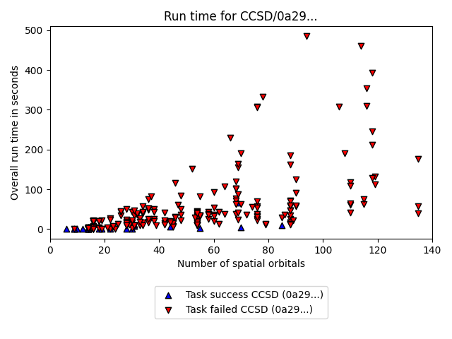

Note: plot only contains `attempted` tasks.

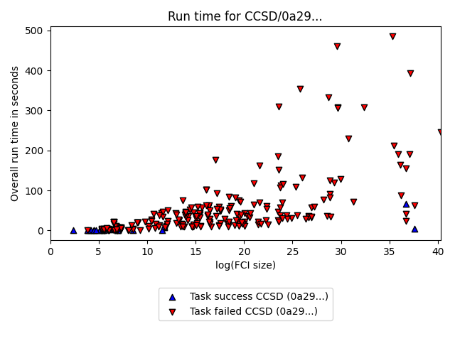

Note: plot only contains `attempted` tasks.

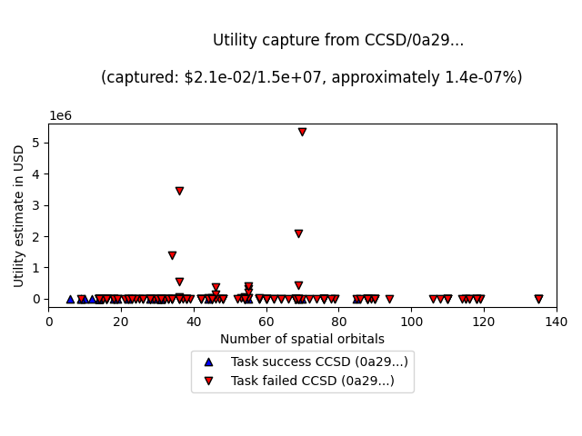

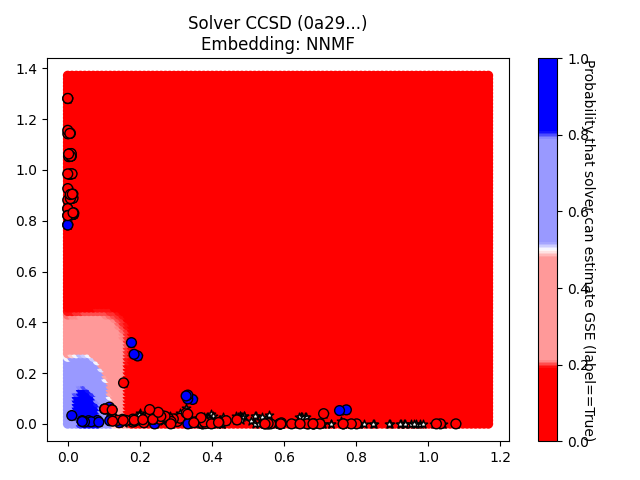

Note: `attempted` may be `True` or `False`.  Tasks with a `reference_energy` can be labeled as solved or failed-to-solve. A task with a `reference_energy` that was NOT `attempted` is labeled as a failed-to-solve.  White stars indicate Hamiltonians for which we do not have a `reference_energy`.

## Solver DMRG_Niagara_cluster_lowest_energy, 16537433-9f4c-4eae-a65d-787dc3b35b59

solver_uuid:16537433-9f4c-4eae-a65d-787dc3b35b59

solver_short_name:DMRG_Niagara_cluster_lowest_energy

compute_hardware_type:classical_computer

classical_hardware_details:{'computing_environment_name': 'Niagara Cluster, Compute Canada', 'cpu_description': '40 Intel "Skylake" cores at 2.4 GHz or 40 Intel "CascadeLake" cores at 2.5 GHz', 'ram_available_gb': '202 GB (188 GiB)', 'clock_speed': '2.4 GHz or 2.5 GHz', 'total_num_cores': 40}

algorithm_details:DMRG with the lowest variational energy obtained so far.

software_details:Block2 v0.5.3rc16 with dmrghandler, commit version d603fdc6409fc194a416aa3a519362d5d91790d9 or later.

performance_metrics_uuid: 98ee23bd-16f7-402a-9818-f1ffc399ac74

creation_timestamp: 2025-01-28T21:50:06.833854+00:00

number_of_problem_instances: 84

number_of_problem_instances_attempted: 84

number_of_problem_instances_solved: 9

number_of_tasks: 276

number_of_tasks_attempted: 276

number_of_tasks_solved: 112

number_of_tasks_solved_within_run_time_limit: 276

number_of_tasks_solved_within_accuracy_threshold: 112

max_run_time_of_attempted_tasks: 80820.729907066

sum_of_run_time_of_attempted_tasks: 2471726.9051446947

solvability_ratio: 0.6106

f1_score: [0.9662921348314607, 0.986784140969163]

ml_metrics_calculator_version: 1

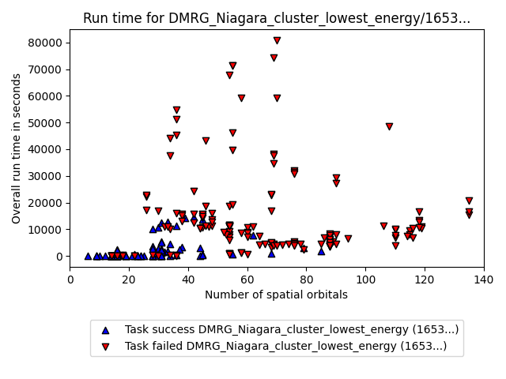

Note: plot only contains `attempted` tasks.

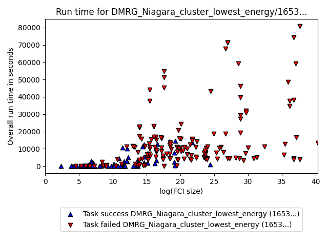

Note: plot only contains `attempted` tasks.

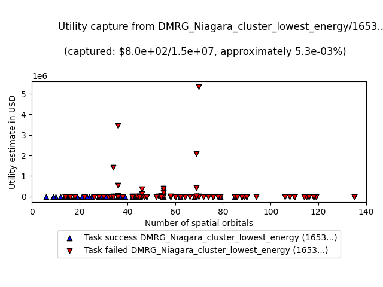

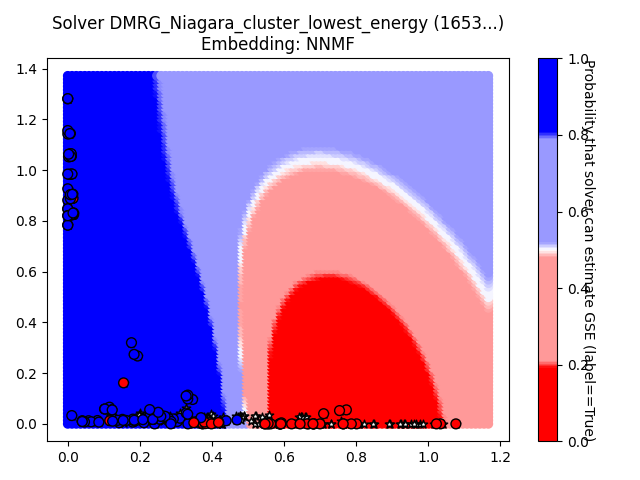

Note: `attempted` may be `True` or `False`.  Tasks with a `reference_energy` can be labeled as solved or failed-to-solve. A task with a `reference_energy` that was NOT `attempted` is labeled as a failed-to-solve.  White stars indicate Hamiltonians for which we do not have a `reference_energy`.

# Non-negative matrix factorization (ML latent space)

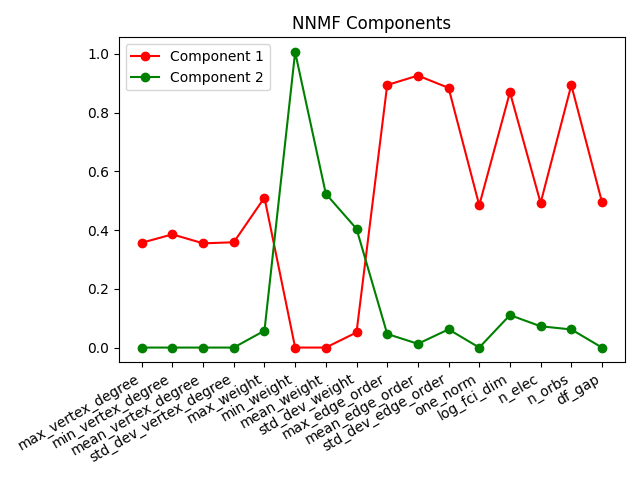

Features: ['max_vertex_degree', 'min_vertex_degree', 'mean_vertex_degree', 'std_dev_vertex_degree', 'max_weight', 'min_weight', 'mean_weight', 'std_dev_weight', 'max_edge_order', 'mean_edge_order', 'std_dev_edge_order', 'one_norm', 'log_fci_dim', 'n_elec', 'n_orbs', 'df_gap']

Component 1: [0.35690922 0.38545468 0.35487749 0.35852601 0.51063391 0.
 0.         0.0515893  0.89395573 0.92611292 0.88423213 0.48450204
 0.86941452 0.49234596 0.89376327 0.49515561]

Component 2: [0.         0.         0.         0.         0.05747991 1.00601694
 0.52355998 0.4045106  0.04642006 0.0127596  0.06203818 0.
 0.11068966 0.07250786 0.06174321 0.        ]

