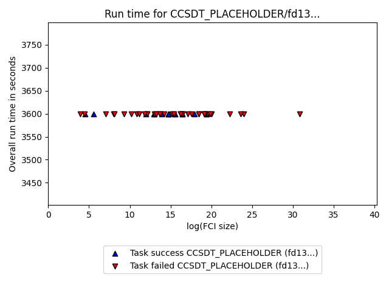

# GSEE Benchmark Standard Report

Report based on data from 2025-01-23T19:37:07.010747+00:00

[https://github.com/isi-usc-edu/qb-gsee-benchmark](https://github.com/isi-usc-edu/qb-gsee-benchmark)

Input data: `Hamiltonian_features.csv`, last modified Mon Dec 30 16:29:03 2024

WARNING!  We only have features calculated for                             230/276 Hamiltonians.                             This report is based on partial results!

Input data: `GSEE-HC_utility_estimates_all_instances_task_uuids_v2.csv`, last modified Thu Jan  9 12:11:19 2025

Latest creation time for a `problem_instance.json` file: Wed Jan 22 17:01:13 2025

Latest creation time for a `solution.json` file: Wed Jan 22 16:55:50 2025

# Problem Instance Summary Statistics

number of `problem_instances`: 84.

`problem_instance.json` with the most tasks: 30 (hubbard_square/614c4444-a31a-4348-b24d-01040208651c)

number of Hamiltonians (i.e., tasks) we have features calculated for: 230

minimum number of orbitals: 6

median number of orbitals: 53.5

maximum number of orbitals: 135

# Solver Summary Statistics

number of unique participating solvers: 9

NOTE: only `attempted` tasks are plotted on the chart.  Triangle up/down indicates solved/unsolved.

NOTE: only `attempted` tasks are plotted on the chart.  Triangle up/down indicates solved/unsolved.

NOTE: only `attempted` tasks are plotted on the chart.  Triangle up/down indicates solved/unsolved.

NOTE: only `attempted` tasks are plotted on the chart.  Triangle up/down indicates solved/unsolved.

NOTE: only `attempted` tasks are plotted on the chart.  Triangle up/down indicates solved/unsolved.

## Solver SHCI_opt, 2dde727e-a881-44fa-aabf-bba6248e4baf

solver_uuid:2dde727e-a881-44fa-aabf-bba6248e4baf

solver_short_name:SHCI_opt

compute_hardware_type:classical_computer

classical_hardware_details:{'computing_environment_name': 'LCRC Improv (per node)', 'cpu_description': '2x AMD EPYC 7713 64C', 'ram_available_gb': '256GB', 'clock_speed': '2 GHz', 'total_num_cores': 128}

algorithm_details:SHCI with optimized orbitals followed by SHCI+PT

software_details:SHCI Arrow Code (https://github.com/QMC-Cornell/shci).

performance_metrics_uuid: b2dab9b6-24f2-46c2-8ade-d0f29dd62ec1

creation_timestamp: 2025-01-23T19:37:07.010747+00:00

number_of_problem_instances: 82

number_of_problem_instances_attempted: 41

number_of_problem_instances_solved: 14

number_of_tasks: 230

number_of_tasks_attempted: 162

number_of_tasks_solved: 80

number_of_tasks_solved_within_run_time_limit: 162

number_of_tasks_solved_within_accuracy_threshold: 80

max_run_time_of_attempted_tasks: 55299.387

sum_of_run_time_of_attempted_tasks: 1138067.4269999997

solvability_ratio: 0.9998

f1_score: [0.7058823529411765, 0.8275862068965517]

ml_metrics_calculator_version: 1

Note: plot only contains `attempted` tasks.

Note: plot only contains `attempted` tasks.

Note: ML surface plot is based on Hamiltonians where a `reference_energy` was provided. (`attempted` may be `True` or `False`.)

## Solver CCSDT_PLACEHOLDER, fd13c864-baf1-44de-b52d-0e5dd69f647a

solver_uuid:fd13c864-baf1-44de-b52d-0e5dd69f647a

solver_short_name:CCSDT_PLACEHOLDER

compute_hardware_type:classical_computer

classical_hardware_details:{'cpu_description': 'CCSDT_PLACEHOLDER_cpu_description'}

algorithm_details:CCSDT_PLACEHOLDER_algorithm_details

software_details:CCSDT_PLACEHOLDER_software_details

performance_metrics_uuid: 5feaa842-812e-4167-a8dd-c422a36cb6dd

creation_timestamp: 2025-01-23T19:37:07.010747+00:00

number_of_problem_instances: 82

number_of_problem_instances_attempted: 4

number_of_problem_instances_solved: 0

number_of_tasks: 230

number_of_tasks_attempted: 53

number_of_tasks_solved: 16

number_of_tasks_solved_within_run_time_limit: 53

number_of_tasks_solved_within_accuracy_threshold: 16

max_run_time_of_attempted_tasks: 3600.0

sum_of_run_time_of_attempted_tasks: 190800.0

solvability_ratio: 0.0

f1_score: [0.9878542510121457, 0.896551724137931]

ml_metrics_calculator_version: 1

Note: plot only contains `attempted` tasks.

Note: plot only contains `attempted` tasks.

Note: ML surface plot is based on Hamiltonians where a `reference_energy` was provided. (`attempted` may be `True` or `False`.)

## Solver CISD, 418f060e-496b-4024-8d2d-9b1f8791e76d

solver_uuid:418f060e-496b-4024-8d2d-9b1f8791e76d

solver_short_name:CISD

compute_hardware_type:classical_computer

classical_hardware_details:{'computing_environment_name': 'LCRC Improv (per node)', 'cpu_description': '2x AMD EPYC 7713 64C', 'ram_available_gb': '256GB', 'clock_speed': '2 GHz', 'total_num_cores': 128}

algorithm_details:CISD

software_details:pyscf (https://github.com/pyscf/pyscf).

performance_metrics_uuid: adb25b3d-aee5-437d-9e6c-2493228d58fa

creation_timestamp: 2025-01-23T19:37:07.010747+00:00

number_of_problem_instances: 82

number_of_problem_instances_attempted: 82

number_of_problem_instances_solved: 9

number_of_tasks: 230

number_of_tasks_attempted: 230

number_of_tasks_solved: 14

number_of_tasks_solved_within_run_time_limit: 230

number_of_tasks_solved_within_accuracy_threshold: 14

max_run_time_of_attempted_tasks: 62.58296537399292

sum_of_run_time_of_attempted_tasks: 2895.8530027866364

solvability_ratio: 0.0047

f1_score: [0.9919354838709677, 0.9285714285714286]

ml_metrics_calculator_version: 1

Note: plot only contains `attempted` tasks.

Note: plot only contains `attempted` tasks.

Note: ML surface plot is based on Hamiltonians where a `reference_energy` was provided. (`attempted` may be `True` or `False`.)

## Solver CCSD(T), c09217e6-d0f7-4b0f-81c4-79210b7ac878

solver_uuid:c09217e6-d0f7-4b0f-81c4-79210b7ac878

solver_short_name:CCSD(T)

compute_hardware_type:classical_computer

classical_hardware_details:{'computing_environment_name': 'LCRC Improv (per node)', 'cpu_description': '2x AMD EPYC 7713 64C', 'ram_available_gb': '256GB', 'clock_speed': '2 GHz', 'total_num_cores': 128}

algorithm_details:CCSD(T)

software_details:pyscf (https://github.com/pyscf/pyscf).

performance_metrics_uuid: 432c53c7-0bd1-47b0-a97f-7831c2ae896e

creation_timestamp: 2025-01-23T19:37:07.010747+00:00

number_of_problem_instances: 82

number_of_problem_instances_attempted: 78

number_of_problem_instances_solved: 19

number_of_tasks: 230

number_of_tasks_attempted: 221

number_of_tasks_solved: 64

number_of_tasks_solved_within_run_time_limit: 221

number_of_tasks_solved_within_accuracy_threshold: 64

max_run_time_of_attempted_tasks: 493.4080808162689

sum_of_run_time_of_attempted_tasks: 12968.4871737957

solvability_ratio: 0.0715

f1_score: [0.759493670886076, 0.6779661016949152]

ml_metrics_calculator_version: 1

Note: plot only contains `attempted` tasks.

Note: plot only contains `attempted` tasks.

Note: ML surface plot is based on Hamiltonians where a `reference_energy` was provided. (`attempted` may be `True` or `False`.)

## Solver HF, 5f5e617a-19c2-4d82-bebc-b2d6b3dcb012

solver_uuid:5f5e617a-19c2-4d82-bebc-b2d6b3dcb012

solver_short_name:HF

compute_hardware_type:classical_computer

classical_hardware_details:{'computing_environment_name': 'LCRC Improv (per node)', 'cpu_description': '2x AMD EPYC 7713 64C', 'ram_available_gb': '256GB', 'clock_speed': '2 GHz', 'total_num_cores': 128}

algorithm_details:Hartree Fock

software_details:pyscf (https://github.com/pyscf/pyscf).

performance_metrics_uuid: 1c5cb0b7-6a61-4cbb-ae64-ba8030800b25

creation_timestamp: 2025-01-23T19:37:07.010747+00:00

number_of_problem_instances: 82

number_of_problem_instances_attempted: 82

number_of_problem_instances_solved: 5

number_of_tasks: 230

number_of_tasks_attempted: 230

number_of_tasks_solved: 5

number_of_tasks_solved_within_run_time_limit: 230

number_of_tasks_solved_within_accuracy_threshold: 5

max_run_time_of_attempted_tasks: 20.338801622390747

sum_of_run_time_of_attempted_tasks: 792.8028435707092

solvability_ratio: 0.0

f1_score: [0.9847328244274809, 0.7142857142857143]

ml_metrics_calculator_version: 1

Note: plot only contains `attempted` tasks.

Note: plot only contains `attempted` tasks.

Note: ML surface plot is based on Hamiltonians where a `reference_energy` was provided. (`attempted` may be `True` or `False`.)

## Solver MP2, b420358b-5def-41e6-8c5d-b9d93b6aecd2

solver_uuid:b420358b-5def-41e6-8c5d-b9d93b6aecd2

solver_short_name:MP2

compute_hardware_type:classical_computer

classical_hardware_details:{'computing_environment_name': 'LCRC Improv (per node)', 'cpu_description': '2x AMD EPYC 7713 64C', 'ram_available_gb': '256GB', 'clock_speed': '2 GHz', 'total_num_cores': 128}

algorithm_details:MP2

software_details:pyscf (https://github.com/pyscf/pyscf).

performance_metrics_uuid: b46a5d2f-14f9-4125-8dc3-7dc467296d4a

creation_timestamp: 2025-01-23T19:37:07.010747+00:00

number_of_problem_instances: 82

number_of_problem_instances_attempted: 79

number_of_problem_instances_solved: 5

number_of_tasks: 230

number_of_tasks_attempted: 222

number_of_tasks_solved: 5

number_of_tasks_solved_within_run_time_limit: 222

number_of_tasks_solved_within_accuracy_threshold: 5

max_run_time_of_attempted_tasks: 2.230440139770508

sum_of_run_time_of_attempted_tasks: 87.6544258594513

solvability_ratio: 0.0

f1_score: [0.9847328244274809, 0.7142857142857143]

ml_metrics_calculator_version: 1

Note: plot only contains `attempted` tasks.

Note: plot only contains `attempted` tasks.

Note: ML surface plot is based on Hamiltonians where a `reference_energy` was provided. (`attempted` may be `True` or `False`.)

## Solver CCSD, 0a29e54f-bef9-4d19-bafa-d94b1c4b37aa

solver_uuid:0a29e54f-bef9-4d19-bafa-d94b1c4b37aa

solver_short_name:CCSD

compute_hardware_type:classical_computer

classical_hardware_details:{'computing_environment_name': 'LCRC Improv (per node)', 'cpu_description': '2x AMD EPYC 7713 64C', 'ram_available_gb': '256GB', 'clock_speed': '2 GHz', 'total_num_cores': 128}

algorithm_details:CCSD

software_details:pyscf (https://github.com/pyscf/pyscf).

performance_metrics_uuid: 2b7f9540-da3b-42b2-a511-d324af07c0f4

creation_timestamp: 2025-01-23T19:37:07.010747+00:00

number_of_problem_instances: 82

number_of_problem_instances_attempted: 78

number_of_problem_instances_solved: 9

number_of_tasks: 230

number_of_tasks_attempted: 221

number_of_tasks_solved: 17

number_of_tasks_solved_within_run_time_limit: 221

number_of_tasks_solved_within_accuracy_threshold: 17

max_run_time_of_attempted_tasks: 485.1982181072235

sum_of_run_time_of_attempted_tasks: 12029.76450586319

solvability_ratio: 0.0122

f1_score: [0.995850622406639, 0.9714285714285714]

ml_metrics_calculator_version: 1

Note: plot only contains `attempted` tasks.

Note: plot only contains `attempted` tasks.

Note: ML surface plot is based on Hamiltonians where a `reference_energy` was provided. (`attempted` may be `True` or `False`.)

## Solver DF_QPE, 5dad4064-cd11-412f-85cb-d722afe3b3de

solver_uuid:5dad4064-cd11-412f-85cb-d722afe3b3de

solver_short_name:DF_QPE

compute_hardware_type:quantum_computer

algorithm_details:{'algorithm_description': 'Double factorized QPE resource estimates based on methodology of arXiv:2406.06335. Note that the truncation error is not included in the error bounds and that the SCF compute time is not included in the preprocessing time. Ground-state overlap is taken to be that estimated for the dominant CSF as estimated by DMRG and that this DMRG runtime is not included in the classical compute costs.', 'algorithm_parameters': {'overlap_csv': 'overlaps.csv', 'sf_threshold': 1e-12, 'df_threshold': 0.001, 'max_orbitals': 70}}

software_details:[{'software_name': 'pyLIQTR', 'software_version': '1.2.1'}, {'software_name': 'qb-gsee-benchmark', 'software_version': '0.1.0a2.dev71+g5d9efab.d20241230'}, {'software_name': 'Python', 'software_version': '3.10.12 (main, Nov  6 2024, 20:22:13) [GCC 11.4.0]'}, {'software_name': 'qualtran', 'software_version': '0.2.0'}]

quantum_hardware_details:{'quantum_hardware_description': 'Optimistic superconducting hardware model based on that described in https://arxiv.org/abs/2011.03494.', 'quantum_hardware_parameters': {'num_factories': 4, 'physical_error_rate': 0.0001, 'cycle_time_microseconds': 1}}

logical_resource_estimate_solution_uuid:72dea71b-fb03-43f0-8086-eb37605ba3db

logical_resource_estimate_solver_uuid:f2d73e1f-3058-43c4-a634-b6c267c84ff1

performance_metrics_uuid: 65f92ed8-716d-40aa-bd7b-852a8e3c2297

creation_timestamp: 2025-01-23T19:37:07.010747+00:00

number_of_problem_instances: 82

number_of_problem_instances_attempted: 24

number_of_problem_instances_solved: 3

number_of_tasks: 230

number_of_tasks_attempted: 163

number_of_tasks_solved: 26

number_of_tasks_solved_within_run_time_limit: 26

number_of_tasks_solved_within_accuracy_threshold: 163

max_run_time_of_attempted_tasks: 233737829.40462503

sum_of_run_time_of_attempted_tasks: 1180589418.3385448

solvability_ratio: 0.0235

f1_score: [0.9819819819819819, 0.9259259259259259]

ml_metrics_calculator_version: 1

Note: plot only contains `attempted` tasks.

Note: plot only contains `attempted` tasks.

Note: ML surface plot is based on Hamiltonians where a `reference_energy` was provided. (`attempted` may be `True` or `False`.)

## Solver DMRG_Niagara_cluster_lowest_energy, 16537433-9f4c-4eae-a65d-787dc3b35b59

solver_uuid:16537433-9f4c-4eae-a65d-787dc3b35b59

solver_short_name:DMRG_Niagara_cluster_lowest_energy

compute_hardware_type:classical_computer

classical_hardware_details:{'computing_environment_name': 'Niagara Cluster, Compute Canada', 'cpu_description': '40 Intel "Skylake" cores at 2.4 GHz or 40 Intel "CascadeLake" cores at 2.5 GHz', 'ram_available_gb': '202 GB (188 GiB)', 'clock_speed': '2.4 GHz or 2.5 GHz', 'total_num_cores': 40}

algorithm_details:DMRG with the lowest variational energy obtained so far.

software_details:Block2 v0.5.3rc16 with dmrghandler, commit version d603fdc6409fc194a416aa3a519362d5d91790d9 or later.

performance_metrics_uuid: ebfcd8c7-f5b0-4b5f-962f-4e17ad966a6c

creation_timestamp: 2025-01-23T19:37:07.010747+00:00

number_of_problem_instances: 82

number_of_problem_instances_attempted: 82

number_of_problem_instances_solved: 8

number_of_tasks: 230

number_of_tasks_attempted: 230

number_of_tasks_solved: 72

number_of_tasks_solved_within_run_time_limit: 230

number_of_tasks_solved_within_accuracy_threshold: 72

max_run_time_of_attempted_tasks: 80820.729907066

sum_of_run_time_of_attempted_tasks: 2456481.4481055504

solvability_ratio: 0.1179

f1_score: [0.8955223880597015, 0.9014084507042254]

ml_metrics_calculator_version: 1

Note: plot only contains `attempted` tasks.

Note: plot only contains `attempted` tasks.

Note: ML surface plot is based on Hamiltonians where a `reference_energy` was provided. (`attempted` may be `True` or `False`.)

# Non-negative matrix factorization (ML latent space)

Features: ['max_vertex_degree', 'min_vertex_degree', 'mean_vertex_degree', 'std_dev_vertex_degree', 'max_weight', 'min_weight', 'mean_weight', 'std_dev_weight', 'max_edge_order', 'mean_edge_order', 'std_dev_edge_order', 'one_norm', 'log_fci_dim', 'n_elec', 'n_orbs', 'df_gap']

Component 1: [0.05774064 0.19694981 0.0603299  0.0508406  0.4012572  0.0346899
 0.08885595 0.11803315 0.41809938 0.44697988 0.40843297 0.02288265
 0.97875176 1.18836004 0.41822578 0.        ]

Component 2: [0.38626949 0.3223573  0.38508113 0.38692953 0.2859609  0.
 0.00339035 0.02136758 0.58665216 0.58951865 0.58380465 0.39646894
 0.33932268 0.         0.58688391 0.54358436]

