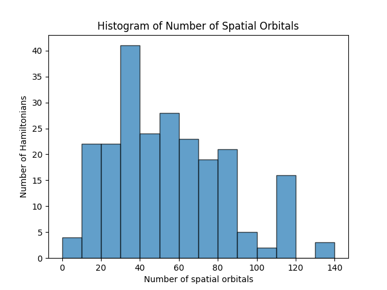
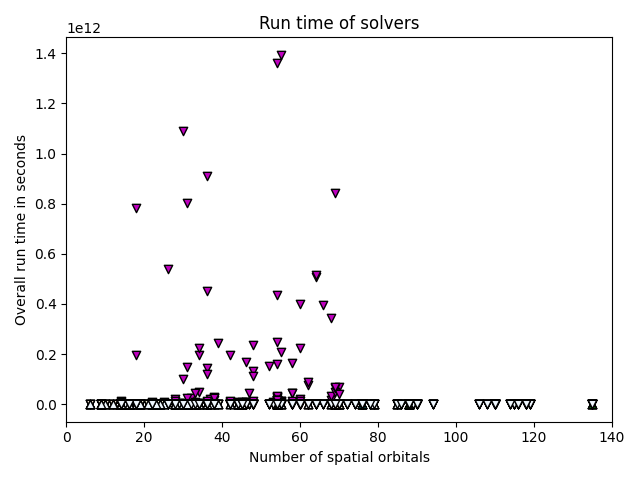
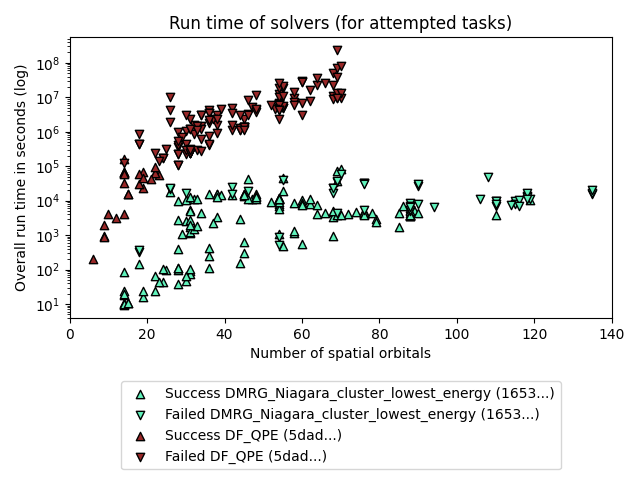
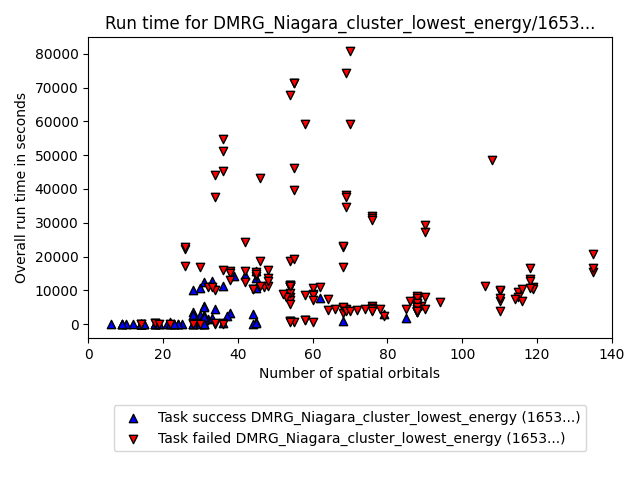
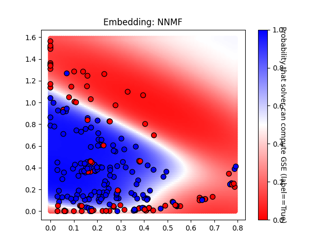
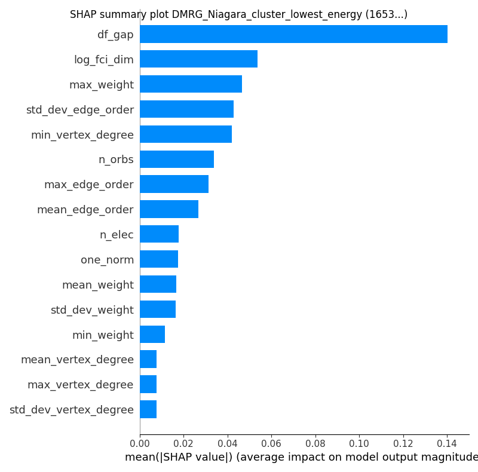
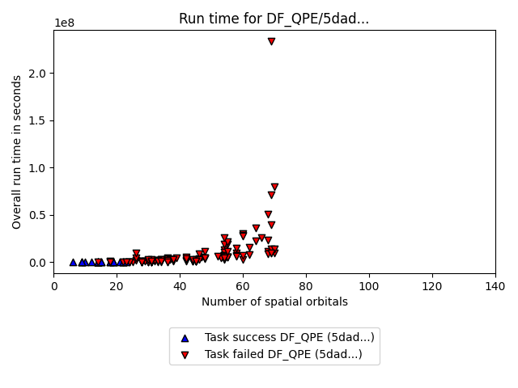
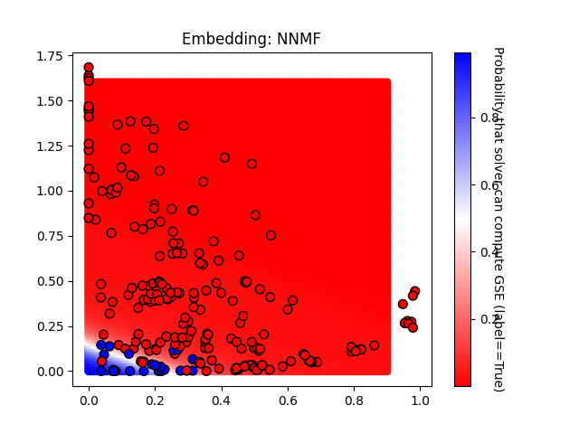
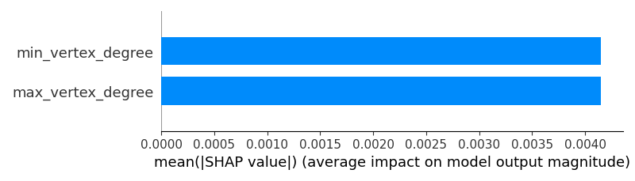

# GSEE Benchmark Standard Report

Report created on 2025-01-06T16:06:38.752601+00:00

[https://github.com/isi-usc-edu/qb-gsee-benchmark](https://github.com/isi-usc-edu/qb-gsee-benchmark)

Input data: `aggregated_solver_labels.csv`, last modified Mon Jan  6 11:05:47 2025

Input data: `Hamiltonian_features.csv`, last modified Mon Dec 30 14:31:01 2024

Latest creation time for a `problem_instance.json` file: Mon Jan  6 11:05:23 2025

Latest creation time for a `performance_metrics.json` file: Mon Jan  6 10:47:43 2025

Latest creation time for a `solution.json` file: Mon Jan  6 11:05:23 2025

## Problem Instance Summary Statistics

number of `problem_instances`: 82

`problem_instance.json` with the most tasks: 16 (mo_n2_pincer/8a3787cc-d3d0-42a8-d9a9-7de2aed45208)

number of Hamiltonians (i.e., tasks): 230

minimum number of orbitals: 6

median number of orbitals: 53.5

maximum number of orbitals: 135

## Solver Summary Statistics

number of unique participating solvers: 2

### Solver DMRG_Niagara_cluster_lowest_energy, 16537433-9f4c-4eae-a65d-787dc3b35b59

solver_short_name: DMRG_Niagara_cluster_lowest_energy

performance_metrics_uuid: f666d154-a6ff-4a89-a795-8a9b1e5bb786

creation_timestamp: 2025-01-06T14:04:15.318011+00:00

number_of_problem_instances: 82

number_of_problem_instances_attempted: 76

number_of_problem_instances_solved: 43

number_of_tasks: 230

number_of_tasks_attempted: 192

number_of_tasks_solved: 142

number_of_tasks_solved_within_run_time_limit: 192

number_of_tasks_solved_within_accuracy_threshold: 142

max_run_time_of_attempted_tasks: 80820.729907066

sum_of_run_time_of_attempted_tasks: 1824772.0337238186

solvability_ratio: 0.0

f1_score: [0.7586206896551724, 0.8531468531468531]

ml_metrics_calculator_version: 1

### Solver DF_QPE, 5dad4064-cd11-412f-85cb-d722afe3b3de

solver_short_name: DF_QPE

performance_metrics_uuid: b836aa30-274e-4d09-bc93-6bd2e8506b67

creation_timestamp: 2025-01-06T14:04:15.984519+00:00

number_of_problem_instances: 82

number_of_problem_instances_attempted: 24

number_of_problem_instances_solved: 3

number_of_tasks: 230

number_of_tasks_attempted: 163

number_of_tasks_solved: 26

number_of_tasks_solved_within_run_time_limit: 26

number_of_tasks_solved_within_accuracy_threshold: 163

max_run_time_of_attempted_tasks: 233737829.40462503

sum_of_run_time_of_attempted_tasks: 1180589418.3385441

solvability_ratio: 0.0086

f1_score: [0.9950738916256158, 0.9629629629629629]

ml_metrics_calculator_version: 1

