# GSEE Benchmark Standard Report

Report based on data from 2026-03-11T16:10:15.716097+00:00

[https://github.com/isi-usc-edu/qb-gsee-benchmark](https://github.com/isi-usc-edu/qb-gsee-benchmark)

Input data: `Hamiltonian_features.csv`, last modified Thu Feb 26 10:38:50 2026

Input data: `GSEE-HC_utility_estimates_all_instances_task_uuids_v2.csv`, last modified Thu Feb 26 10:38:50 2026

Latest creation time for a `problem_instance.json` file: Thu Feb 26 10:38:50 2026

Latest creation time for a `solution.json` file: Wed Mar 11 11:58:51 2026

# Problem Instance Summary Statistics

number of `problem_instances`: 68.

`problem_instance.json` with the most tasks: 30 (hubbard_square/614c4444-a31a-4348-b24d-01040208651c)

number of Hamiltonians (i.e., tasks) we have features calculated for: 228

minimum number of orbitals: 5

median number of orbitals: 36.0

maximum number of orbitals: 135

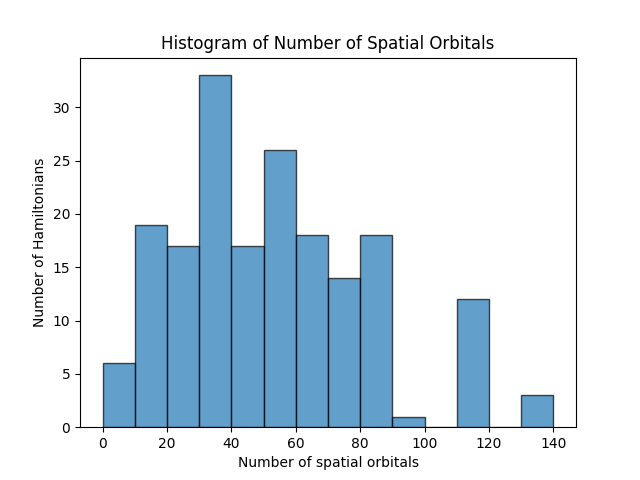

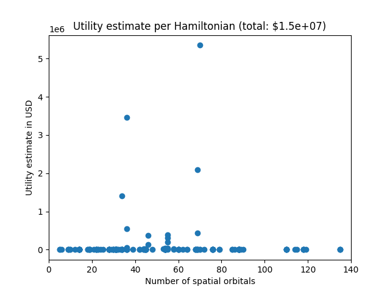

# Solver Summary Statistics

number of unique participating solvers: 23

Solver: DF_QPE/2610d8de-bd3a-469e-9a80-473e8988755f, ML Solvability Ratio: {'PCA': 0.0716, 'NNMF': 0.0}, F1 Score: [1. 1.]

Solver: SHCI_opt/2dde727e-a881-44fa-aabf-bba6248e4baf, ML Solvability Ratio: {'PCA': 1.0, 'NNMF': 1.0}, F1 Score: [0.83333333 0.99319728]

Solver: DF_QPE/5dad4064-cd11-412f-85cb-d722afe3b3de, ML Solvability Ratio: {'PCA': 0.0394, 'NNMF': 0.0199}, F1 Score: [1. 1.]

Solver: THC_BLISS_QPE_1mHa/b8ed03bd-9c3e-4d07-80af-8f77f0e7c2ac, Model could not be calculated.

Solver: SHCI_pt_1e-4/4ed500f1-0650-41e3-af00-e4d0359394b4, ML Solvability Ratio: {'PCA': 1.0, 'NNMF': 1.0}, F1 Score: [0.71428571 0.97122302]

Solver: SHCI_var_1e-4/7e730dfb-57ee-480b-a8a1-4b73f5f07c54, ML Solvability Ratio: {'PCA': 0.6562, 'NNMF': 0.7836}, F1 Score: [0.98387097 0.98901099]

Solver: SHCI_pt_2e-4/ad964781-302e-4728-a26d-39918e0a6cdb, ML Solvability Ratio: {'PCA': 1.0, 'NNMF': 0.9868}, F1 Score: [0.89361702 0.98069498]

Solver: SHCI_pt_2e-5/c71b90bd-3250-4c0c-b4e7-fc9878f141f6, ML Solvability Ratio: {'PCA': 0.9317, 'NNMF': 0.5441}, F1 Score: [0.76470588 0.97058824]

Solver: SHCI_pt_5e-5/d626506c-7aae-4ad6-802a-b29af5f2bb93, ML Solvability Ratio: {'PCA': 1.0, 'NNMF': 1.0}, F1 Score: [0.9375     0.99270073]

Solver: SHCI_var_2e-4/0db183e3-a86d-491b-9125-599556e37c7a, ML Solvability Ratio: {'PCA': 0.8125, 'NNMF': 0.8487}, F1 Score: [0.99280576 0.99401198]

Solver: SHCI_var_2e-5/86bfe50c-9342-4d54-bb68-abc8abd95688, ML Solvability Ratio: {'PCA': 0.6486, 'NNMF': 0.4057}, F1 Score: [0.88      0.9765625]

Solver: SHCI_var_5e-5/01949b95-c427-4693-9134-01f47f688c09, ML Solvability Ratio: {'PCA': 0.8749, 'NNMF': 0.391}, F1 Score: [0.83950617 0.94222222]

Solver: THC_QPE_1mHa/18c187af-3e5b-4e6c-87fd-73c26fd48a60, Model could not be calculated.

Solver: CISD/418f060e-496b-4024-8d2d-9b1f8791e76d, ML Solvability Ratio: {'PCA': 0.0233, 'NNMF': 0.0051}, F1 Score: [0.98069498 0.89361702]

Solver: CCSD/0a29e54f-bef9-4d19-bafa-d94b1c4b37aa, ML Solvability Ratio: {'PCA': 0.011, 'NNMF': 0.0418}, F1 Score: [0.98795181 0.94736842]

Solver: HF/5f5e617a-19c2-4d82-bebc-b2d6b3dcb012, ML Solvability Ratio: {'PCA': 0.0, 'NNMF': 0.0}, F1 Score: [0.        0.0754717]

Solver: MP2/b420358b-5def-41e6-8c5d-b9d93b6aecd2, ML Solvability Ratio: {'PCA': 0.0, 'NNMF': 0.0}, F1 Score: [0.        0.0754717]

Solver: CCSD(T)/c09217e6-d0f7-4b0f-81c4-79210b7ac878, ML Solvability Ratio: {'PCA': 0.2847, 'NNMF': 0.092}, F1 Score: [0.96855346 0.96598639]

Solver: DF_QPE/4b07b89f-c66f-4e72-8c24-df3e4222cb41, ML Solvability Ratio: {'PCA': 0.0, 'NNMF': 0.0}, F1 Score: [1. 1.]

Solver: DF_QPE/7c8ef984-4d3a-4468-8900-e0da3bd8b22d, ML Solvability Ratio: {'PCA': 0.0, 'NNMF': 0.0}, F1 Score: [0.93706294 0.1       ]

Solver: DF_QPE/f6b36bde-be4a-4eee-975b-2c5f7e553f5f, ML Solvability Ratio: {'PCA': 0.013, 'NNMF': 0.0006}, F1 Score: [0.99319728 0.83333333]

Solver: DF_QPE/5d768520-b3d0-4292-bbb4-9776fa128107, ML Solvability Ratio: {'PCA': 0.0394, 'NNMF': 0.0199}, F1 Score: [1. 1.]

Solver: DMRG_Niagara_cluster_lowest_energy/16537433-9f4c-4eae-a65d-787dc3b35b59, ML Solvability Ratio: {'PCA': 0.4126, 'NNMF': 0.3022}, F1 Score: [0.91304348 0.96261682]

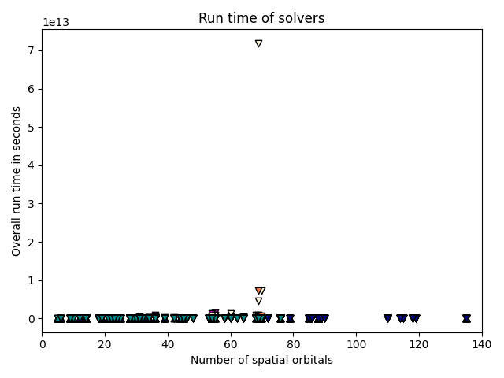

NOTE: only `attempted` tasks are plotted on the chart.  Triangle up/down indicates solved/unsolved.

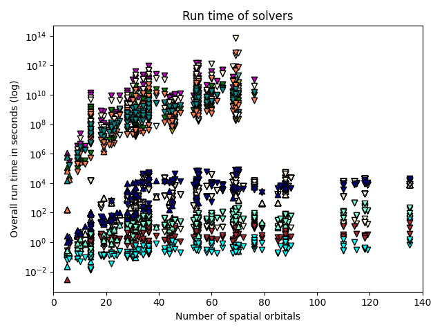

NOTE: only `attempted` tasks are plotted on the chart.  Triangle up/down indicates solved/unsolved.

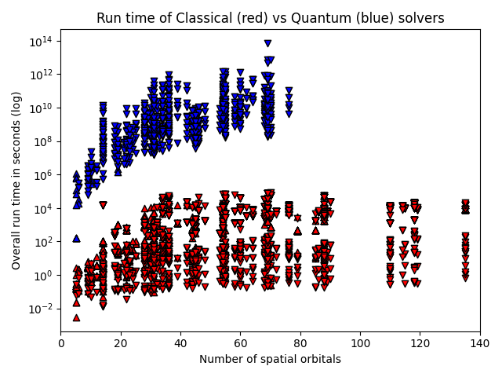

NOTE: only `attempted` tasks are plotted on the chart.  Triangle up/down indicates solved/unsolved.

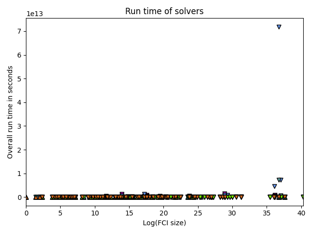

NOTE: only `attempted` tasks are plotted on the chart.  Triangle up/down indicates solved/unsolved.

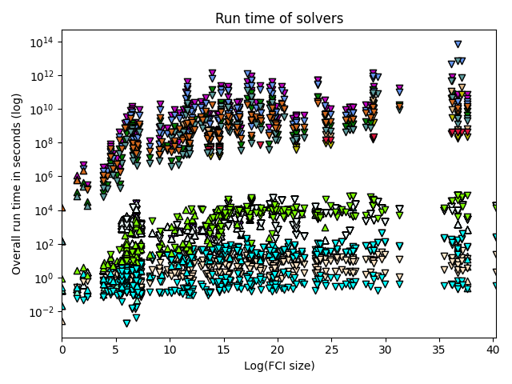

NOTE: only `attempted` tasks are plotted on the chart.  Triangle up/down indicates solved/unsolved.

## Solver DF_QPE, 2610d8de-bd3a-469e-9a80-473e8988755f

solver_uuid:2610d8de-bd3a-469e-9a80-473e8988755f

solver_short_name:DF_QPE

compute_hardware_type:quantum_computer

algorithm_details:{'algorithm_description': 'Double factorized QPE resource estimates based on methodology of arXiv:2406.06335. Note that the truncation error is not included in the error bounds and that the SCF compute time is not included in the preprocessing time. Ground-state overlap is taken to be that estimated for the dominant CSF as estimated by DMRG and that this DMRG runtime is not included in the classical compute costs.', 'algorithm_parameters': {'overlap_csv': 'overlaps.csv', 'sf_threshold': 1e-12, 'df_threshold': 0.001, 'max_orbitals': 70}}

software_details:[{'software_name': 'pyLIQTR', 'software_version': '1.4.2'}, {'software_name': 'qb-gsee-benchmark', 'software_version': '0.1.0a3.dev107+gc9c6ccda3.d20260302'}, {'software_name': 'Python', 'software_version': '3.12.2 (main, Feb 26 2026, 10:21:15) [GCC 11.4.0]'}, {'software_name': 'qualtran', 'software_version': '0.4.0'}]

quantum_hardware_details:{'quantum_hardware_description': 'Ultra-optimistic hardware model based on the superconducting architecture described in https://arxiv.org/abs/2011.03494.', 'quantum_hardware_parameters': {'num_factories': 4, 'physical_error_rate': 0.0001, 'cycle_time_microseconds': 0.1, 'parallelize_shots': False}}

logical_resource_estimate_solution_uuid:c7dddc47-261a-40a9-af26-b53cf209f8e2

logical_resource_estimate_solver_uuid:f2d73e1f-3058-43c4-a634-b6c267c84ff1

performance_metrics_uuid: 78b92e0e-9b46-4528-8ebc-7a66ce77051b

creation_timestamp: 2026-03-11T16:10:15.716097+00:00

number_of_problem_instances: 68

number_of_problem_instances_attempted: 22

number_of_problem_instances_solved: 3

number_of_tasks: 228

number_of_tasks_attempted: 131

number_of_tasks_solved: 4

number_of_tasks_solved_within_run_time_limit: 4

number_of_tasks_solved_within_accuracy_threshold: 131

max_run_time_of_attempted_tasks: 139405709800.31985

sum_of_run_time_of_attempted_tasks: 1070189503968.0303

solvability_ratio: 0.0716

comments: solvability ratio based on PCA embedding.

f1_score: [1.0, 1.0]

ml_metrics_calculator_version: 1

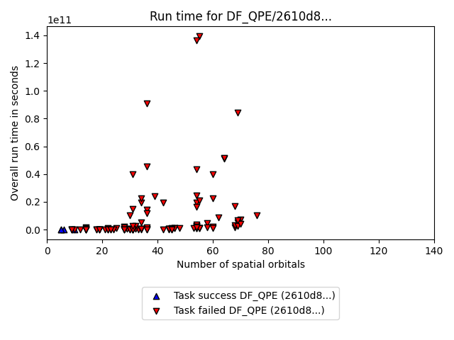

Note: plot only contains `attempted` tasks.

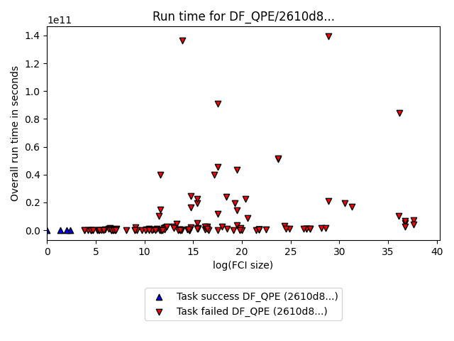

Note: plot only contains `attempted` tasks.

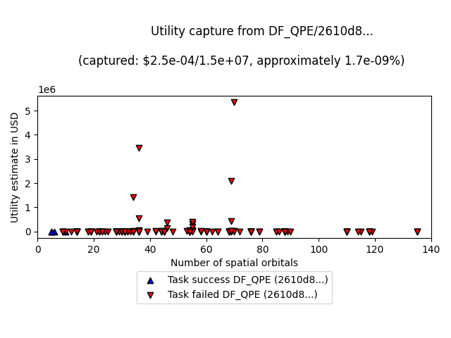

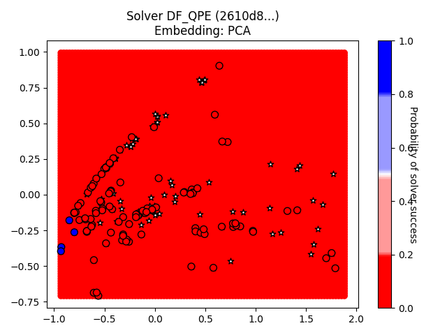

Note: `attempted` may be `True` or `False`.  Tasks with a `reference_energy` can be labeled as solved or failed-to-solve. A task with a `reference_energy` that was NOT `attempted` is labeled as a failed-to-solve.  White stars indicate Hamiltonians for which we do not have a `reference_energy`.

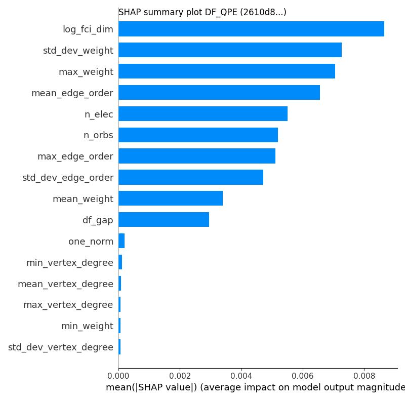

## Solver SHCI_opt, 2dde727e-a881-44fa-aabf-bba6248e4baf

solver_uuid:2dde727e-a881-44fa-aabf-bba6248e4baf

solver_short_name:SHCI_opt

compute_hardware_type:classical_computer

classical_hardware_details:{'computing_environment_name': 'LCRC Improv (per node)', 'cpu_description': '2x AMD EPYC 7713 64C', 'ram_available_gb': '256GB', 'clock_speed': '2 GHz', 'total_num_cores': 128}

algorithm_details:SHCI with optimized orbitals followed by SHCI+PT

software_details:SHCI Arrow Code (https://github.com/QMC-Cornell/shci).

performance_metrics_uuid: 26a077d0-bcef-4e37-8944-d287f4580826

creation_timestamp: 2026-03-11T16:10:15.716097+00:00

number_of_problem_instances: 68

number_of_problem_instances_attempted: 66

number_of_problem_instances_solved: 37

number_of_tasks: 228

number_of_tasks_attempted: 226

number_of_tasks_solved: 148

number_of_tasks_solved_within_run_time_limit: 226

number_of_tasks_solved_within_accuracy_threshold: 148

max_run_time_of_attempted_tasks: 57334.2

sum_of_run_time_of_attempted_tasks: 1100317.592

solvability_ratio: 1.0

comments: solvability ratio based on PCA embedding.

f1_score: [0.8333333333333334, 0.9931972789115646]

ml_metrics_calculator_version: 1

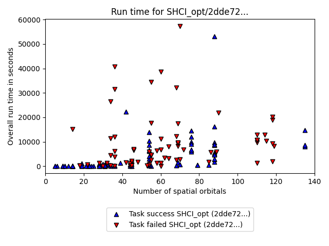

Note: plot only contains `attempted` tasks.

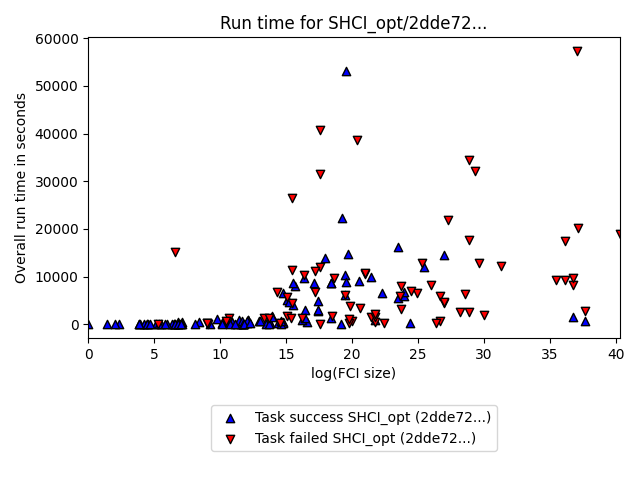

Note: plot only contains `attempted` tasks.

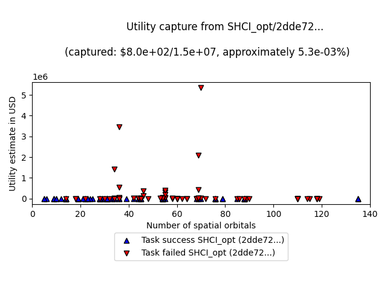

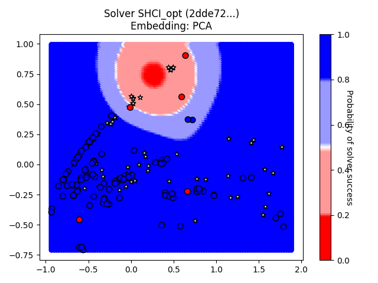

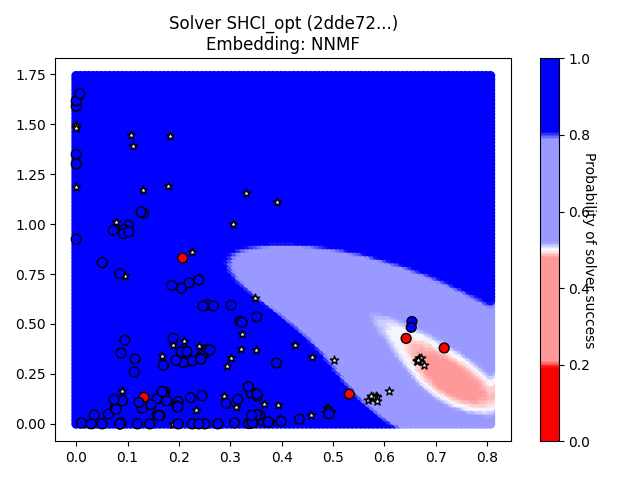

Note: `attempted` may be `True` or `False`.  Tasks with a `reference_energy` can be labeled as solved or failed-to-solve. A task with a `reference_energy` that was NOT `attempted` is labeled as a failed-to-solve.  White stars indicate Hamiltonians for which we do not have a `reference_energy`.

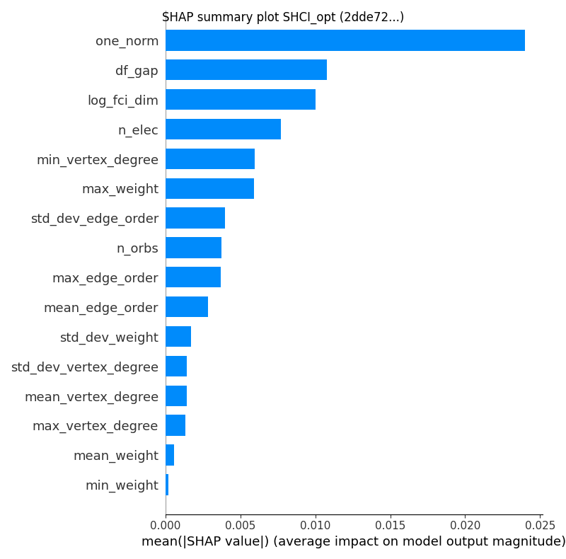

## Solver DF_QPE, 5dad4064-cd11-412f-85cb-d722afe3b3de

solver_uuid:5dad4064-cd11-412f-85cb-d722afe3b3de

solver_short_name:DF_QPE

compute_hardware_type:quantum_computer

algorithm_details:{'algorithm_description': 'Double factorized QPE resource estimates based on methodology of arXiv:2406.06335. Note that the truncation error is not included in the error bounds and that the SCF compute time is not included in the preprocessing time. Ground-state overlap is taken to be that estimated for the dominant CSF as estimated by DMRG and that this DMRG runtime is not included in the classical compute costs.', 'algorithm_parameters': {'overlap_csv': 'overlaps.csv', 'sf_threshold': 1e-12, 'df_threshold': 0.001, 'max_orbitals': 70}}

software_details:[{'software_name': 'pyLIQTR', 'software_version': '1.4.2'}, {'software_name': 'qb-gsee-benchmark', 'software_version': '0.1.0a3.dev107+gc9c6ccda3.d20260302'}, {'software_name': 'Python', 'software_version': '3.12.2 (main, Feb 26 2026, 10:21:15) [GCC 11.4.0]'}, {'software_name': 'qualtran', 'software_version': '0.4.0'}]

quantum_hardware_details:{'quantum_hardware_description': 'Optimistic superconducting hardware model based on that described in https://arxiv.org/abs/2011.03494.', 'quantum_hardware_parameters': {'num_factories': 4, 'physical_error_rate': 0.0001, 'cycle_time_microseconds': 1, 'parallelize_shots': False}}

logical_resource_estimate_solution_uuid:0d495e30-978f-4e99-848a-9fe3a8b51de4

logical_resource_estimate_solver_uuid:f2d73e1f-3058-43c4-a634-b6c267c84ff1

performance_metrics_uuid: c892ba92-c13e-43bd-b986-af6e8ffd8e28

creation_timestamp: 2026-03-11T16:10:15.716097+00:00

number_of_problem_instances: 68

number_of_problem_instances_attempted: 22

number_of_problem_instances_solved: 2

number_of_tasks: 228

number_of_tasks_attempted: 131

number_of_tasks_solved: 2

number_of_tasks_solved_within_run_time_limit: 2

number_of_tasks_solved_within_accuracy_threshold: 131

max_run_time_of_attempted_tasks: 1394057079996.7158

sum_of_run_time_of_attempted_tasks: 10701894017855.469

solvability_ratio: 0.0394

comments: solvability ratio based on PCA embedding.

f1_score: [1.0, 1.0]

ml_metrics_calculator_version: 1

Note: plot only contains `attempted` tasks.

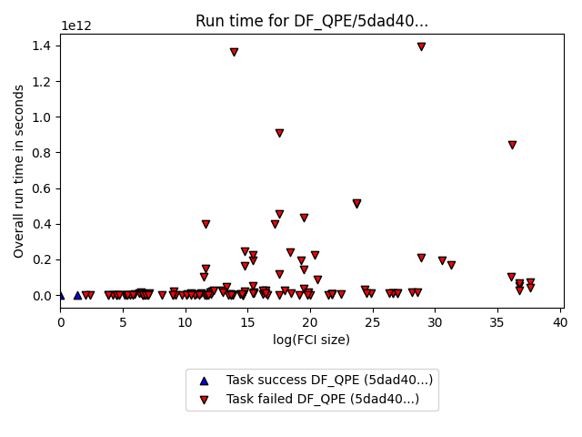

Note: plot only contains `attempted` tasks.

Note: `attempted` may be `True` or `False`.  Tasks with a `reference_energy` can be labeled as solved or failed-to-solve. A task with a `reference_energy` that was NOT `attempted` is labeled as a failed-to-solve.  White stars indicate Hamiltonians for which we do not have a `reference_energy`.

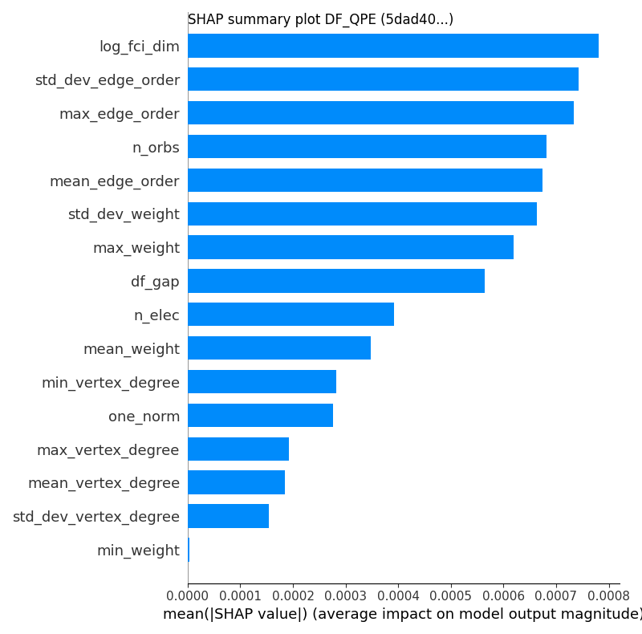

## Solver THC_BLISS_QPE_1mHa, b8ed03bd-9c3e-4d07-80af-8f77f0e7c2ac

solver_uuid:b8ed03bd-9c3e-4d07-80af-8f77f0e7c2ac

solver_short_name:THC_BLISS_QPE_1mHa

compute_hardware_type:quantum_computer

algorithm_details:{'algorithm_description': '', 'algorithm_parameters': {'overlap_csv': 'overlaps.csv'}, 'description': 'Tensor Hypercontraction + BLock Invariant Symmetry Shift (BLISS) QPE resource estimates for 1mHa accuracy (more stringent than benchmark-requested 1.59 mHa accuracy) based on methodology in arXiv:2406.06335v2, which is a modified form of the method in arXiv: 2501.06165. Note that the truncation error is not included in the error bounds and that the SCF compute time is not included in the preprocessing time. Ground-state overlap is taken to be that estimated for the dominant CSF as estimated by DMRG and this DMRG runtime is not included in the classical compute costs.'}

software_details:[{'software_name': 'benchq', 'software_version': '0.7.1.dev10+g80b8279.d20250116'}, {'software_name': 'openfermion', 'software_version': '1.6.1'}, {'software_name': 'Python', 'software_version': '3.12.2'}, {'software_name': 'JAX', 'software_version': '0.4.31'}, {'software_name': 'benchq', 'software_version': '0.1.dev153+g3d429cb.d20250508'}]

logical_resource_estimate_solution_uuid:fd9fd934-0256-494b-b973-5a816ce69fe8

quantum_hardware_details:{'quantum_hardware_description': 'Superconducting hardware model based on that described in https://arxiv.org/abs/2011.03494. Used with THC+BLISS.', 'quantum_hardware_parameters': {'num_factories': 4, 'physical_error_rate': 0.001, 'cycle_time_microseconds': 1}}

logical_resource_estimate_solver_uuid:12fbca08-3df3-4f3e-b7fd-c535b6b44b1c

performance_metrics_uuid: 06e3bed1-6f0c-43bb-9c3b-e5846bd58866

creation_timestamp: 2026-03-11T16:10:15.716097+00:00

number_of_problem_instances: 68

number_of_problem_instances_attempted: 3

number_of_problem_instances_solved: 0

number_of_tasks: 228

number_of_tasks_attempted: 23

number_of_tasks_solved: 0

number_of_tasks_solved_within_run_time_limit: 0

number_of_tasks_solved_within_accuracy_threshold: 23

max_run_time_of_attempted_tasks: 68780768267.04153

sum_of_run_time_of_attempted_tasks: 145936991321.73734

solvability_ratio: None

f1_score: None

ml_metrics_calculator_version: 1

comment: All labels were either all `True` or all `False` and we cannot create an ML model with only one class.

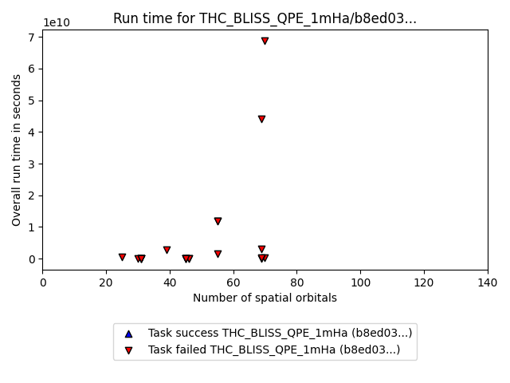

Note: plot only contains `attempted` tasks.

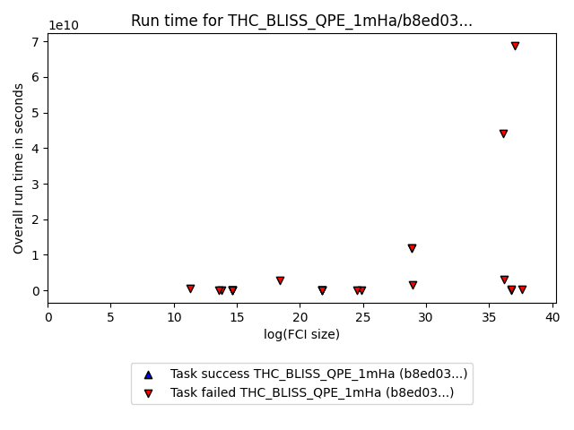

Note: plot only contains `attempted` tasks.

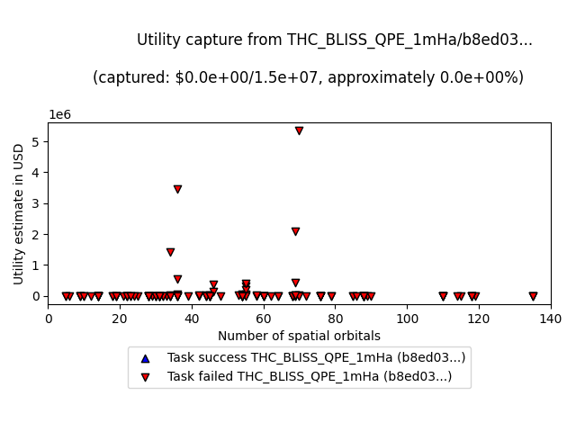

Note: `attempted` may be `True` or `False`.  Tasks with a `reference_energy` can be labeled as solved or failed-to-solve. A task with a `reference_energy` that was NOT `attempted` is labeled as a failed-to-solve.  White stars indicate Hamiltonians for which we do not have a `reference_energy`.

## Solver SHCI_pt_1e-4, 4ed500f1-0650-41e3-af00-e4d0359394b4

solver_uuid:4ed500f1-0650-41e3-af00-e4d0359394b4

solver_short_name:SHCI_pt_1e-4

compute_hardware_type:classical_computer

classical_hardware_details:{'computing_environment_name': 'LCRC Improv (per node)', 'cpu_description': '2x AMD EPYC 7713 64C', 'ram_available_gb': '256GB', 'clock_speed': '2 GHz', 'total_num_cores': 128}

algorithm_details:SHCI with eps_var 1e-4 + PT

software_details:SHCI Arrow Code (https://github.com/QMC-Cornell/shci).

performance_metrics_uuid: 046fca44-91ec-4129-9d6b-376a3ce10a0a

creation_timestamp: 2026-03-11T16:10:15.716097+00:00

number_of_problem_instances: 68

number_of_problem_instances_attempted: 68

number_of_problem_instances_solved: 26

number_of_tasks: 228

number_of_tasks_attempted: 228

number_of_tasks_solved: 135

number_of_tasks_solved_within_run_time_limit: 227

number_of_tasks_solved_within_accuracy_threshold: 135

max_run_time_of_attempted_tasks: 77244.15200000002

sum_of_run_time_of_attempted_tasks: 1220721.795

solvability_ratio: 1.0

comments: solvability ratio based on PCA embedding.

f1_score: [0.7142857142857143, 0.9712230215827338]

ml_metrics_calculator_version: 1

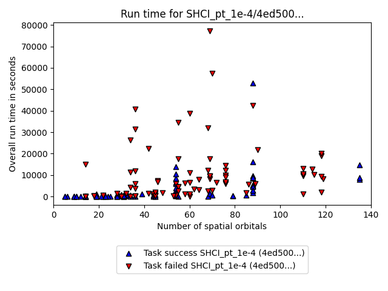

Note: plot only contains `attempted` tasks.

Note: plot only contains `attempted` tasks.

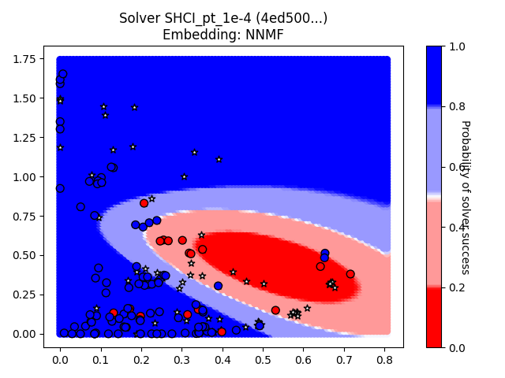

Note: `attempted` may be `True` or `False`.  Tasks with a `reference_energy` can be labeled as solved or failed-to-solve. A task with a `reference_energy` that was NOT `attempted` is labeled as a failed-to-solve.  White stars indicate Hamiltonians for which we do not have a `reference_energy`.

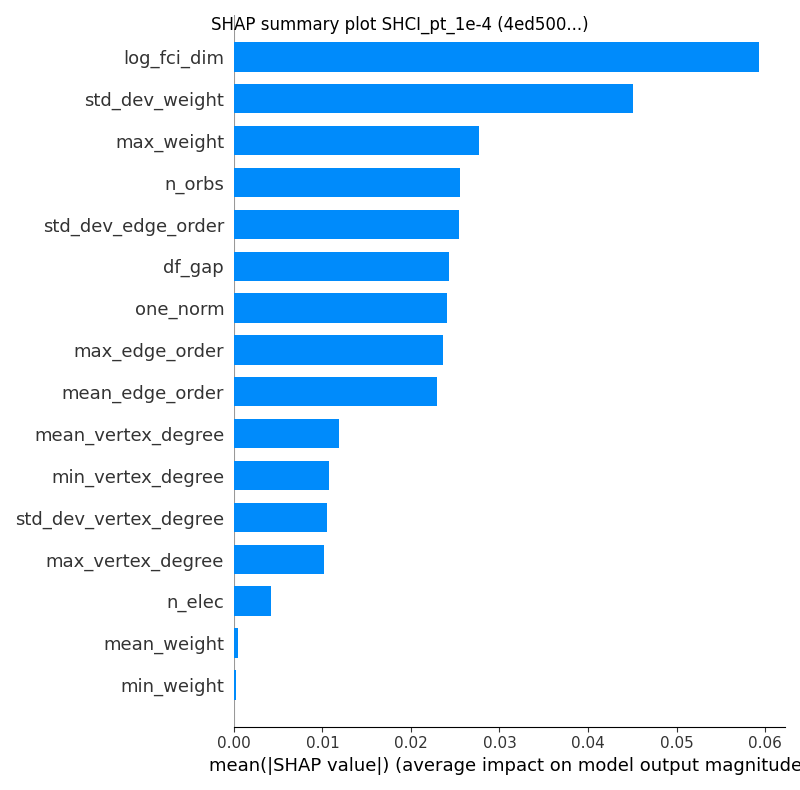

## Solver SHCI_var_1e-4, 7e730dfb-57ee-480b-a8a1-4b73f5f07c54

solver_uuid:7e730dfb-57ee-480b-a8a1-4b73f5f07c54

solver_short_name:SHCI_var_1e-4

compute_hardware_type:classical_computer

classical_hardware_details:{'computing_environment_name': 'LCRC Improv (per node)', 'cpu_description': '2x AMD EPYC 7713 64C', 'ram_available_gb': '256GB', 'clock_speed': '2 GHz', 'total_num_cores': 128}

algorithm_details:SHCI with eps_var 1e-4

software_details:SHCI Arrow Code (https://github.com/QMC-Cornell/shci).

performance_metrics_uuid: e642d2bb-9815-458f-9b07-e7fead11e439

creation_timestamp: 2026-03-11T16:10:15.716097+00:00

number_of_problem_instances: 68

number_of_problem_instances_attempted: 68

number_of_problem_instances_solved: 17

number_of_tasks: 228

number_of_tasks_attempted: 228

number_of_tasks_solved: 91

number_of_tasks_solved_within_run_time_limit: 227

number_of_tasks_solved_within_accuracy_threshold: 91

max_run_time_of_attempted_tasks: 77244.15200000002

sum_of_run_time_of_attempted_tasks: 1220721.795

solvability_ratio: 0.6562

comments: solvability ratio based on PCA embedding.

f1_score: [0.9838709677419355, 0.989010989010989]

ml_metrics_calculator_version: 1

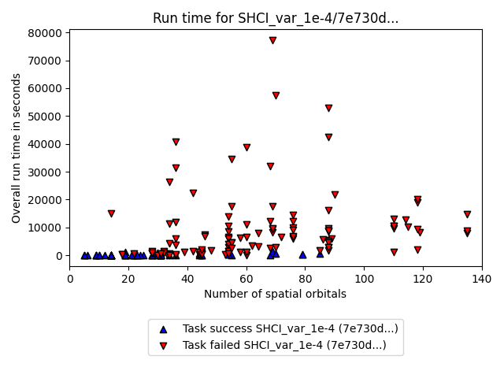

Note: plot only contains `attempted` tasks.

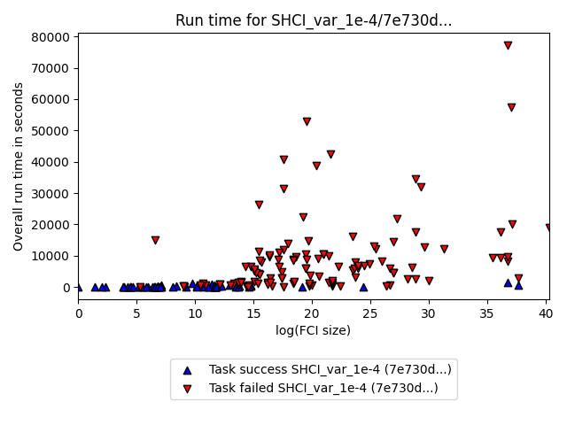

Note: plot only contains `attempted` tasks.

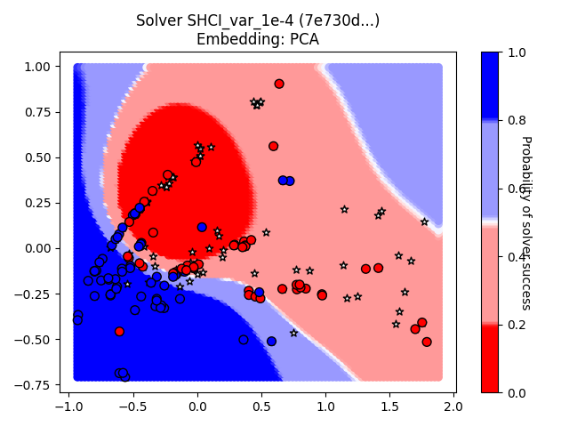

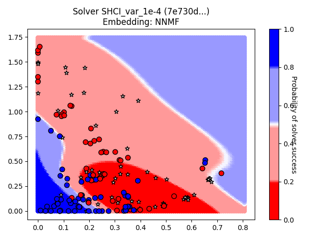

Note: `attempted` may be `True` or `False`.  Tasks with a `reference_energy` can be labeled as solved or failed-to-solve. A task with a `reference_energy` that was NOT `attempted` is labeled as a failed-to-solve.  White stars indicate Hamiltonians for which we do not have a `reference_energy`.

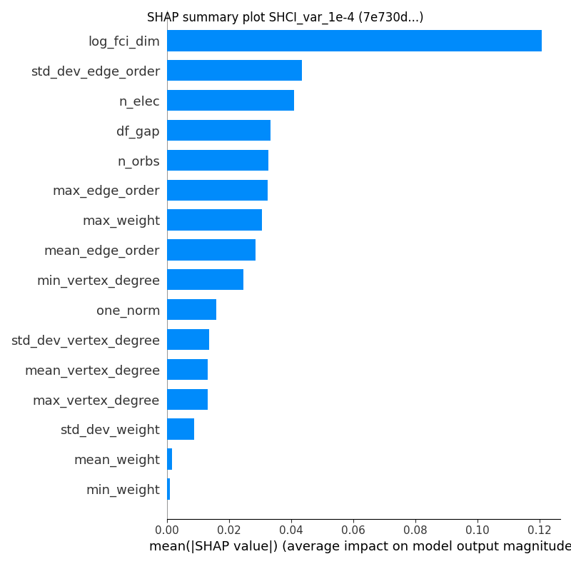

## Solver SHCI_pt_2e-4, ad964781-302e-4728-a26d-39918e0a6cdb

solver_uuid:ad964781-302e-4728-a26d-39918e0a6cdb

solver_short_name:SHCI_pt_2e-4

compute_hardware_type:classical_computer

classical_hardware_details:{'computing_environment_name': 'LCRC Improv (per node)', 'cpu_description': '2x AMD EPYC 7713 64C', 'ram_available_gb': '256GB', 'clock_speed': '2 GHz', 'total_num_cores': 128}

algorithm_details:SHCI with eps_var 2e-4 + PT

software_details:SHCI Arrow Code (https://github.com/QMC-Cornell/shci).

performance_metrics_uuid: 8d4b7674-a44b-4b25-b1ac-ef8a868794e8

creation_timestamp: 2026-03-11T16:10:15.716097+00:00

number_of_problem_instances: 68

number_of_problem_instances_attempted: 68

number_of_problem_instances_solved: 26

number_of_tasks: 228

number_of_tasks_attempted: 228

number_of_tasks_solved: 132

number_of_tasks_solved_within_run_time_limit: 227

number_of_tasks_solved_within_accuracy_threshold: 132

max_run_time_of_attempted_tasks: 77244.15200000002

sum_of_run_time_of_attempted_tasks: 1220721.795

solvability_ratio: 1.0

comments: solvability ratio based on PCA embedding.

f1_score: [0.8936170212765957, 0.9806949806949807]

ml_metrics_calculator_version: 1

Note: plot only contains `attempted` tasks.

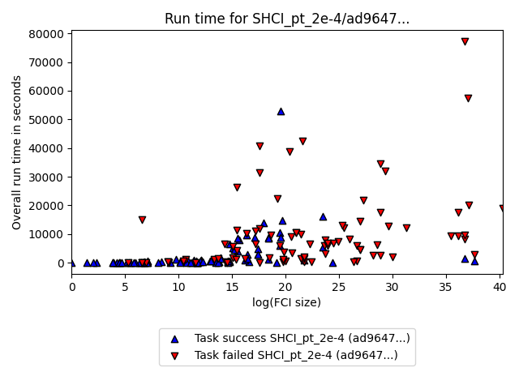

Note: plot only contains `attempted` tasks.

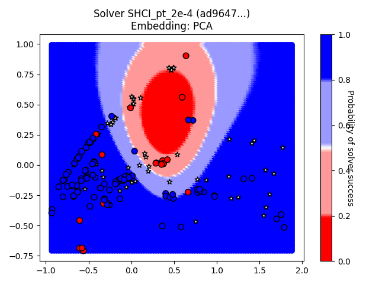

Note: `attempted` may be `True` or `False`.  Tasks with a `reference_energy` can be labeled as solved or failed-to-solve. A task with a `reference_energy` that was NOT `attempted` is labeled as a failed-to-solve.  White stars indicate Hamiltonians for which we do not have a `reference_energy`.

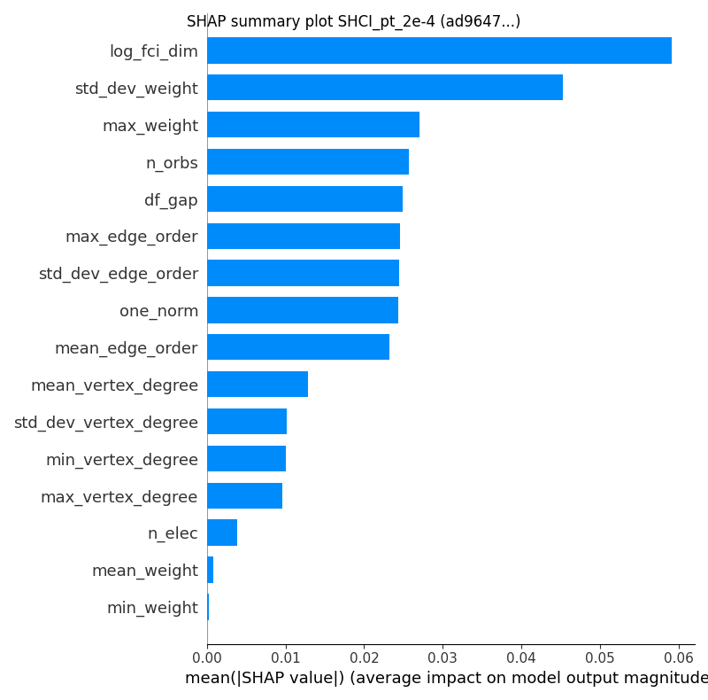

## Solver SHCI_pt_2e-5, c71b90bd-3250-4c0c-b4e7-fc9878f141f6

solver_uuid:c71b90bd-3250-4c0c-b4e7-fc9878f141f6

solver_short_name:SHCI_pt_2e-5

compute_hardware_type:classical_computer

classical_hardware_details:{'computing_environment_name': 'LCRC Improv (per node)', 'cpu_description': '2x AMD EPYC 7713 64C', 'ram_available_gb': '256GB', 'clock_speed': '2 GHz', 'total_num_cores': 128}

algorithm_details:SHCI with eps_var 2e-5 + PT

software_details:SHCI Arrow Code (https://github.com/QMC-Cornell/shci).

performance_metrics_uuid: e5a32a60-2bfa-4330-8a2f-1813e10d8250

creation_timestamp: 2026-03-11T16:10:15.716097+00:00

number_of_problem_instances: 68

number_of_problem_instances_attempted: 68

number_of_problem_instances_solved: 30

number_of_tasks: 228

number_of_tasks_attempted: 228

number_of_tasks_solved: 140

number_of_tasks_solved_within_run_time_limit: 227

number_of_tasks_solved_within_accuracy_threshold: 140

max_run_time_of_attempted_tasks: 77244.15200000002

sum_of_run_time_of_attempted_tasks: 1220721.795

solvability_ratio: 0.9317

comments: solvability ratio based on PCA embedding.

f1_score: [0.7647058823529411, 0.9705882352941176]

ml_metrics_calculator_version: 1

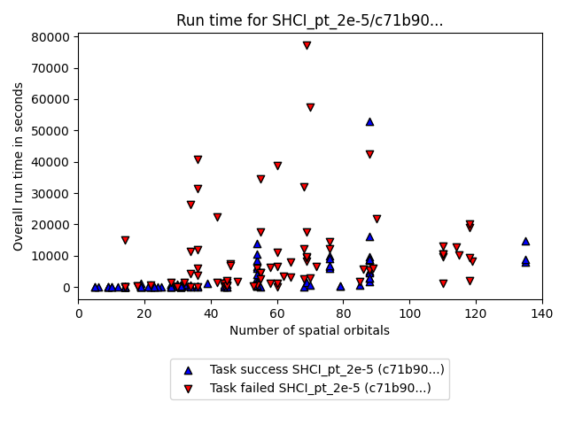

Note: plot only contains `attempted` tasks.

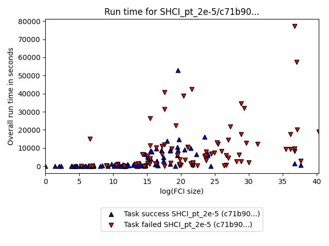

Note: plot only contains `attempted` tasks.

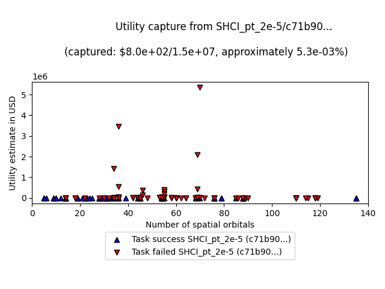

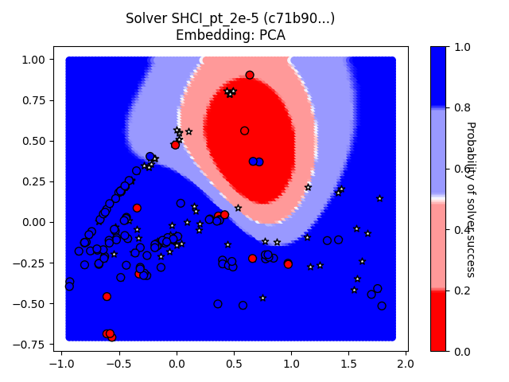

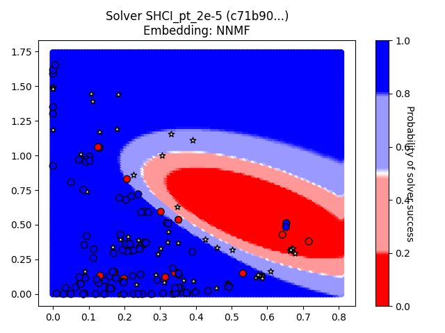

Note: `attempted` may be `True` or `False`.  Tasks with a `reference_energy` can be labeled as solved or failed-to-solve. A task with a `reference_energy` that was NOT `attempted` is labeled as a failed-to-solve.  White stars indicate Hamiltonians for which we do not have a `reference_energy`.

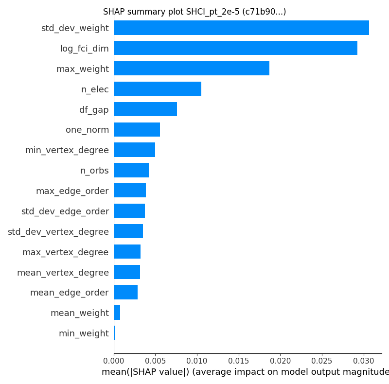

## Solver SHCI_pt_5e-5, d626506c-7aae-4ad6-802a-b29af5f2bb93

solver_uuid:d626506c-7aae-4ad6-802a-b29af5f2bb93

solver_short_name:SHCI_pt_5e-5

compute_hardware_type:classical_computer

classical_hardware_details:{'computing_environment_name': 'LCRC Improv (per node)', 'cpu_description': '2x AMD EPYC 7713 64C', 'ram_available_gb': '256GB', 'clock_speed': '2 GHz', 'total_num_cores': 128}

algorithm_details:SHCI with eps_var 5e-5 + PT

software_details:SHCI Arrow Code (https://github.com/QMC-Cornell/shci).

performance_metrics_uuid: 5d73d1d5-de65-4065-83d3-e60865d6bfb0

creation_timestamp: 2026-03-11T16:10:15.716097+00:00

number_of_problem_instances: 68

number_of_problem_instances_attempted: 68

number_of_problem_instances_solved: 28

number_of_tasks: 228

number_of_tasks_attempted: 228

number_of_tasks_solved: 138

number_of_tasks_solved_within_run_time_limit: 227

number_of_tasks_solved_within_accuracy_threshold: 138

max_run_time_of_attempted_tasks: 77244.15200000002

sum_of_run_time_of_attempted_tasks: 1220721.795

solvability_ratio: 1.0

comments: solvability ratio based on PCA embedding.

f1_score: [0.9375, 0.9927007299270073]

ml_metrics_calculator_version: 1

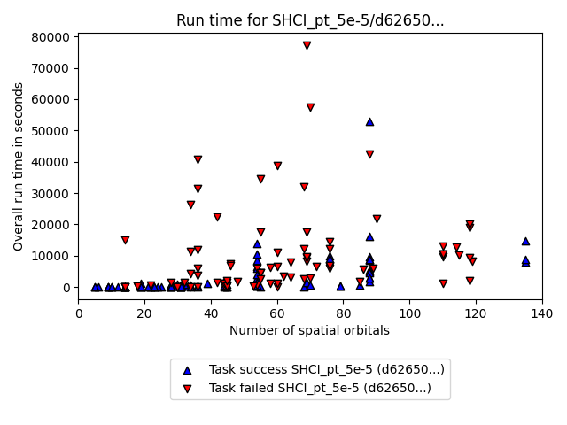

Note: plot only contains `attempted` tasks.

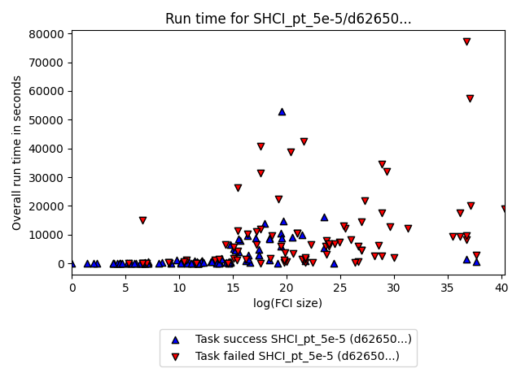

Note: plot only contains `attempted` tasks.

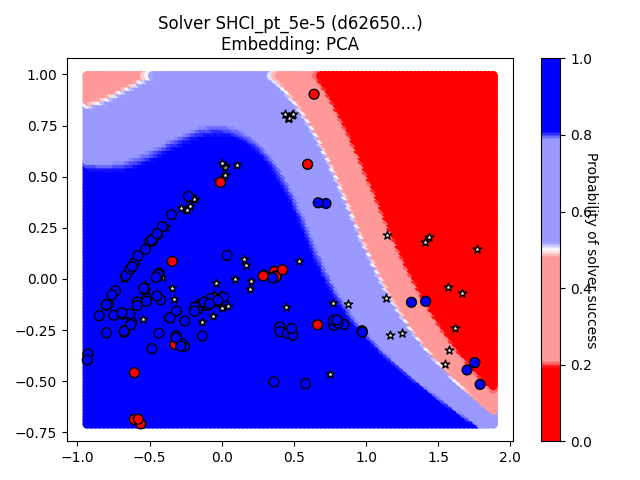

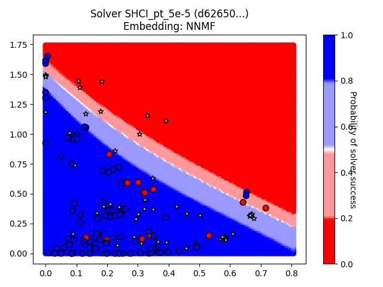

Note: `attempted` may be `True` or `False`.  Tasks with a `reference_energy` can be labeled as solved or failed-to-solve. A task with a `reference_energy` that was NOT `attempted` is labeled as a failed-to-solve.  White stars indicate Hamiltonians for which we do not have a `reference_energy`.

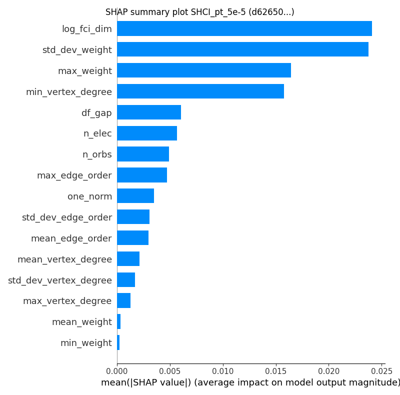

## Solver SHCI_var_2e-4, 0db183e3-a86d-491b-9125-599556e37c7a

solver_uuid:0db183e3-a86d-491b-9125-599556e37c7a

solver_short_name:SHCI_var_2e-4

compute_hardware_type:classical_computer

classical_hardware_details:{'computing_environment_name': 'LCRC Improv (per node)', 'cpu_description': '2x AMD EPYC 7713 64C', 'ram_available_gb': '256GB', 'clock_speed': '2 GHz', 'total_num_cores': 128}

algorithm_details:SHCI with eps_var 2e-4

software_details:SHCI Arrow Code (https://github.com/QMC-Cornell/shci).

performance_metrics_uuid: 7d5d3682-bcd2-4042-af55-26c39ae70cee

creation_timestamp: 2026-03-11T16:10:15.716097+00:00

number_of_problem_instances: 68

number_of_problem_instances_attempted: 68

number_of_problem_instances_solved: 17

number_of_tasks: 228

number_of_tasks_attempted: 228

number_of_tasks_solved: 83

number_of_tasks_solved_within_run_time_limit: 227

number_of_tasks_solved_within_accuracy_threshold: 83

max_run_time_of_attempted_tasks: 77244.15200000002

sum_of_run_time_of_attempted_tasks: 1220721.795

solvability_ratio: 0.8125

comments: solvability ratio based on PCA embedding.

f1_score: [0.9928057553956835, 0.9940119760479041]

ml_metrics_calculator_version: 1

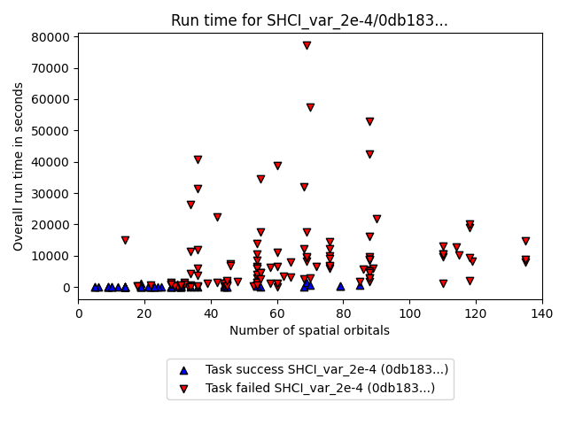

Note: plot only contains `attempted` tasks.

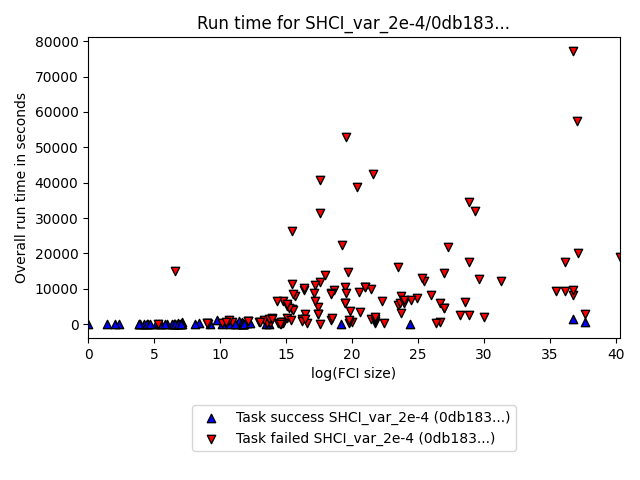

Note: plot only contains `attempted` tasks.

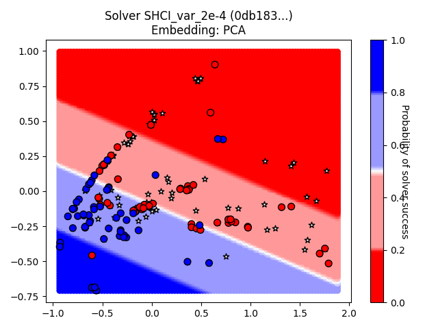

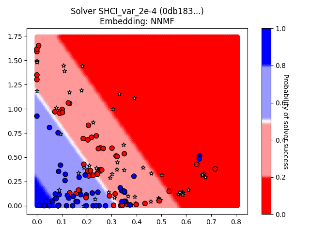

Note: `attempted` may be `True` or `False`.  Tasks with a `reference_energy` can be labeled as solved or failed-to-solve. A task with a `reference_energy` that was NOT `attempted` is labeled as a failed-to-solve.  White stars indicate Hamiltonians for which we do not have a `reference_energy`.

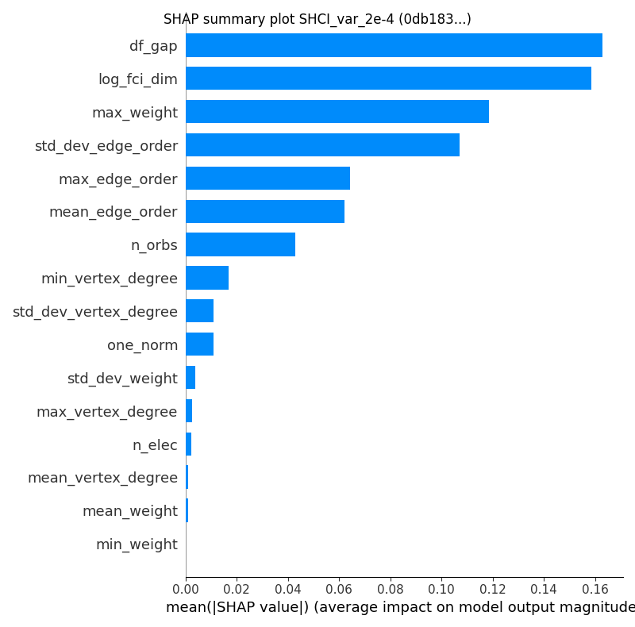

## Solver SHCI_var_2e-5, 86bfe50c-9342-4d54-bb68-abc8abd95688

solver_uuid:86bfe50c-9342-4d54-bb68-abc8abd95688

solver_short_name:SHCI_var_2e-5

compute_hardware_type:classical_computer

classical_hardware_details:{'computing_environment_name': 'LCRC Improv (per node)', 'cpu_description': '2x AMD EPYC 7713 64C', 'ram_available_gb': '256GB', 'clock_speed': '2 GHz', 'total_num_cores': 128}

algorithm_details:SHCI with eps_var 2e-5

software_details:SHCI Arrow Code (https://github.com/QMC-Cornell/shci).

performance_metrics_uuid: ea68f11e-3c93-4531-b116-dec3bb2bce04

creation_timestamp: 2026-03-11T16:10:15.716097+00:00

number_of_problem_instances: 68

number_of_problem_instances_attempted: 68

number_of_problem_instances_solved: 22

number_of_tasks: 228

number_of_tasks_attempted: 228

number_of_tasks_solved: 128

number_of_tasks_solved_within_run_time_limit: 227

number_of_tasks_solved_within_accuracy_threshold: 128

max_run_time_of_attempted_tasks: 77244.15200000002

sum_of_run_time_of_attempted_tasks: 1220721.795

solvability_ratio: 0.6486

comments: solvability ratio based on PCA embedding.

f1_score: [0.88, 0.9765625]

ml_metrics_calculator_version: 1


Note: plot only contains `attempted` tasks.


Note: plot only contains `attempted` tasks.


Note: `attempted` may be `True` or `False`.  Tasks with a `reference_energy` can be labeled as solved or failed-to-solve. A task with a `reference_energy` that was NOT `attempted` is labeled as a failed-to-solve.  White stars indicate Hamiltonians for which we do not have a `reference_energy`.


## Solver SHCI_var_5e-5, 01949b95-c427-4693-9134-01f47f688c09

solver_uuid:01949b95-c427-4693-9134-01f47f688c09

solver_short_name:SHCI_var_5e-5

compute_hardware_type:classical_computer

classical_hardware_details:{'computing_environment_name': 'LCRC Improv (per node)', 'cpu_description': '2x AMD EPYC 7713 64C', 'ram_available_gb': '256GB', 'clock_speed': '2 GHz', 'total_num_cores': 128}

algorithm_details:SHCI with eps_var 5e-5

software_details:SHCI Arrow Code (https://github.com/QMC-Cornell/shci).

performance_metrics_uuid: ee708716-cfd8-4d43-8478-363fab820681

creation_timestamp: 2026-03-11T16:10:15.716097+00:00

number_of_problem_instances: 68

number_of_problem_instances_attempted: 68

number_of_problem_instances_solved: 18

number_of_tasks: 228

number_of_tasks_attempted: 228

number_of_tasks_solved: 115

number_of_tasks_solved_within_run_time_limit: 227

number_of_tasks_solved_within_accuracy_threshold: 115

max_run_time_of_attempted_tasks: 77244.15200000002

sum_of_run_time_of_attempted_tasks: 1220721.795

solvability_ratio: 0.8749

comments: solvability ratio based on PCA embedding.

f1_score: [0.8395061728395061, 0.9422222222222222]

ml_metrics_calculator_version: 1


Note: plot only contains `attempted` tasks.


Note: plot only contains `attempted` tasks.


Note: `attempted` may be `True` or `False`.  Tasks with a `reference_energy` can be labeled as solved or failed-to-solve. A task with a `reference_energy` that was NOT `attempted` is labeled as a failed-to-solve.  White stars indicate Hamiltonians for which we do not have a `reference_energy`.


## Solver THC_QPE_1mHa, 18c187af-3e5b-4e6c-87fd-73c26fd48a60

solver_uuid:18c187af-3e5b-4e6c-87fd-73c26fd48a60

solver_short_name:THC_QPE_1mHa

compute_hardware_type:quantum_computer

algorithm_details:{'algorithm_description': 'Tensor Hypercontraction QPE resource estimates based on methodology of arXiv:2011.03494. Note that the truncation error is not included in the error bounds and that the SCF compute time is not included in the preprocessing time. Ground-state overlap is taken to be that estimated for the dominant CSF as estimated by DMRG and that this DMRG runtime is not included in the classical compute costs.', 'algorithm_parameters': {'overlap_csv': 'overlaps.csv'}, 'description': 'Tensor Hypercontraction QPE resource estimates for 1mHa accuracy (more stringent than benchmark-requested 1.59 mHa accuracy) based on methodology of arXiv:2011.03494. Note that the truncation error is not included in the error bounds and that the SCF compute time is not included in the preprocessing time. Ground-state overlap is taken to be that estimated for the dominant CSF as estimated by DMRG and that this DMRG runtime is not included in the classical compute costs.'}

software_details:[{'software_name': 'benchq', 'software_version': '0.7.1.dev10+g80b8279.d20250116'}, {'software_name': 'openfermion', 'software_version': '1.6.1'}, {'software_name': 'Python', 'software_version': '3.12.2'}, {'software_name': 'JAX', 'software_version': '0.4.31'}, {'software_name': 'benchq', 'software_version': '0.1.dev153+g3d429cb.d20250508'}]

logical_resource_estimate_solution_uuid:f9a5bd95-6968-4078-b115-88e5b7a7ddcb

quantum_hardware_details:{'quantum_hardware_description': 'Superconducting hardware model based on that described in https://arxiv.org/abs/2011.03494. Used with THC.', 'quantum_hardware_parameters': {'num_factories': 4, 'physical_error_rate': 0.001, 'cycle_time_microseconds': 1}}

logical_resource_estimate_solver_uuid:d6f49cca-6f10-4de8-bc94-4c6fe4d23296

performance_metrics_uuid: 222338cd-fd03-49be-9a47-d025064dd690

creation_timestamp: 2026-03-11T16:10:15.716097+00:00

number_of_problem_instances: 68

number_of_problem_instances_attempted: 3

number_of_problem_instances_solved: 0

number_of_tasks: 228

number_of_tasks_attempted: 23

number_of_tasks_solved: 0

number_of_tasks_solved_within_run_time_limit: 0

number_of_tasks_solved_within_accuracy_threshold: 23

max_run_time_of_attempted_tasks: 203781742944.55988

sum_of_run_time_of_attempted_tasks: 398497180382.5944

solvability_ratio: None

f1_score: None

ml_metrics_calculator_version: 1

comment: All labels were either all `True` or all `False` and we cannot create an ML model with only one class.


Note: plot only contains `attempted` tasks.


Note: plot only contains `attempted` tasks.


Note: `attempted` may be `True` or `False`.  Tasks with a `reference_energy` can be labeled as solved or failed-to-solve. A task with a `reference_energy` that was NOT `attempted` is labeled as a failed-to-solve.  White stars indicate Hamiltonians for which we do not have a `reference_energy`.

## Solver CISD, 418f060e-496b-4024-8d2d-9b1f8791e76d

solver_uuid:418f060e-496b-4024-8d2d-9b1f8791e76d

solver_short_name:CISD

compute_hardware_type:classical_computer

classical_hardware_details:{'computing_environment_name': 'LCRC Improv (per node)', 'cpu_description': '2x AMD EPYC 7713 64C', 'ram_available_gb': '256GB', 'clock_speed': '2 GHz', 'total_num_cores': 128}

algorithm_details:CISD

software_details:pyscf (https://github.com/pyscf/pyscf).

performance_metrics_uuid: 568d7a79-46b7-4c3b-83be-5fc63cc7d875

creation_timestamp: 2026-03-11T16:10:15.716097+00:00

number_of_problem_instances: 68

number_of_problem_instances_attempted: 68

number_of_problem_instances_solved: 13

number_of_tasks: 228

number_of_tasks_attempted: 228

number_of_tasks_solved: 21

number_of_tasks_solved_within_run_time_limit: 228

number_of_tasks_solved_within_accuracy_threshold: 21

max_run_time_of_attempted_tasks: 62.58296537399292

sum_of_run_time_of_attempted_tasks: 2147.015964984894

solvability_ratio: 0.0233

comments: solvability ratio based on PCA embedding.

f1_score: [0.9806949806949807, 0.8936170212765957]

ml_metrics_calculator_version: 1


Note: plot only contains `attempted` tasks.


Note: plot only contains `attempted` tasks.


Note: `attempted` may be `True` or `False`.  Tasks with a `reference_energy` can be labeled as solved or failed-to-solve. A task with a `reference_energy` that was NOT `attempted` is labeled as a failed-to-solve.  White stars indicate Hamiltonians for which we do not have a `reference_energy`.


## Solver CCSD, 0a29e54f-bef9-4d19-bafa-d94b1c4b37aa

solver_uuid:0a29e54f-bef9-4d19-bafa-d94b1c4b37aa

solver_short_name:CCSD

compute_hardware_type:classical_computer

classical_hardware_details:{'computing_environment_name': 'LCRC Improv (per node)', 'cpu_description': '2x AMD EPYC 7713 64C', 'ram_available_gb': '256GB', 'clock_speed': '2 GHz', 'total_num_cores': 128}

algorithm_details:CCSD

software_details:pyscf (https://github.com/pyscf/pyscf).

performance_metrics_uuid: 75838200-c127-42c0-9981-bec031932626

creation_timestamp: 2026-03-11T16:10:15.716097+00:00

number_of_problem_instances: 68

number_of_problem_instances_attempted: 64

number_of_problem_instances_solved: 14

number_of_tasks: 228

number_of_tasks_attempted: 217

number_of_tasks_solved: 27

number_of_tasks_solved_within_run_time_limit: 217

number_of_tasks_solved_within_accuracy_threshold: 27

max_run_time_of_attempted_tasks: 460.71552085876465

sum_of_run_time_of_attempted_tasks: 7096.755430221558

solvability_ratio: 0.011

comments: solvability ratio based on PCA embedding.

f1_score: [0.9879518072289156, 0.9473684210526315]

ml_metrics_calculator_version: 1


Note: plot only contains `attempted` tasks.


Note: plot only contains `attempted` tasks.


Note: `attempted` may be `True` or `False`.  Tasks with a `reference_energy` can be labeled as solved or failed-to-solve. A task with a `reference_energy` that was NOT `attempted` is labeled as a failed-to-solve.  White stars indicate Hamiltonians for which we do not have a `reference_energy`.


## Solver HF, 5f5e617a-19c2-4d82-bebc-b2d6b3dcb012

solver_uuid:5f5e617a-19c2-4d82-bebc-b2d6b3dcb012

solver_short_name:HF

compute_hardware_type:classical_computer

classical_hardware_details:{'computing_environment_name': 'LCRC Improv (per node)', 'cpu_description': '2x AMD EPYC 7713 64C', 'ram_available_gb': '256GB', 'clock_speed': '2 GHz', 'total_num_cores': 128}

algorithm_details:Hartree Fock

software_details:pyscf (https://github.com/pyscf/pyscf).

performance_metrics_uuid: c0b5ac94-82a1-4bb9-b5e9-5b6227961f6d

creation_timestamp: 2026-03-11T16:10:15.716097+00:00

number_of_problem_instances: 68

number_of_problem_instances_attempted: 68

number_of_problem_instances_solved: 6

number_of_tasks: 228

number_of_tasks_attempted: 228

number_of_tasks_solved: 6

number_of_tasks_solved_within_run_time_limit: 228

number_of_tasks_solved_within_accuracy_threshold: 6

max_run_time_of_attempted_tasks: 20.338801622390747

sum_of_run_time_of_attempted_tasks: 800.5601267814636

solvability_ratio: 0.0

comments: solvability ratio based on PCA embedding.

f1_score: [0.0, 0.07547169811320754]

ml_metrics_calculator_version: 1


Note: plot only contains `attempted` tasks.


Note: plot only contains `attempted` tasks.


Note: `attempted` may be `True` or `False`.  Tasks with a `reference_energy` can be labeled as solved or failed-to-solve. A task with a `reference_energy` that was NOT `attempted` is labeled as a failed-to-solve.  White stars indicate Hamiltonians for which we do not have a `reference_energy`.


## Solver MP2, b420358b-5def-41e6-8c5d-b9d93b6aecd2

solver_uuid:b420358b-5def-41e6-8c5d-b9d93b6aecd2

solver_short_name:MP2

compute_hardware_type:classical_computer

classical_hardware_details:{'computing_environment_name': 'LCRC Improv (per node)', 'cpu_description': '2x AMD EPYC 7713 64C', 'ram_available_gb': '256GB', 'clock_speed': '2 GHz', 'total_num_cores': 128}

algorithm_details:MP2

software_details:pyscf (https://github.com/pyscf/pyscf).

performance_metrics_uuid: c9428037-e651-4b85-80b9-bbf6c40e7b92

creation_timestamp: 2026-03-11T16:10:15.716097+00:00

number_of_problem_instances: 68

number_of_problem_instances_attempted: 65

number_of_problem_instances_solved: 6

number_of_tasks: 228

number_of_tasks_attempted: 220

number_of_tasks_solved: 6

number_of_tasks_solved_within_run_time_limit: 220

number_of_tasks_solved_within_accuracy_threshold: 6

max_run_time_of_attempted_tasks: 2.230440139770508

sum_of_run_time_of_attempted_tasks: 78.57580351829529

solvability_ratio: 0.0

comments: solvability ratio based on PCA embedding.

f1_score: [0.0, 0.07547169811320754]

ml_metrics_calculator_version: 1


Note: plot only contains `attempted` tasks.


Note: plot only contains `attempted` tasks.


Note: `attempted` may be `True` or `False`.  Tasks with a `reference_energy` can be labeled as solved or failed-to-solve. A task with a `reference_energy` that was NOT `attempted` is labeled as a failed-to-solve.  White stars indicate Hamiltonians for which we do not have a `reference_energy`.


## Solver CCSD(T), c09217e6-d0f7-4b0f-81c4-79210b7ac878

solver_uuid:c09217e6-d0f7-4b0f-81c4-79210b7ac878

solver_short_name:CCSD(T)

compute_hardware_type:classical_computer

classical_hardware_details:{'computing_environment_name': 'LCRC Improv (per node)', 'cpu_description': '2x AMD EPYC 7713 64C', 'ram_available_gb': '256GB', 'clock_speed': '2 GHz', 'total_num_cores': 128}

algorithm_details:CCSD(T)

software_details:pyscf (https://github.com/pyscf/pyscf).

performance_metrics_uuid: 68cd188d-f5a2-4448-a66b-498d59929dc0

creation_timestamp: 2026-03-11T16:10:15.716097+00:00

number_of_problem_instances: 68

number_of_problem_instances_attempted: 64

number_of_problem_instances_solved: 23

number_of_tasks: 228

number_of_tasks_attempted: 217

number_of_tasks_solved: 71

number_of_tasks_solved_within_run_time_limit: 217

number_of_tasks_solved_within_accuracy_threshold: 71

max_run_time_of_attempted_tasks: 469.1432478427887

sum_of_run_time_of_attempted_tasks: 7918.634609699249

solvability_ratio: 0.2847

comments: solvability ratio based on PCA embedding.

f1_score: [0.9685534591194969, 0.9659863945578231]

ml_metrics_calculator_version: 1


Note: plot only contains `attempted` tasks.


Note: plot only contains `attempted` tasks.


Note: `attempted` may be `True` or `False`.  Tasks with a `reference_energy` can be labeled as solved or failed-to-solve. A task with a `reference_energy` that was NOT `attempted` is labeled as a failed-to-solve.  White stars indicate Hamiltonians for which we do not have a `reference_energy`.


## Solver DF_QPE, 4b07b89f-c66f-4e72-8c24-df3e4222cb41

solver_uuid:4b07b89f-c66f-4e72-8c24-df3e4222cb41

solver_short_name:DF_QPE

compute_hardware_type:quantum_computer

algorithm_details:{'algorithm_description': 'Double factorized QPE resource estimates based on methodology of arXiv:2406.06335. Note that the truncation error is not included in the error bounds and that the SCF compute time is not included in the preprocessing time. Ground-state overlap is taken to be that estimated for the dominant CSF as estimated by DMRG and that this DMRG runtime is not included in the classical compute costs.', 'algorithm_parameters': {'overlap_csv': 'overlaps.csv', 'sf_threshold': 1e-12, 'df_threshold': 0.001, 'max_orbitals': 70}}

software_details:[{'software_name': 'pyLIQTR', 'software_version': '1.4.2'}, {'software_name': 'qb-gsee-benchmark', 'software_version': '0.1.0a3.dev107+gc9c6ccda3.d20260302'}, {'software_name': 'Python', 'software_version': '3.12.2 (main, Feb 26 2026, 10:21:15) [GCC 11.4.0]'}, {'software_name': 'qualtran', 'software_version': '0.4.0'}]

quantum_hardware_details:{'quantum_hardware_description': 'Optimistic superconducting hardware model based on that described in https://arxiv.org/abs/2011.03494. Assumes that enough QPUs are available to run all shots in parallel.', 'quantum_hardware_parameters': {'num_factories': 4, 'physical_error_rate': 0.0001, 'cycle_time_microseconds': 1, 'parallelize_shots': True}}

logical_resource_estimate_solution_uuid:612747d5-61ee-40cd-b440-0ad59c064c04

logical_resource_estimate_solver_uuid:f2d73e1f-3058-43c4-a634-b6c267c84ff1

performance_metrics_uuid: 97b33906-6c89-479b-a10b-ab80fde691bb

creation_timestamp: 2026-03-11T16:10:15.716097+00:00

number_of_problem_instances: 68

number_of_problem_instances_attempted: 22

number_of_problem_instances_solved: 3

number_of_tasks: 228

number_of_tasks_attempted: 131

number_of_tasks_solved: 3

number_of_tasks_solved_within_run_time_limit: 3

number_of_tasks_solved_within_accuracy_threshold: 131

max_run_time_of_attempted_tasks: 26774752769.01683

sum_of_run_time_of_attempted_tasks: 381759342046.6917

solvability_ratio: 0.0

comments: solvability ratio based on PCA embedding.

f1_score: [1.0, 1.0]

ml_metrics_calculator_version: 1


Note: plot only contains `attempted` tasks.


Note: plot only contains `attempted` tasks.


Note: `attempted` may be `True` or `False`.  Tasks with a `reference_energy` can be labeled as solved or failed-to-solve. A task with a `reference_energy` that was NOT `attempted` is labeled as a failed-to-solve.  White stars indicate Hamiltonians for which we do not have a `reference_energy`.


## Solver DF_QPE, 7c8ef984-4d3a-4468-8900-e0da3bd8b22d

solver_uuid:7c8ef984-4d3a-4468-8900-e0da3bd8b22d

solver_short_name:DF_QPE

compute_hardware_type:quantum_computer

algorithm_details:{'algorithm_description': 'Double factorized QPE resource estimates based on methodology of arXiv:2406.06335. Note that the truncation error is not included in the error bounds and that the SCF compute time is not included in the preprocessing time. Ground-state overlap is taken to be that estimated for the dominant CSF as estimated by DMRG and that this DMRG runtime is not included in the classical compute costs.', 'algorithm_parameters': {'overlap': 0.94868329805, 'sf_threshold': 1e-12, 'df_threshold': 0.001, 'max_orbitals': 70}}

software_details:[{'software_name': 'benchq', 'software_version': '0.7.1.dev10+g80b8279.d20250116'}, {'software_name': 'openfermion', 'software_version': '1.6.1'}, {'software_name': 'Python', 'software_version': '3.11.5 (main, Sep 11 2023, 08:31:25) [Clang 14.0.6 ]'}, {'software_name': 'benchq', 'software_version': '0.7.1.dev10+g80b8279.d20250116'}]

quantum_hardware_details:{'quantum_hardware_description': 'Superconducting hardware model based on the optimistic model described in https://arxiv.org/abs/2011.03494.', 'quantum_hardware_parameters': {'num_factories': 4, 'physical_error_rate': 0.0001, 'cycle_time_microseconds': 1}}

logical_resource_estimate_solution_uuid:e135679c-e314-4808-9634-252bc376d295

logical_resource_estimate_solver_uuid:f2d73e1f-3058-43c4-a634-b6c267c84ff1

performance_metrics_uuid: d8def2ae-3e71-4bdb-9027-5e679fe5f540

creation_timestamp: 2026-03-11T16:10:15.716097+00:00

number_of_problem_instances: 68

number_of_problem_instances_attempted: 4

number_of_problem_instances_solved: 1

number_of_tasks: 228

number_of_tasks_attempted: 24

number_of_tasks_solved: 1

number_of_tasks_solved_within_run_time_limit: 1

number_of_tasks_solved_within_accuracy_threshold: 24

max_run_time_of_attempted_tasks: 451622221.769206

sum_of_run_time_of_attempted_tasks: 4206142119.554202

solvability_ratio: 0.0

comments: solvability ratio based on PCA embedding., ML model calculated without `GridSearchCV`

f1_score: [0.9370629370629371, 0.1]

ml_metrics_calculator_version: 1


Note: plot only contains `attempted` tasks.


Note: plot only contains `attempted` tasks.


Note: `attempted` may be `True` or `False`.  Tasks with a `reference_energy` can be labeled as solved or failed-to-solve. A task with a `reference_energy` that was NOT `attempted` is labeled as a failed-to-solve.  White stars indicate Hamiltonians for which we do not have a `reference_energy`.


## Solver DF_QPE, f6b36bde-be4a-4eee-975b-2c5f7e553f5f

solver_uuid:f6b36bde-be4a-4eee-975b-2c5f7e553f5f

solver_short_name:DF_QPE

compute_hardware_type:quantum_computer

algorithm_details:{'algorithm_description': 'Double factorized QPE resource estimates based on methodology of arXiv:2406.06335. Note that the truncation error is not included in the error bounds and that the SCF compute time is not included in the preprocessing time. Ground-state overlap is taken to be that estimated for the dominant CSF as estimated by DMRG and that this DMRG runtime is not included in the classical compute costs.', 'algorithm_parameters': {'overlap_csv': 'overlaps.csv', 'sf_threshold': 1e-12, 'df_threshold': 0.001, 'max_orbitals': 70}}

software_details:[{'software_name': 'pyLIQTR', 'software_version': '1.4.2'}, {'software_name': 'qb-gsee-benchmark', 'software_version': '0.1.0a3.dev107+gc9c6ccda3.d20260302'}, {'software_name': 'Python', 'software_version': '3.12.2 (main, Feb 26 2026, 10:21:15) [GCC 11.4.0]'}, {'software_name': 'qualtran', 'software_version': '0.4.0'}]

quantum_hardware_details:{'quantum_hardware_description': 'Ultra-optimistic hardware model based on the superconducting architecture described in https://arxiv.org/abs/2011.03494.', 'quantum_hardware_parameters': {'num_factories': 4, 'physical_error_rate': 1e-06, 'cycle_time_microseconds': 0.1, 'parallelize_shots': False}}

logical_resource_estimate_solution_uuid:712bb942-1d58-4bfb-bdee-a7635f0b9cd7

logical_resource_estimate_solver_uuid:f2d73e1f-3058-43c4-a634-b6c267c84ff1

performance_metrics_uuid: 33cb9092-857f-4795-a9d3-16fc7fd3aa9c

creation_timestamp: 2026-03-11T16:10:15.716097+00:00

number_of_problem_instances: 68

number_of_problem_instances_attempted: 24

number_of_problem_instances_solved: 4

number_of_tasks: 228

number_of_tasks_attempted: 137

number_of_tasks_solved: 5

number_of_tasks_solved_within_run_time_limit: 5

number_of_tasks_solved_within_accuracy_threshold: 137

max_run_time_of_attempted_tasks: 7188148034586.839

sum_of_run_time_of_attempted_tasks: 9230378066161.62

solvability_ratio: 0.013

comments: solvability ratio based on PCA embedding.

f1_score: [0.9931972789115646, 0.8333333333333334]

ml_metrics_calculator_version: 1


Note: plot only contains `attempted` tasks.


Note: plot only contains `attempted` tasks.


Note: `attempted` may be `True` or `False`.  Tasks with a `reference_energy` can be labeled as solved or failed-to-solve. A task with a `reference_energy` that was NOT `attempted` is labeled as a failed-to-solve.  White stars indicate Hamiltonians for which we do not have a `reference_energy`.


## Solver DF_QPE, 5d768520-b3d0-4292-bbb4-9776fa128107

solver_uuid:5d768520-b3d0-4292-bbb4-9776fa128107

solver_short_name:DF_QPE

compute_hardware_type:quantum_computer

algorithm_details:{'algorithm_description': 'Double factorized QPE resource estimates based on methodology of arXiv:2406.06335. Note that the truncation error is not included in the error bounds and that the SCF compute time is not included in the preprocessing time. Ground-state overlap is taken to be that estimated for the dominant CSF as estimated by DMRG and that this DMRG runtime is not included in the classical compute costs.', 'algorithm_parameters': {'overlap_csv': 'overlaps.csv', 'sf_threshold': 1e-12, 'df_threshold': 0.001, 'max_orbitals': 70}}

software_details:[{'software_name': 'pyLIQTR', 'software_version': '1.4.2'}, {'software_name': 'qb-gsee-benchmark', 'software_version': '0.1.0a3.dev107+gc9c6ccda3.d20260302'}, {'software_name': 'Python', 'software_version': '3.12.2 (main, Feb 26 2026, 10:21:15) [GCC 11.4.0]'}, {'software_name': 'qualtran', 'software_version': '0.4.0'}]

quantum_hardware_details:{'quantum_hardware_description': 'Superconducting hardware model based on that described in https://arxiv.org/abs/2011.03494 with an extremely optimistic physical error rate.', 'quantum_hardware_parameters': {'num_factories': 4, 'physical_error_rate': 1e-06, 'cycle_time_microseconds': 1, 'parallelize_shots': False}}

logical_resource_estimate_solution_uuid:27aa9788-c0c7-4f8e-ba5b-315099c05240

logical_resource_estimate_solver_uuid:f2d73e1f-3058-43c4-a634-b6c267c84ff1

performance_metrics_uuid: 17a84be6-9906-4013-877c-95fc09ecdae3

creation_timestamp: 2026-03-11T16:10:15.716097+00:00

number_of_problem_instances: 68

number_of_problem_instances_attempted: 24

number_of_problem_instances_solved: 2

number_of_tasks: 228

number_of_tasks_attempted: 137

number_of_tasks_solved: 2

number_of_tasks_solved_within_run_time_limit: 2

number_of_tasks_solved_within_accuracy_threshold: 137

max_run_time_of_attempted_tasks: 71881480309304.23

sum_of_run_time_of_attempted_tasks: 92303779438561.5

solvability_ratio: 0.0394

comments: solvability ratio based on PCA embedding.

f1_score: [1.0, 1.0]

ml_metrics_calculator_version: 1


Note: plot only contains `attempted` tasks.


Note: plot only contains `attempted` tasks.

Note: `attempted` may be `True` or `False`.  Tasks with a `reference_energy` can be labeled as solved or failed-to-solve. A task with a `reference_energy` that was NOT `attempted` is labeled as a failed-to-solve.  White stars indicate Hamiltonians for which we do not have a `reference_energy`.


## Solver DMRG_Niagara_cluster_lowest_energy, 16537433-9f4c-4eae-a65d-787dc3b35b59

solver_uuid:16537433-9f4c-4eae-a65d-787dc3b35b59

solver_short_name:DMRG_Niagara_cluster_lowest_energy

compute_hardware_type:classical_computer

classical_hardware_details:{'computing_environment_name': 'Niagara Cluster, Compute Canada', 'cpu_description': '40 Intel "Skylake" cores at 2.4 GHz or 40 Intel "CascadeLake" cores at 2.5 GHz', 'ram_available_gb': '202 GB (188 GiB)', 'clock_speed': '2.4 GHz or 2.5 GHz', 'total_num_cores': 40}

algorithm_details:DMRG with the lowest variational energy obtained so far.

software_details:Block2 v0.5.3rc16 with dmrghandler, commit version d603fdc6409fc194a416aa3a519362d5d91790d9 or later.

performance_metrics_uuid: f8154ef4-ac18-45bd-8477-25be72fdd5eb

creation_timestamp: 2026-03-11T16:10:15.716097+00:00

number_of_problem_instances: 68

number_of_problem_instances_attempted: 68

number_of_problem_instances_solved: 13

number_of_tasks: 228

number_of_tasks_attempted: 228

number_of_tasks_solved: 107

number_of_tasks_solved_within_run_time_limit: 228

number_of_tasks_solved_within_accuracy_threshold: 107

max_run_time_of_attempted_tasks: 80820.729907066

sum_of_run_time_of_attempted_tasks: 1841774.7109000839

solvability_ratio: 0.4126

comments: solvability ratio based on PCA embedding.

f1_score: [0.9130434782608695, 0.9626168224299065]

ml_metrics_calculator_version: 1


Note: plot only contains `attempted` tasks.


Note: plot only contains `attempted` tasks.


Note: `attempted` may be `True` or `False`.  Tasks with a `reference_energy` can be labeled as solved or failed-to-solve. A task with a `reference_energy` that was NOT `attempted` is labeled as a failed-to-solve.  White stars indicate Hamiltonians for which we do not have a `reference_energy`.


# ML Feature Analysis


Features: ['max_vertex_degree', 'min_vertex_degree', 'mean_vertex_degree', 'std_dev_vertex_degree', 'max_weight', 'min_weight', 'mean_weight', 'std_dev_weight', 'max_edge_order', 'mean_edge_order', 'std_dev_edge_order', 'one_norm', 'log_fci_dim', 'n_elec', 'n_orbs', 'df_gap']

NNMF Component 1: [0.44176701 0.45449395 0.45163263 0.4206377  0.51199883 0.
 0.         0.04944855 0.87023998 0.88722992 0.85986962 0.45957332
 0.87154483 0.56686512 0.8574673  0.51617008]

NNMF Component 2: [0.         0.         0.         0.         0.05545233 1.03487444
 0.54168445 0.41821312 0.07259491 0.01856936 0.0876162  0.
 0.1752886  0.11462803 0.07264437 0.        ]


Features: ['max_vertex_degree', 'min_vertex_degree', 'mean_vertex_degree', 'std_dev_vertex_degree', 'max_weight', 'min_weight', 'mean_weight', 'std_dev_weight', 'max_edge_order', 'mean_edge_order', 'std_dev_edge_order', 'one_norm', 'log_fci_dim', 'n_elec', 'n_orbs', 'df_gap']

PCA Component 1: [-0.22922229 -0.21461603 -0.23398401 -0.21923522 -0.16402432  0.39183587
  0.20302013  0.14659357 -0.3134204  -0.33485059 -0.30553226 -0.22630863
 -0.2258685  -0.10070305 -0.31226268 -0.20457232]

PCA Component 2: [ 0.22146419  0.13713247  0.22479465  0.21502049  0.02836024  0.66237732
  0.34970611  0.22348305  0.1309698   0.08010198  0.14460543  0.21623573
 -0.07605394 -0.30861836  0.14283042  0.10453104]


