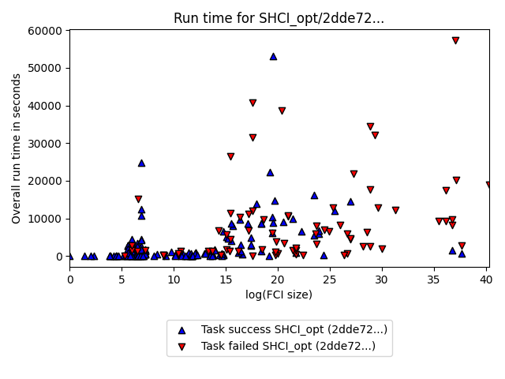
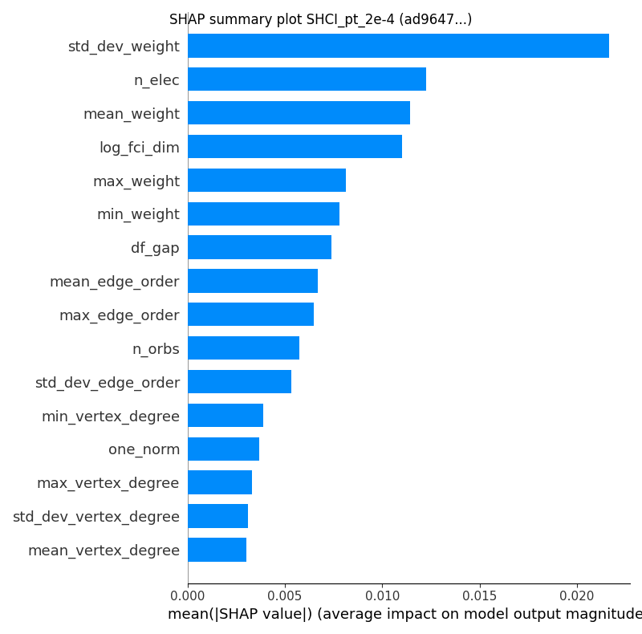
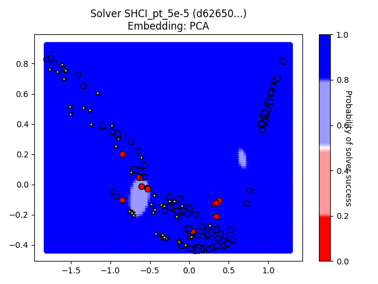
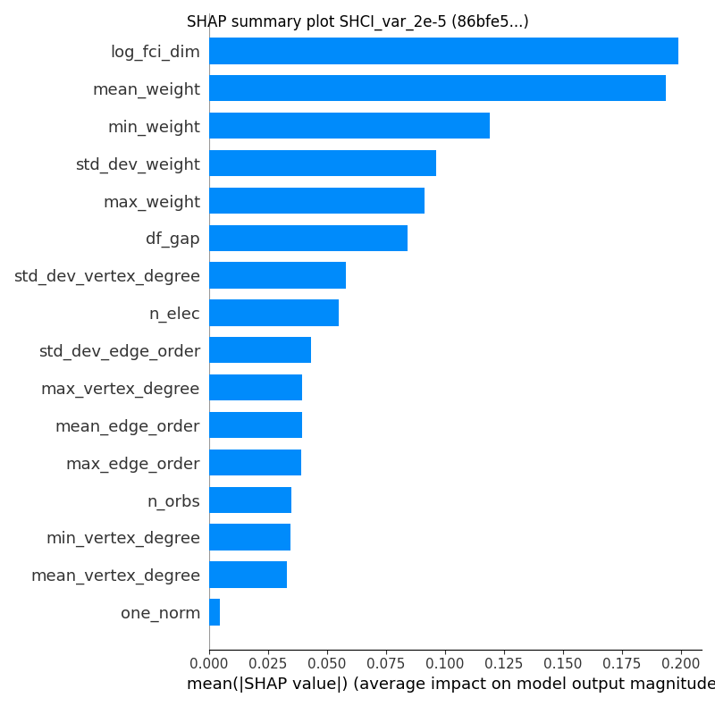
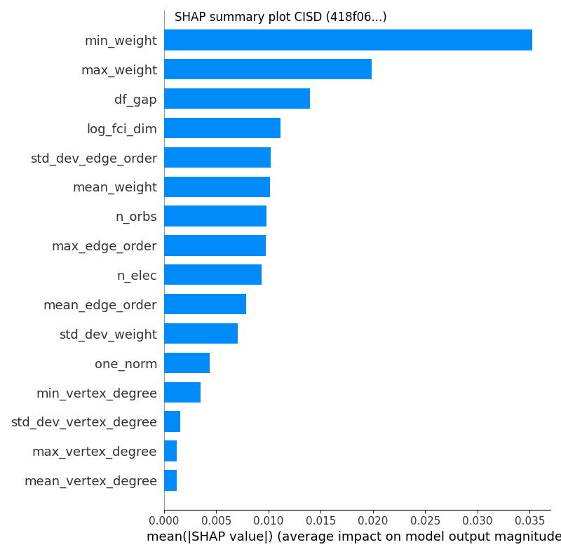
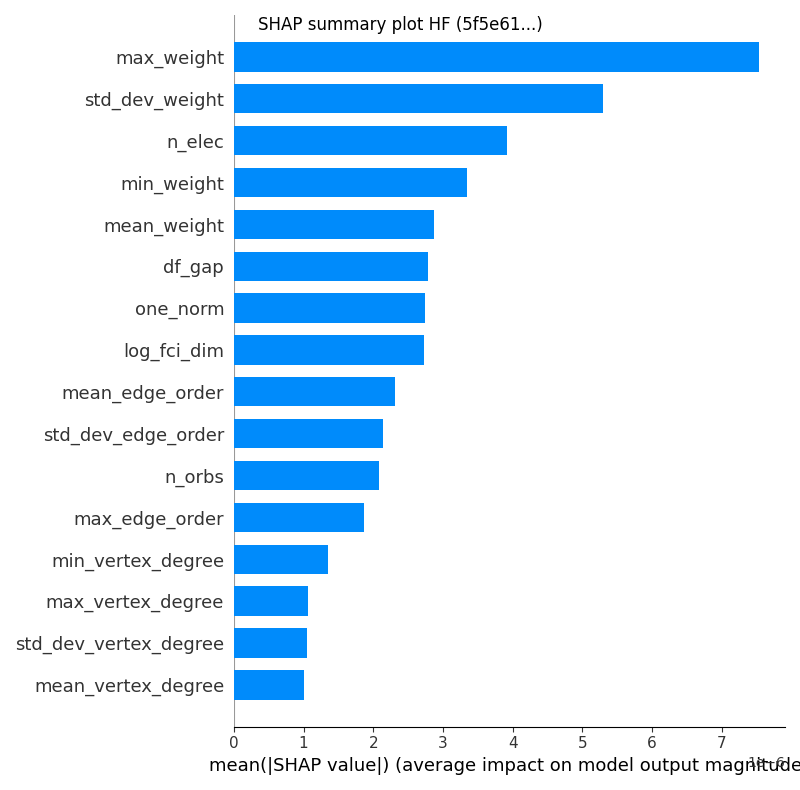

# GSEE Benchmark Standard Report

Report based on data from 2025-02-11T14:17:47.615513+00:00

[https://github.com/isi-usc-edu/qb-gsee-benchmark](https://github.com/isi-usc-edu/qb-gsee-benchmark)

Input data: `Hamiltonian_features.csv`, last modified Wed Jan 29 10:24:10 2025

Input data: `GSEE-HC_utility_estimates_all_instances_task_uuids_v2.csv`, last modified Thu Jan  9 12:11:19 2025

Latest creation time for a `problem_instance.json` file: Mon Jan 27 11:42:37 2025

Latest creation time for a `solution.json` file: Tue Feb 11 09:05:20 2025

# Problem Instance Summary Statistics

number of `problem_instances`: 84.

`problem_instance.json` with the most tasks: 30 (hubbard_square/614c4444-a31a-4348-b24d-01040208651c)

number of Hamiltonians (i.e., tasks) we have features calculated for: 276

minimum number of orbitals: 6

median number of orbitals: 42.0

maximum number of orbitals: 135

# Solver Summary Statistics

number of unique participating solvers: 17

Solver: SHCI_opt/2dde727e-a881-44fa-aabf-bba6248e4baf, ML Solvability Ratio: {'PCA': 1.0, 'NNMF': 1.0}, F1 Score: [0.83333333 0.99342105]

Solver: SHCI_pt_1e-4/4ed500f1-0650-41e3-af00-e4d0359394b4, ML Solvability Ratio: {'PCA': 0.9707, 'NNMF': 0.9859}, F1 Score: [0.71428571 0.97222222]

Solver: SHCI_var_1e-4/7e730dfb-57ee-480b-a8a1-4b73f5f07c54, ML Solvability Ratio: {'PCA': 0.8691, 'NNMF': 0.8794}, F1 Score: [0.99212598 0.99470899]

Solver: SHCI_pt_2e-4/ad964781-302e-4728-a26d-39918e0a6cdb, ML Solvability Ratio: {'PCA': 1.0, 'NNMF': 1.0}, F1 Score: [0.64516129 0.96140351]

Solver: SHCI_pt_2e-5/c71b90bd-3250-4c0c-b4e7-fc9878f141f6, ML Solvability Ratio: {'PCA': 1.0, 'NNMF': 1.0}, F1 Score: [0.375      0.96666667]

Solver: SHCI_pt_5e-5/d626506c-7aae-4ad6-802a-b29af5f2bb93, ML Solvability Ratio: {'PCA': 1.0, 'NNMF': 1.0}, F1 Score: [0.9375     0.99295775]

Solver: SHCI_var_2e-4/0db183e3-a86d-491b-9125-599556e37c7a, ML Solvability Ratio: {'PCA': 0.3499, 'NNMF': 0.0833}, F1 Score: [0.95364238 0.95757576]

Solver: SHCI_var_2e-5/86bfe50c-9342-4d54-bb68-abc8abd95688, ML Solvability Ratio: {'PCA': 0.5812, 'NNMF': 0.3942}, F1 Score: [0.8627451  0.97358491]

Solver: SHCI_var_5e-5/01949b95-c427-4693-9134-01f47f688c09, ML Solvability Ratio: {'PCA': 0.6393, 'NNMF': 0.3549}, F1 Score: [0.83950617 0.94468085]

Solver: DF_QPE/5dad4064-cd11-412f-85cb-d722afe3b3de, Model could not be calculated.

Solver: CISD/418f060e-496b-4024-8d2d-9b1f8791e76d, ML Solvability Ratio: {'PCA': 0.0079, 'NNMF': 0.003}, F1 Score: [0.97826087 0.85      ]

Solver: CCSD(T)/c09217e6-d0f7-4b0f-81c4-79210b7ac878, ML Solvability Ratio: {'PCA': 0.6011, 'NNMF': 0.8102}, F1 Score: [0.86956522 0.86451613]

Solver: HF/5f5e617a-19c2-4d82-bebc-b2d6b3dcb012, ML Solvability Ratio: {'PCA': 0.0, 'NNMF': 0.0}, F1 Score: [0.98675497 0.71428571]

Solver: MP2/b420358b-5def-41e6-8c5d-b9d93b6aecd2, ML Solvability Ratio: {'PCA': 0.0, 'NNMF': 0.0}, F1 Score: [0.98675497 0.71428571]

Solver: CCSD/0a29e54f-bef9-4d19-bafa-d94b1c4b37aa, ML Solvability Ratio: {'PCA': 0.0, 'NNMF': 0.0197}, F1 Score: [0.98867925 0.94117647]

Solver: DMRG_Niagara_cluster_lowest_energy/16537433-9f4c-4eae-a65d-787dc3b35b59, ML Solvability Ratio: {'PCA': 0.5461, 'NNMF': 0.6106}, F1 Score: [0.96629213 0.98678414]

Solver: DF_QPE/6f385080-934b-4cbb-b813-39c2cb61349e, Model could not be calculated.

NOTE: only `attempted` tasks are plotted on the chart.  Triangle up/down indicates solved/unsolved.

NOTE: only `attempted` tasks are plotted on the chart.  Triangle up/down indicates solved/unsolved.

NOTE: only `attempted` tasks are plotted on the chart.  Triangle up/down indicates solved/unsolved.

NOTE: only `attempted` tasks are plotted on the chart.  Triangle up/down indicates solved/unsolved.

NOTE: only `attempted` tasks are plotted on the chart.  Triangle up/down indicates solved/unsolved.

## Solver SHCI_opt, 2dde727e-a881-44fa-aabf-bba6248e4baf

solver_uuid:2dde727e-a881-44fa-aabf-bba6248e4baf

solver_short_name:SHCI_opt

compute_hardware_type:classical_computer

classical_hardware_details:{'computing_environment_name': 'LCRC Improv (per node)', 'cpu_description': '2x AMD EPYC 7713 64C', 'ram_available_gb': '256GB', 'clock_speed': '2 GHz', 'total_num_cores': 128}

algorithm_details:SHCI with optimized orbitals followed by SHCI+PT

software_details:SHCI Arrow Code (https://github.com/QMC-Cornell/shci).

performance_metrics_uuid: 033beb97-92f8-40f4-8ebd-3fe645f3a33e

creation_timestamp: 2025-02-11T14:17:47.615513+00:00

number_of_problem_instances: 84

number_of_problem_instances_attempted: 80

number_of_problem_instances_solved: 33

number_of_tasks: 276

number_of_tasks_attempted: 265

number_of_tasks_solved: 153

number_of_tasks_solved_within_run_time_limit: 265

number_of_tasks_solved_within_accuracy_threshold: 153

max_run_time_of_attempted_tasks: 57334.2

sum_of_run_time_of_attempted_tasks: 1553340.6179999998

solvability_ratio: 1.0

comment: solvability ratio based on PCA embedding.

f1_score: [0.8333333333333334, 0.993421052631579]

ml_metrics_calculator_version: 1

Note: plot only contains `attempted` tasks.

Note: plot only contains `attempted` tasks.

![Solver utility capture]supporting_artifacts/(solver_2dde727e-a881-44fa-aabf-bba6248e4baf_utility_capture_plot.png)

Note: `attempted` may be `True` or `False`.  Tasks with a `reference_energy` can be labeled as solved or failed-to-solve. A task with a `reference_energy` that was NOT `attempted` is labeled as a failed-to-solve.  White stars indicate Hamiltonians for which we do not have a `reference_energy`.

## Solver SHCI_pt_1e-4, 4ed500f1-0650-41e3-af00-e4d0359394b4

solver_uuid:4ed500f1-0650-41e3-af00-e4d0359394b4

solver_short_name:SHCI_pt_1e-4

compute_hardware_type:classical_computer

classical_hardware_details:{'computing_environment_name': 'LCRC Improv (per node)', 'cpu_description': '2x AMD EPYC 7713 64C', 'ram_available_gb': '256GB', 'clock_speed': '2 GHz', 'total_num_cores': 128}

algorithm_details:SHCI with eps_var 1e-4 + PT

software_details:SHCI Arrow Code (https://github.com/QMC-Cornell/shci).

performance_metrics_uuid: 2d4d2ebd-f2bc-4f27-a14c-8434e6caa859

creation_timestamp: 2025-02-11T14:17:47.615513+00:00

number_of_problem_instances: 84

number_of_problem_instances_attempted: 83

number_of_problem_instances_solved: 22

number_of_tasks: 276

number_of_tasks_attempted: 275

number_of_tasks_solved: 140

number_of_tasks_solved_within_run_time_limit: 275

number_of_tasks_solved_within_accuracy_threshold: 140

max_run_time_of_attempted_tasks: 77244.15200000002

sum_of_run_time_of_attempted_tasks: 1863349.633000001

solvability_ratio: 0.9707

comment: solvability ratio based on PCA embedding.

f1_score: [0.7142857142857143, 0.9722222222222222]

ml_metrics_calculator_version: 1

Note: plot only contains `attempted` tasks.

Note: plot only contains `attempted` tasks.

![Solver utility capture]supporting_artifacts/(solver_4ed500f1-0650-41e3-af00-e4d0359394b4_utility_capture_plot.png)

Note: `attempted` may be `True` or `False`.  Tasks with a `reference_energy` can be labeled as solved or failed-to-solve. A task with a `reference_energy` that was NOT `attempted` is labeled as a failed-to-solve.  White stars indicate Hamiltonians for which we do not have a `reference_energy`.

## Solver SHCI_var_1e-4, 7e730dfb-57ee-480b-a8a1-4b73f5f07c54

solver_uuid:7e730dfb-57ee-480b-a8a1-4b73f5f07c54

solver_short_name:SHCI_var_1e-4

compute_hardware_type:classical_computer

classical_hardware_details:{'computing_environment_name': 'LCRC Improv (per node)', 'cpu_description': '2x AMD EPYC 7713 64C', 'ram_available_gb': '256GB', 'clock_speed': '2 GHz', 'total_num_cores': 128}

algorithm_details:SHCI with eps_var 1e-4

software_details:SHCI Arrow Code (https://github.com/QMC-Cornell/shci).

performance_metrics_uuid: 10f22256-d455-4655-b1cb-03bb30979576

creation_timestamp: 2025-02-11T14:17:47.615513+00:00

number_of_problem_instances: 84

number_of_problem_instances_attempted: 83

number_of_problem_instances_solved: 13

number_of_tasks: 276

number_of_tasks_attempted: 275

number_of_tasks_solved: 95

number_of_tasks_solved_within_run_time_limit: 275

number_of_tasks_solved_within_accuracy_threshold: 95

max_run_time_of_attempted_tasks: 77244.15200000002

sum_of_run_time_of_attempted_tasks: 1863349.633000001

solvability_ratio: 0.8691

comment: solvability ratio based on PCA embedding.

f1_score: [0.9921259842519685, 0.9947089947089947]

ml_metrics_calculator_version: 1

Note: plot only contains `attempted` tasks.

Note: plot only contains `attempted` tasks.

![Solver utility capture]supporting_artifacts/(solver_7e730dfb-57ee-480b-a8a1-4b73f5f07c54_utility_capture_plot.png)

Note: `attempted` may be `True` or `False`.  Tasks with a `reference_energy` can be labeled as solved or failed-to-solve. A task with a `reference_energy` that was NOT `attempted` is labeled as a failed-to-solve.  White stars indicate Hamiltonians for which we do not have a `reference_energy`.

## Solver SHCI_pt_2e-4, ad964781-302e-4728-a26d-39918e0a6cdb

solver_uuid:ad964781-302e-4728-a26d-39918e0a6cdb

solver_short_name:SHCI_pt_2e-4

compute_hardware_type:classical_computer

classical_hardware_details:{'computing_environment_name': 'LCRC Improv (per node)', 'cpu_description': '2x AMD EPYC 7713 64C', 'ram_available_gb': '256GB', 'clock_speed': '2 GHz', 'total_num_cores': 128}

algorithm_details:SHCI with eps_var 2e-4 + PT

software_details:SHCI Arrow Code (https://github.com/QMC-Cornell/shci).

performance_metrics_uuid: 6cb3879c-b0e6-481a-b25c-4304d5f4db88

creation_timestamp: 2025-02-11T14:17:47.615513+00:00

number_of_problem_instances: 84

number_of_problem_instances_attempted: 83

number_of_problem_instances_solved: 22

number_of_tasks: 276

number_of_tasks_attempted: 275

number_of_tasks_solved: 137

number_of_tasks_solved_within_run_time_limit: 275

number_of_tasks_solved_within_accuracy_threshold: 137

max_run_time_of_attempted_tasks: 77244.15200000002

sum_of_run_time_of_attempted_tasks: 1863349.633000001

solvability_ratio: 1.0

comment: solvability ratio based on PCA embedding.

f1_score: [0.6451612903225806, 0.9614035087719298]

ml_metrics_calculator_version: 1

Note: plot only contains `attempted` tasks.

Note: plot only contains `attempted` tasks.

![Solver utility capture]supporting_artifacts/(solver_ad964781-302e-4728-a26d-39918e0a6cdb_utility_capture_plot.png)

Note: `attempted` may be `True` or `False`.  Tasks with a `reference_energy` can be labeled as solved or failed-to-solve. A task with a `reference_energy` that was NOT `attempted` is labeled as a failed-to-solve.  White stars indicate Hamiltonians for which we do not have a `reference_energy`.

## Solver SHCI_pt_2e-5, c71b90bd-3250-4c0c-b4e7-fc9878f141f6

solver_uuid:c71b90bd-3250-4c0c-b4e7-fc9878f141f6

solver_short_name:SHCI_pt_2e-5

compute_hardware_type:classical_computer

classical_hardware_details:{'computing_environment_name': 'LCRC Improv (per node)', 'cpu_description': '2x AMD EPYC 7713 64C', 'ram_available_gb': '256GB', 'clock_speed': '2 GHz', 'total_num_cores': 128}

algorithm_details:SHCI with eps_var 2e-5 + PT

software_details:SHCI Arrow Code (https://github.com/QMC-Cornell/shci).

performance_metrics_uuid: 6dfc5696-0c6c-49d2-9749-433c1bbf7784

creation_timestamp: 2025-02-11T14:17:47.615513+00:00

number_of_problem_instances: 84

number_of_problem_instances_attempted: 83

number_of_problem_instances_solved: 26

number_of_tasks: 276

number_of_tasks_attempted: 275

number_of_tasks_solved: 145

number_of_tasks_solved_within_run_time_limit: 275

number_of_tasks_solved_within_accuracy_threshold: 145

max_run_time_of_attempted_tasks: 77244.15200000002

sum_of_run_time_of_attempted_tasks: 1863349.633000001

solvability_ratio: 1.0

comment: solvability ratio based on PCA embedding.

f1_score: [0.375, 0.9666666666666667]

ml_metrics_calculator_version: 1

Note: plot only contains `attempted` tasks.

Note: plot only contains `attempted` tasks.

![Solver utility capture]supporting_artifacts/(solver_c71b90bd-3250-4c0c-b4e7-fc9878f141f6_utility_capture_plot.png)

Note: `attempted` may be `True` or `False`.  Tasks with a `reference_energy` can be labeled as solved or failed-to-solve. A task with a `reference_energy` that was NOT `attempted` is labeled as a failed-to-solve.  White stars indicate Hamiltonians for which we do not have a `reference_energy`.

## Solver SHCI_pt_5e-5, d626506c-7aae-4ad6-802a-b29af5f2bb93

solver_uuid:d626506c-7aae-4ad6-802a-b29af5f2bb93

solver_short_name:SHCI_pt_5e-5

compute_hardware_type:classical_computer

classical_hardware_details:{'computing_environment_name': 'LCRC Improv (per node)', 'cpu_description': '2x AMD EPYC 7713 64C', 'ram_available_gb': '256GB', 'clock_speed': '2 GHz', 'total_num_cores': 128}

algorithm_details:SHCI with eps_var 5e-5 + PT

software_details:SHCI Arrow Code (https://github.com/QMC-Cornell/shci).

performance_metrics_uuid: 467e9815-566e-4263-aea5-07dcbf626a07

creation_timestamp: 2025-02-11T14:17:47.615513+00:00

number_of_problem_instances: 84

number_of_problem_instances_attempted: 83

number_of_problem_instances_solved: 24

number_of_tasks: 276

number_of_tasks_attempted: 275

number_of_tasks_solved: 143

number_of_tasks_solved_within_run_time_limit: 275

number_of_tasks_solved_within_accuracy_threshold: 143

max_run_time_of_attempted_tasks: 77244.15200000002

sum_of_run_time_of_attempted_tasks: 1863349.633000001

solvability_ratio: 1.0

comment: solvability ratio based on PCA embedding.

f1_score: [0.9375, 0.9929577464788732]

ml_metrics_calculator_version: 1

Note: plot only contains `attempted` tasks.

Note: plot only contains `attempted` tasks.

![Solver utility capture]supporting_artifacts/(solver_d626506c-7aae-4ad6-802a-b29af5f2bb93_utility_capture_plot.png)

Note: `attempted` may be `True` or `False`.  Tasks with a `reference_energy` can be labeled as solved or failed-to-solve. A task with a `reference_energy` that was NOT `attempted` is labeled as a failed-to-solve.  White stars indicate Hamiltonians for which we do not have a `reference_energy`.

## Solver SHCI_var_2e-4, 0db183e3-a86d-491b-9125-599556e37c7a

solver_uuid:0db183e3-a86d-491b-9125-599556e37c7a

solver_short_name:SHCI_var_2e-4

compute_hardware_type:classical_computer

classical_hardware_details:{'computing_environment_name': 'LCRC Improv (per node)', 'cpu_description': '2x AMD EPYC 7713 64C', 'ram_available_gb': '256GB', 'clock_speed': '2 GHz', 'total_num_cores': 128}

algorithm_details:SHCI with eps_var 2e-4

software_details:SHCI Arrow Code (https://github.com/QMC-Cornell/shci).

performance_metrics_uuid: 50e426a2-d5d6-40d2-adfd-426d9b778698

creation_timestamp: 2025-02-11T14:17:47.615513+00:00

number_of_problem_instances: 84

number_of_problem_instances_attempted: 83

number_of_problem_instances_solved: 13

number_of_tasks: 276

number_of_tasks_attempted: 275

number_of_tasks_solved: 84

number_of_tasks_solved_within_run_time_limit: 275

number_of_tasks_solved_within_accuracy_threshold: 84

max_run_time_of_attempted_tasks: 77244.15200000002

sum_of_run_time_of_attempted_tasks: 1863349.633000001

solvability_ratio: 0.3499

comment: solvability ratio based on PCA embedding.

f1_score: [0.9536423841059603, 0.9575757575757575]

ml_metrics_calculator_version: 1

Note: plot only contains `attempted` tasks.

Note: plot only contains `attempted` tasks.

![Solver utility capture]supporting_artifacts/(solver_0db183e3-a86d-491b-9125-599556e37c7a_utility_capture_plot.png)

Note: `attempted` may be `True` or `False`.  Tasks with a `reference_energy` can be labeled as solved or failed-to-solve. A task with a `reference_energy` that was NOT `attempted` is labeled as a failed-to-solve.  White stars indicate Hamiltonians for which we do not have a `reference_energy`.

## Solver SHCI_var_2e-5, 86bfe50c-9342-4d54-bb68-abc8abd95688

solver_uuid:86bfe50c-9342-4d54-bb68-abc8abd95688

solver_short_name:SHCI_var_2e-5

compute_hardware_type:classical_computer

classical_hardware_details:{'computing_environment_name': 'LCRC Improv (per node)', 'cpu_description': '2x AMD EPYC 7713 64C', 'ram_available_gb': '256GB', 'clock_speed': '2 GHz', 'total_num_cores': 128}

algorithm_details:SHCI with eps_var 2e-5

software_details:SHCI Arrow Code (https://github.com/QMC-Cornell/shci).

performance_metrics_uuid: eb26f8df-2ae8-4037-a0d0-60b8e64d0d37

creation_timestamp: 2025-02-11T14:17:47.615513+00:00

number_of_problem_instances: 84

number_of_problem_instances_attempted: 83

number_of_problem_instances_solved: 18

number_of_tasks: 276

number_of_tasks_attempted: 275

number_of_tasks_solved: 133

number_of_tasks_solved_within_run_time_limit: 275

number_of_tasks_solved_within_accuracy_threshold: 133

max_run_time_of_attempted_tasks: 77244.15200000002

sum_of_run_time_of_attempted_tasks: 1863349.633000001

solvability_ratio: 0.5812

comment: solvability ratio based on PCA embedding.

f1_score: [0.8627450980392157, 0.9735849056603774]

ml_metrics_calculator_version: 1

Note: plot only contains `attempted` tasks.

Note: plot only contains `attempted` tasks.

![Solver utility capture]supporting_artifacts/(solver_86bfe50c-9342-4d54-bb68-abc8abd95688_utility_capture_plot.png)

Note: `attempted` may be `True` or `False`.  Tasks with a `reference_energy` can be labeled as solved or failed-to-solve. A task with a `reference_energy` that was NOT `attempted` is labeled as a failed-to-solve.  White stars indicate Hamiltonians for which we do not have a `reference_energy`.

## Solver SHCI_var_5e-5, 01949b95-c427-4693-9134-01f47f688c09

solver_uuid:01949b95-c427-4693-9134-01f47f688c09

solver_short_name:SHCI_var_5e-5

compute_hardware_type:classical_computer

classical_hardware_details:{'computing_environment_name': 'LCRC Improv (per node)', 'cpu_description': '2x AMD EPYC 7713 64C', 'ram_available_gb': '256GB', 'clock_speed': '2 GHz', 'total_num_cores': 128}

algorithm_details:SHCI with eps_var 5e-5

software_details:SHCI Arrow Code (https://github.com/QMC-Cornell/shci).

performance_metrics_uuid: b06598e1-3d2a-424b-8277-aca3d7e09d7d

creation_timestamp: 2025-02-11T14:17:47.615513+00:00

number_of_problem_instances: 84

number_of_problem_instances_attempted: 83

number_of_problem_instances_solved: 14

number_of_tasks: 276

number_of_tasks_attempted: 275

number_of_tasks_solved: 120

number_of_tasks_solved_within_run_time_limit: 275

number_of_tasks_solved_within_accuracy_threshold: 120

max_run_time_of_attempted_tasks: 77244.15200000002

sum_of_run_time_of_attempted_tasks: 1863349.633000001

solvability_ratio: 0.6393

comment: solvability ratio based on PCA embedding.

f1_score: [0.8395061728395061, 0.9446808510638298]

ml_metrics_calculator_version: 1

Note: plot only contains `attempted` tasks.

Note: plot only contains `attempted` tasks.

![Solver utility capture]supporting_artifacts/(solver_01949b95-c427-4693-9134-01f47f688c09_utility_capture_plot.png)

Note: `attempted` may be `True` or `False`.  Tasks with a `reference_energy` can be labeled as solved or failed-to-solve. A task with a `reference_energy` that was NOT `attempted` is labeled as a failed-to-solve.  White stars indicate Hamiltonians for which we do not have a `reference_energy`.

## Solver DF_QPE, 5dad4064-cd11-412f-85cb-d722afe3b3de

solver_uuid:5dad4064-cd11-412f-85cb-d722afe3b3de

solver_short_name:DF_QPE

compute_hardware_type:quantum_computer

algorithm_details:{'algorithm_description': 'Double factorized QPE resource estimates based on methodology of arXiv:2406.06335. Note that the truncation error is not included in the error bounds and that the SCF compute time is not included in the preprocessing time. Ground-state overlap is taken to be that estimated for the dominant CSF as estimated by DMRG and that this DMRG runtime is not included in the classical compute costs.', 'algorithm_parameters': {'overlap_csv': 'overlaps.csv', 'sf_threshold': 1e-12, 'df_threshold': 0.001, 'max_orbitals': 70}}

software_details:[{'software_name': 'pyLIQTR', 'software_version': '1.3.4'}, {'software_name': 'qb-gsee-benchmark', 'software_version': '0.1.0a2.dev193+g879c00d'}, {'software_name': 'Python', 'software_version': '3.10.12 (main, Nov  6 2024, 20:22:13) [GCC 11.4.0]'}, {'software_name': 'qualtran', 'software_version': '0.4.0'}]

quantum_hardware_details:{'quantum_hardware_description': 'Optimistic superconducting hardware model based on that described in https://arxiv.org/abs/2011.03494.', 'quantum_hardware_parameters': {'num_factories': 4, 'physical_error_rate': 0.0001, 'cycle_time_microseconds': 1}}

logical_resource_estimate_solution_uuid:fc17e113-d2e0-49ab-955a-6fc08c6eb2f9

logical_resource_estimate_solver_uuid:f2d73e1f-3058-43c4-a634-b6c267c84ff1

performance_metrics_uuid: 7564bb11-09d9-4667-a1d8-9b2ae080837d

creation_timestamp: 2025-02-11T14:17:47.615513+00:00

number_of_problem_instances: 84

number_of_problem_instances_attempted: 22

number_of_problem_instances_solved: 0

number_of_tasks: 276

number_of_tasks_attempted: 154

number_of_tasks_solved: 0

number_of_tasks_solved_within_run_time_limit: 0

number_of_tasks_solved_within_accuracy_threshold: 154

max_run_time_of_attempted_tasks: 1394068547267.4111

sum_of_run_time_of_attempted_tasks: 15652541022388.93

solvability_ratio: None

f1_score: None

ml_metrics_calculator_version: 1

comment: All labels were either all `True` or all `False` and we cannot create an ML model with only one class.

Note: plot only contains `attempted` tasks.

Note: plot only contains `attempted` tasks.

![Solver utility capture]supporting_artifacts/(solver_5dad4064-cd11-412f-85cb-d722afe3b3de_utility_capture_plot.png)

Note: `attempted` may be `True` or `False`.  Tasks with a `reference_energy` can be labeled as solved or failed-to-solve. A task with a `reference_energy` that was NOT `attempted` is labeled as a failed-to-solve.  White stars indicate Hamiltonians for which we do not have a `reference_energy`.

## Solver CISD, 418f060e-496b-4024-8d2d-9b1f8791e76d

solver_uuid:418f060e-496b-4024-8d2d-9b1f8791e76d

solver_short_name:CISD

compute_hardware_type:classical_computer

classical_hardware_details:{'computing_environment_name': 'LCRC Improv (per node)', 'cpu_description': '2x AMD EPYC 7713 64C', 'ram_available_gb': '256GB', 'clock_speed': '2 GHz', 'total_num_cores': 128}

algorithm_details:CISD

software_details:pyscf (https://github.com/pyscf/pyscf).

performance_metrics_uuid: 80d4d65f-447f-43d1-af55-42ef8f71f0fe

creation_timestamp: 2025-02-11T14:17:47.615513+00:00

number_of_problem_instances: 84

number_of_problem_instances_attempted: 84

number_of_problem_instances_solved: 9

number_of_tasks: 276

number_of_tasks_attempted: 276

number_of_tasks_solved: 17

number_of_tasks_solved_within_run_time_limit: 276

number_of_tasks_solved_within_accuracy_threshold: 17

max_run_time_of_attempted_tasks: 62.58296537399292

sum_of_run_time_of_attempted_tasks: 2929.870177745819

solvability_ratio: 0.0079

comment: solvability ratio based on PCA embedding.

f1_score: [0.9782608695652174, 0.85]

ml_metrics_calculator_version: 1

Note: plot only contains `attempted` tasks.

Note: plot only contains `attempted` tasks.

![Solver utility capture]supporting_artifacts/(solver_418f060e-496b-4024-8d2d-9b1f8791e76d_utility_capture_plot.png)

Note: `attempted` may be `True` or `False`.  Tasks with a `reference_energy` can be labeled as solved or failed-to-solve. A task with a `reference_energy` that was NOT `attempted` is labeled as a failed-to-solve.  White stars indicate Hamiltonians for which we do not have a `reference_energy`.

## Solver CCSD(T), c09217e6-d0f7-4b0f-81c4-79210b7ac878

solver_uuid:c09217e6-d0f7-4b0f-81c4-79210b7ac878

solver_short_name:CCSD(T)

compute_hardware_type:classical_computer

classical_hardware_details:{'computing_environment_name': 'LCRC Improv (per node)', 'cpu_description': '2x AMD EPYC 7713 64C', 'ram_available_gb': '256GB', 'clock_speed': '2 GHz', 'total_num_cores': 128}

algorithm_details:CCSD(T)

software_details:pyscf (https://github.com/pyscf/pyscf).

performance_metrics_uuid: e1124422-d92a-4721-886b-d26e6043ac96

creation_timestamp: 2025-02-11T14:17:47.615513+00:00

number_of_problem_instances: 84

number_of_problem_instances_attempted: 79

number_of_problem_instances_solved: 19

number_of_tasks: 276

number_of_tasks_attempted: 264

number_of_tasks_solved: 71

number_of_tasks_solved_within_run_time_limit: 264

number_of_tasks_solved_within_accuracy_threshold: 71

max_run_time_of_attempted_tasks: 493.4080808162689

sum_of_run_time_of_attempted_tasks: 13199.317583084106

solvability_ratio: 0.6011

comment: solvability ratio based on PCA embedding.

f1_score: [0.8695652173913043, 0.864516129032258]

ml_metrics_calculator_version: 1

Note: plot only contains `attempted` tasks.

Note: plot only contains `attempted` tasks.

![Solver utility capture]supporting_artifacts/(solver_c09217e6-d0f7-4b0f-81c4-79210b7ac878_utility_capture_plot.png)

Note: `attempted` may be `True` or `False`.  Tasks with a `reference_energy` can be labeled as solved or failed-to-solve. A task with a `reference_energy` that was NOT `attempted` is labeled as a failed-to-solve.  White stars indicate Hamiltonians for which we do not have a `reference_energy`.

## Solver HF, 5f5e617a-19c2-4d82-bebc-b2d6b3dcb012

solver_uuid:5f5e617a-19c2-4d82-bebc-b2d6b3dcb012

solver_short_name:HF

compute_hardware_type:classical_computer

classical_hardware_details:{'computing_environment_name': 'LCRC Improv (per node)', 'cpu_description': '2x AMD EPYC 7713 64C', 'ram_available_gb': '256GB', 'clock_speed': '2 GHz', 'total_num_cores': 128}

algorithm_details:Hartree Fock

software_details:pyscf (https://github.com/pyscf/pyscf).

performance_metrics_uuid: 6ffcf51c-4ecd-469d-8124-5e2f32d6e37b

creation_timestamp: 2025-02-11T14:17:47.615513+00:00

number_of_problem_instances: 84

number_of_problem_instances_attempted: 84

number_of_problem_instances_solved: 5

number_of_tasks: 276

number_of_tasks_attempted: 276

number_of_tasks_solved: 5

number_of_tasks_solved_within_run_time_limit: 276

number_of_tasks_solved_within_accuracy_threshold: 5

max_run_time_of_attempted_tasks: 20.338801622390747

sum_of_run_time_of_attempted_tasks: 906.4860525131226

solvability_ratio: 0.0

comment: solvability ratio based on PCA embedding.

f1_score: [0.9867549668874173, 0.7142857142857143]

ml_metrics_calculator_version: 1

Note: plot only contains `attempted` tasks.

Note: plot only contains `attempted` tasks.

![Solver utility capture]supporting_artifacts/(solver_5f5e617a-19c2-4d82-bebc-b2d6b3dcb012_utility_capture_plot.png)

Note: `attempted` may be `True` or `False`.  Tasks with a `reference_energy` can be labeled as solved or failed-to-solve. A task with a `reference_energy` that was NOT `attempted` is labeled as a failed-to-solve.  White stars indicate Hamiltonians for which we do not have a `reference_energy`.

## Solver MP2, b420358b-5def-41e6-8c5d-b9d93b6aecd2

solver_uuid:b420358b-5def-41e6-8c5d-b9d93b6aecd2

solver_short_name:MP2

compute_hardware_type:classical_computer

classical_hardware_details:{'computing_environment_name': 'LCRC Improv (per node)', 'cpu_description': '2x AMD EPYC 7713 64C', 'ram_available_gb': '256GB', 'clock_speed': '2 GHz', 'total_num_cores': 128}

algorithm_details:MP2

software_details:pyscf (https://github.com/pyscf/pyscf).

performance_metrics_uuid: 4c7047b8-9f24-497f-8275-911c9daed47b

creation_timestamp: 2025-02-11T14:17:47.615513+00:00

number_of_problem_instances: 84

number_of_problem_instances_attempted: 81

number_of_problem_instances_solved: 5

number_of_tasks: 276

number_of_tasks_attempted: 268

number_of_tasks_solved: 5

number_of_tasks_solved_within_run_time_limit: 268

number_of_tasks_solved_within_accuracy_threshold: 5

max_run_time_of_attempted_tasks: 2.230440139770508

sum_of_run_time_of_attempted_tasks: 94.7442626953125

solvability_ratio: 0.0

comment: solvability ratio based on PCA embedding.

f1_score: [0.9867549668874173, 0.7142857142857143]

ml_metrics_calculator_version: 1

Note: plot only contains `attempted` tasks.

Note: plot only contains `attempted` tasks.

![Solver utility capture]supporting_artifacts/(solver_b420358b-5def-41e6-8c5d-b9d93b6aecd2_utility_capture_plot.png)

Note: `attempted` may be `True` or `False`.  Tasks with a `reference_energy` can be labeled as solved or failed-to-solve. A task with a `reference_energy` that was NOT `attempted` is labeled as a failed-to-solve.  White stars indicate Hamiltonians for which we do not have a `reference_energy`.

## Solver CCSD, 0a29e54f-bef9-4d19-bafa-d94b1c4b37aa

solver_uuid:0a29e54f-bef9-4d19-bafa-d94b1c4b37aa

solver_short_name:CCSD

compute_hardware_type:classical_computer

classical_hardware_details:{'computing_environment_name': 'LCRC Improv (per node)', 'cpu_description': '2x AMD EPYC 7713 64C', 'ram_available_gb': '256GB', 'clock_speed': '2 GHz', 'total_num_cores': 128}

algorithm_details:CCSD

software_details:pyscf (https://github.com/pyscf/pyscf).

performance_metrics_uuid: d82e1095-10a7-45d2-83ed-00d5eec1c220

creation_timestamp: 2025-02-11T14:17:47.615513+00:00

number_of_problem_instances: 84

number_of_problem_instances_attempted: 79

number_of_problem_instances_solved: 10

number_of_tasks: 276

number_of_tasks_attempted: 264

number_of_tasks_solved: 24

number_of_tasks_solved_within_run_time_limit: 264

number_of_tasks_solved_within_accuracy_threshold: 24

max_run_time_of_attempted_tasks: 485.1982181072235

sum_of_run_time_of_attempted_tasks: 12252.72845697403

solvability_ratio: 0.0

comment: solvability ratio based on PCA embedding.

f1_score: [0.9886792452830189, 0.9411764705882353]

ml_metrics_calculator_version: 1

Note: plot only contains `attempted` tasks.

Note: plot only contains `attempted` tasks.

![Solver utility capture]supporting_artifacts/(solver_0a29e54f-bef9-4d19-bafa-d94b1c4b37aa_utility_capture_plot.png)

Note: `attempted` may be `True` or `False`.  Tasks with a `reference_energy` can be labeled as solved or failed-to-solve. A task with a `reference_energy` that was NOT `attempted` is labeled as a failed-to-solve.  White stars indicate Hamiltonians for which we do not have a `reference_energy`.

## Solver DMRG_Niagara_cluster_lowest_energy, 16537433-9f4c-4eae-a65d-787dc3b35b59

solver_uuid:16537433-9f4c-4eae-a65d-787dc3b35b59

solver_short_name:DMRG_Niagara_cluster_lowest_energy

compute_hardware_type:classical_computer

classical_hardware_details:{'computing_environment_name': 'Niagara Cluster, Compute Canada', 'cpu_description': '40 Intel "Skylake" cores at 2.4 GHz or 40 Intel "CascadeLake" cores at 2.5 GHz', 'ram_available_gb': '202 GB (188 GiB)', 'clock_speed': '2.4 GHz or 2.5 GHz', 'total_num_cores': 40}

algorithm_details:DMRG with the lowest variational energy obtained so far.

software_details:Block2 v0.5.3rc16 with dmrghandler, commit version d603fdc6409fc194a416aa3a519362d5d91790d9 or later.

performance_metrics_uuid: d226e8b2-7500-4ef0-87c0-327113b74d02

creation_timestamp: 2025-02-11T14:17:47.615513+00:00

number_of_problem_instances: 84

number_of_problem_instances_attempted: 84

number_of_problem_instances_solved: 9

number_of_tasks: 276

number_of_tasks_attempted: 276

number_of_tasks_solved: 112

number_of_tasks_solved_within_run_time_limit: 276

number_of_tasks_solved_within_accuracy_threshold: 112

max_run_time_of_attempted_tasks: 80820.729907066

sum_of_run_time_of_attempted_tasks: 2471726.9051446947

solvability_ratio: 0.5461

comment: solvability ratio based on PCA embedding.

f1_score: [0.9662921348314607, 0.986784140969163]

ml_metrics_calculator_version: 1

Note: plot only contains `attempted` tasks.

Note: plot only contains `attempted` tasks.

![Solver utility capture]supporting_artifacts/(solver_16537433-9f4c-4eae-a65d-787dc3b35b59_utility_capture_plot.png)

Note: `attempted` may be `True` or `False`.  Tasks with a `reference_energy` can be labeled as solved or failed-to-solve. A task with a `reference_energy` that was NOT `attempted` is labeled as a failed-to-solve.  White stars indicate Hamiltonians for which we do not have a `reference_energy`.

## Solver DF_QPE, 6f385080-934b-4cbb-b813-39c2cb61349e

solver_uuid:6f385080-934b-4cbb-b813-39c2cb61349e

solver_short_name:DF_QPE

compute_hardware_type:quantum_computer

algorithm_details:{'algorithm_description': 'Double factorized QPE resource estimates based on methodology of arXiv:2406.06335, as implemented in BenchQ/OpenFermion. Note that the truncation error is not included in the error bounds and that the SCF compute time is not included in the preprocessing time. Ground-state overlap is taken to be that estimated for the dominant CSF as estimated by DMRG and that this DMRG runtime is not included in the classical compute costs. Note that the target accuracy is 1 mHa, which is smaller than required by the problem instances.', 'algorithm_parameters': {'overlap_csv': 'overlaps.csv', 'sf_threshold': 1e-12, 'df_threshold': 0.001, 'max_orbitals': 70}}

software_details:[{'software_name': 'benchq', 'software_version': '0.7.1.dev10+g80b8279.d20250116'}, {'software_name': 'openfermion', 'software_version': '1.6.1'}, {'software_name': 'Python', 'software_version': '3.11.5 (main, Sep 11 2023, 08:31:25) [Clang 14.0.6 ]'}, {'software_name': 'benchq', 'software_version': '0.7.1.dev10+g80b8279.d20250116'}]

quantum_hardware_details:{'quantum_hardware_description': 'Superconducting hardware model based on that described in https://arxiv.org/abs/2011.03494, but with Litinski factories (Quantum 3, 205 (2019)).', 'quantum_hardware_parameters': {'num_factories': 4, 'physical_error_rate': 0.001, 'cycle_time_microseconds': 1}}

logical_resource_estimate_solution_uuid:0b647970-5b30-47f0-bbca-1a83704b9e06

logical_resource_estimate_solver_uuid:f2d73e1f-3058-43c4-a634-b6c267c84ff1

performance_metrics_uuid: 606d7890-fabf-40d2-bb58-90893f1a3e1f

creation_timestamp: 2025-02-11T14:17:47.615513+00:00

number_of_problem_instances: 84

number_of_problem_instances_attempted: 3

number_of_problem_instances_solved: 0

number_of_tasks: 276

number_of_tasks_attempted: 23

number_of_tasks_solved: 0

number_of_tasks_solved_within_run_time_limit: 0

number_of_tasks_solved_within_accuracy_threshold: 23

max_run_time_of_attempted_tasks: 441362513808.82544

sum_of_run_time_of_attempted_tasks: 819346667619.2955

solvability_ratio: None

f1_score: None

ml_metrics_calculator_version: 1

comment: All labels were either all `True` or all `False` and we cannot create an ML model with only one class.

Note: plot only contains `attempted` tasks.

Note: plot only contains `attempted` tasks.

![Solver utility capture]supporting_artifacts/(solver_6f385080-934b-4cbb-b813-39c2cb61349e_utility_capture_plot.png)

Note: `attempted` may be `True` or `False`.  Tasks with a `reference_energy` can be labeled as solved or failed-to-solve. A task with a `reference_energy` that was NOT `attempted` is labeled as a failed-to-solve.  White stars indicate Hamiltonians for which we do not have a `reference_energy`.

# ML Feature Analysis

Features: ['max_vertex_degree', 'min_vertex_degree', 'mean_vertex_degree', 'std_dev_vertex_degree', 'max_weight', 'min_weight', 'mean_weight', 'std_dev_weight', 'max_edge_order', 'mean_edge_order', 'std_dev_edge_order', 'one_norm', 'log_fci_dim', 'n_elec', 'n_orbs', 'df_gap']

NNMF Component 1: [0.35690922 0.38545468 0.35487749 0.35852601 0.51063391 0.
 0.         0.0515893  0.89395573 0.92611292 0.88423213 0.48450204
 0.86941452 0.49234596 0.89376327 0.49515561]

NNMF Component 2: [0.         0.         0.         0.         0.05747991 1.00601694
 0.52355998 0.4045106  0.04642006 0.0127596  0.06203818 0.
 0.11068966 0.07250786 0.06174321 0.        ]

Features: ['max_vertex_degree', 'min_vertex_degree', 'mean_vertex_degree', 'std_dev_vertex_degree', 'max_weight', 'min_weight', 'mean_weight', 'std_dev_weight', 'max_edge_order', 'mean_edge_order', 'std_dev_edge_order', 'one_norm', 'log_fci_dim', 'n_elec', 'n_orbs', 'df_gap']

PCA Component 1: [-0.19469875 -0.1905585  -0.19330939 -0.19648849 -0.15688445  0.37161153
  0.18959114  0.14129338 -0.34024927 -0.35312811 -0.33247843 -0.24744499
 -0.25069969 -0.08107924 -0.33468266 -0.19367631]

PCA Component 2: [ 0.19114047  0.13109532  0.18894197  0.19538013  0.01054327  0.67004575
  0.35245706  0.22194563  0.141961    0.08731617  0.15593002  0.23400049
 -0.09326605 -0.32024179  0.15208325  0.0928356 ]

