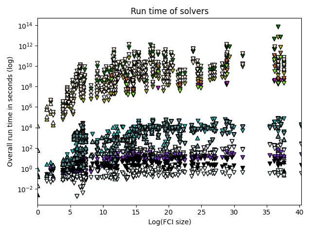
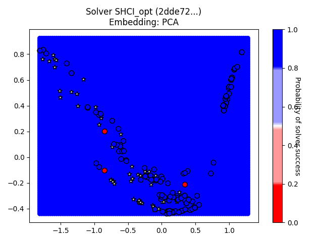
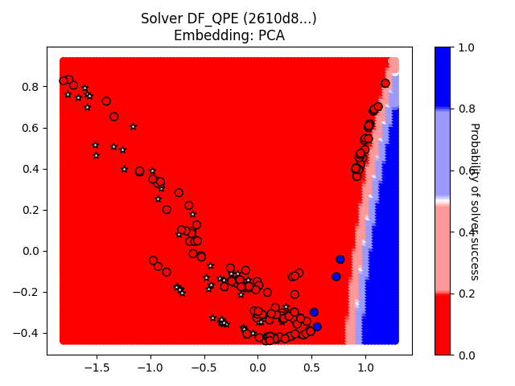
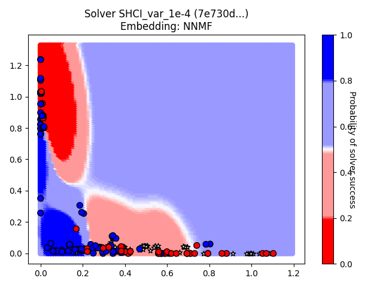
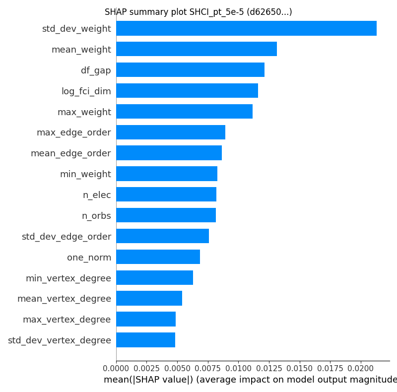

# GSEE Benchmark Standard Report

Report based on data from 2025-03-11T15:10:51.941392+00:00

[https://github.com/isi-usc-edu/qb-gsee-benchmark](https://github.com/isi-usc-edu/qb-gsee-benchmark)

Input data: `Hamiltonian_features.csv`, last modified Tue Mar  4 15:44:53 2025

Input data: `GSEE-HC_utility_estimates_all_instances_task_uuids_v2.csv`, last modified Tue Mar  4 15:44:53 2025

Latest creation time for a `problem_instance.json` file: Tue Mar  4 15:44:53 2025

Latest creation time for a `solution.json` file: Tue Mar 11 11:10:03 2025

# Problem Instance Summary Statistics

number of `problem_instances`: 68.

`problem_instance.json` with the most tasks: 30 (hubbard_square/614c4444-a31a-4348-b24d-01040208651c)

number of Hamiltonians (i.e., tasks) we have features calculated for: 228

minimum number of orbitals: 5

median number of orbitals: 36.0

maximum number of orbitals: 135

# Solver Summary Statistics

number of unique participating solvers: 21

Solver: SHCI_opt/2dde727e-a881-44fa-aabf-bba6248e4baf, ML Solvability Ratio: {'PCA': 1.0, 'NNMF': 1.0}, F1 Score: [0.85714286 0.98947368]

Solver: DF_QPE/2610d8de-bd3a-469e-9a80-473e8988755f, ML Solvability Ratio: {'PCA': 0.0716, 'NNMF': 0.0}, F1 Score: [1. 1.]

Solver: SHCI_pt_1e-4/4ed500f1-0650-41e3-af00-e4d0359394b4, ML Solvability Ratio: {'PCA': 1.0, 'NNMF': 1.0}, F1 Score: [0.70588235 0.96323529]

Solver: SHCI_var_1e-4/7e730dfb-57ee-480b-a8a1-4b73f5f07c54, ML Solvability Ratio: {'PCA': 0.6661, 'NNMF': 0.7848}, F1 Score: [0.98484848 0.98850575]

Solver: SHCI_pt_2e-4/ad964781-302e-4728-a26d-39918e0a6cdb, ML Solvability Ratio: {'PCA': 1.0, 'NNMF': 1.0}, F1 Score: [0.64864865 0.95167286]

Solver: SHCI_pt_2e-5/c71b90bd-3250-4c0c-b4e7-fc9878f141f6, ML Solvability Ratio: {'PCA': 1.0, 'NNMF': 0.8735}, F1 Score: [0.74285714 0.96678967]

Solver: SHCI_pt_5e-5/d626506c-7aae-4ad6-802a-b29af5f2bb93, ML Solvability Ratio: {'PCA': 1.0, 'NNMF': 1.0}, F1 Score: [0.8        0.97416974]

Solver: SHCI_var_2e-4/0db183e3-a86d-491b-9125-599556e37c7a, ML Solvability Ratio: {'PCA': 0.7146, 'NNMF': 0.7963}, F1 Score: [0.98630137 0.9875    ]

Solver: SHCI_var_2e-5/86bfe50c-9342-4d54-bb68-abc8abd95688, ML Solvability Ratio: {'PCA': 0.5598, 'NNMF': 0.5682}, F1 Score: [0.81967213 0.95510204]

Solver: SHCI_var_5e-5/01949b95-c427-4693-9134-01f47f688c09, ML Solvability Ratio: {'PCA': 0.9462, 'NNMF': 0.7526}, F1 Score: [0.95454545 0.98165138]

Solver: DF_QPE/5dad4064-cd11-412f-85cb-d722afe3b3de, ML Solvability Ratio: {'PCA': 0.0394, 'NNMF': 0.0199}, F1 Score: [1. 1.]

Solver: CISD/418f060e-496b-4024-8d2d-9b1f8791e76d, ML Solvability Ratio: {'PCA': 0.0, 'NNMF': 0.0139}, F1 Score: [0.97744361 0.85      ]

Solver: HF/5f5e617a-19c2-4d82-bebc-b2d6b3dcb012, ML Solvability Ratio: {'PCA': 0.0, 'NNMF': 0.0}, F1 Score: [0.98630137 0.71428571]

Solver: MP2/b420358b-5def-41e6-8c5d-b9d93b6aecd2, ML Solvability Ratio: {'PCA': 0.0, 'NNMF': 0.0}, F1 Score: [0.98630137 0.71428571]

Solver: CCSD/0a29e54f-bef9-4d19-bafa-d94b1c4b37aa, ML Solvability Ratio: {'PCA': 0.0, 'NNMF': 0.0232}, F1 Score: [0.97637795 0.88461538]

Solver: CCSD(T)/c09217e6-d0f7-4b0f-81c4-79210b7ac878, ML Solvability Ratio: {'PCA': 0.305, 'NNMF': 0.4969}, F1 Score: [0.95121951 0.94366197]

Solver: DF_QPE/7c8ef984-4d3a-4468-8900-e0da3bd8b22d, Model could not be calculated.

Solver: DF_QPE/5d768520-b3d0-4292-bbb4-9776fa128107, ML Solvability Ratio: {'PCA': 0.0394, 'NNMF': 0.0199}, F1 Score: [1. 1.]

Solver: DF_QPE/f6b36bde-be4a-4eee-975b-2c5f7e553f5f, ML Solvability Ratio: {'PCA': 0.013, 'NNMF': 0.0006}, F1 Score: [0.99319728 0.83333333]

Solver: DF_QPE/4b07b89f-c66f-4e72-8c24-df3e4222cb41, ML Solvability Ratio: {'PCA': 0.0, 'NNMF': 0.0}, F1 Score: [1. 1.]

Solver: DMRG_Niagara_cluster_lowest_energy/16537433-9f4c-4eae-a65d-787dc3b35b59, ML Solvability Ratio: {'PCA': 0.4126, 'NNMF': 0.3022}, F1 Score: [0.91304348 0.96261682]

NOTE: only `attempted` tasks are plotted on the chart.  Triangle up/down indicates solved/unsolved.

NOTE: only `attempted` tasks are plotted on the chart.  Triangle up/down indicates solved/unsolved.

NOTE: only `attempted` tasks are plotted on the chart.  Triangle up/down indicates solved/unsolved.

NOTE: only `attempted` tasks are plotted on the chart.  Triangle up/down indicates solved/unsolved.

NOTE: only `attempted` tasks are plotted on the chart.  Triangle up/down indicates solved/unsolved.

## Solver SHCI_opt, 2dde727e-a881-44fa-aabf-bba6248e4baf

solver_uuid:2dde727e-a881-44fa-aabf-bba6248e4baf

solver_short_name:SHCI_opt

compute_hardware_type:classical_computer

classical_hardware_details:{'computing_environment_name': 'LCRC Improv (per node)', 'cpu_description': '2x AMD EPYC 7713 64C', 'ram_available_gb': '256GB', 'clock_speed': '2 GHz', 'total_num_cores': 128}

algorithm_details:SHCI with optimized orbitals followed by SHCI+PT

software_details:SHCI Arrow Code (https://github.com/QMC-Cornell/shci).

performance_metrics_uuid: 16447854-1413-4821-9c52-dda75e58ea6e

creation_timestamp: 2025-03-11T15:10:51.941392+00:00

number_of_problem_instances: 68

number_of_problem_instances_attempted: 62

number_of_problem_instances_solved: 33

number_of_tasks: 228

number_of_tasks_attempted: 222

number_of_tasks_solved: 144

number_of_tasks_solved_within_run_time_limit: 222

number_of_tasks_solved_within_accuracy_threshold: 144

max_run_time_of_attempted_tasks: 57334.2

sum_of_run_time_of_attempted_tasks: 1100315.9169999997

solvability_ratio: 1.0

comment: solvability ratio based on PCA embedding.

f1_score: [0.8571428571428571, 0.9894736842105263]

ml_metrics_calculator_version: 1

Note: plot only contains `attempted` tasks.

Note: plot only contains `attempted` tasks.

Note: `attempted` may be `True` or `False`.  Tasks with a `reference_energy` can be labeled as solved or failed-to-solve. A task with a `reference_energy` that was NOT `attempted` is labeled as a failed-to-solve.  White stars indicate Hamiltonians for which we do not have a `reference_energy`.

## Solver DF_QPE, 2610d8de-bd3a-469e-9a80-473e8988755f

solver_uuid:2610d8de-bd3a-469e-9a80-473e8988755f

solver_short_name:DF_QPE

compute_hardware_type:quantum_computer

algorithm_details:{'algorithm_description': 'Double factorized QPE resource estimates based on methodology of arXiv:2406.06335. Note that the truncation error is not included in the error bounds and that the SCF compute time is not included in the preprocessing time. Ground-state overlap is taken to be that estimated for the dominant CSF as estimated by DMRG and that this DMRG runtime is not included in the classical compute costs.', 'algorithm_parameters': {'overlap_csv': 'overlaps.csv', 'sf_threshold': 1e-12, 'df_threshold': 0.001, 'max_orbitals': 70}}

software_details:[{'software_name': 'pyLIQTR', 'software_version': '1.3.4'}, {'software_name': 'qb-gsee-benchmark', 'software_version': '0.1.0a2.dev193+g879c00d'}, {'software_name': 'Python', 'software_version': '3.10.12 (main, Nov  6 2024, 20:22:13) [GCC 11.4.0]'}, {'software_name': 'qualtran', 'software_version': '0.4.0'}]

quantum_hardware_details:{'quantum_hardware_description': 'Ultra-optimistic hardware model based on the superconducting architecture described in https://arxiv.org/abs/2011.03494.', 'quantum_hardware_parameters': {'num_factories': 4, 'physical_error_rate': 0.0001, 'cycle_time_microseconds': 0.1, 'parallelize_shots': False}}

logical_resource_estimate_solution_uuid:2f90da87-a699-4de4-98ad-a78231385822

logical_resource_estimate_solver_uuid:f2d73e1f-3058-43c4-a634-b6c267c84ff1

performance_metrics_uuid: 92b3bdc4-8b5d-47d6-933c-1318dd4d6c47

creation_timestamp: 2025-03-11T15:10:51.941392+00:00

number_of_problem_instances: 68

number_of_problem_instances_attempted: 22

number_of_problem_instances_solved: 3

number_of_tasks: 228

number_of_tasks_attempted: 131

number_of_tasks_solved: 4

number_of_tasks_solved_within_run_time_limit: 4

number_of_tasks_solved_within_accuracy_threshold: 131

max_run_time_of_attempted_tasks: 139406856747.7868

sum_of_run_time_of_attempted_tasks: 1131474650773.224

solvability_ratio: 0.0716

comment: solvability ratio based on PCA embedding.

f1_score: [1.0, 1.0]

ml_metrics_calculator_version: 1

Note: plot only contains `attempted` tasks.

Note: plot only contains `attempted` tasks.

Note: `attempted` may be `True` or `False`.  Tasks with a `reference_energy` can be labeled as solved or failed-to-solve. A task with a `reference_energy` that was NOT `attempted` is labeled as a failed-to-solve.  White stars indicate Hamiltonians for which we do not have a `reference_energy`.

## Solver SHCI_pt_1e-4, 4ed500f1-0650-41e3-af00-e4d0359394b4

solver_uuid:4ed500f1-0650-41e3-af00-e4d0359394b4

solver_short_name:SHCI_pt_1e-4

compute_hardware_type:classical_computer

classical_hardware_details:{'computing_environment_name': 'LCRC Improv (per node)', 'cpu_description': '2x AMD EPYC 7713 64C', 'ram_available_gb': '256GB', 'clock_speed': '2 GHz', 'total_num_cores': 128}

algorithm_details:SHCI with eps_var 1e-4 + PT

software_details:SHCI Arrow Code (https://github.com/QMC-Cornell/shci).

performance_metrics_uuid: d398ff9e-fa4d-4cc2-a4d6-448f7b18e4a1

creation_timestamp: 2025-03-11T15:10:51.941392+00:00

number_of_problem_instances: 68

number_of_problem_instances_attempted: 64

number_of_problem_instances_solved: 22

number_of_tasks: 228

number_of_tasks_attempted: 224

number_of_tasks_solved: 131

number_of_tasks_solved_within_run_time_limit: 223

number_of_tasks_solved_within_accuracy_threshold: 131

max_run_time_of_attempted_tasks: 77244.15200000002

sum_of_run_time_of_attempted_tasks: 1220720.12

solvability_ratio: 1.0

comment: solvability ratio based on PCA embedding.

f1_score: [0.7058823529411765, 0.9632352941176471]

ml_metrics_calculator_version: 1

Note: plot only contains `attempted` tasks.

Note: plot only contains `attempted` tasks.

Note: `attempted` may be `True` or `False`.  Tasks with a `reference_energy` can be labeled as solved or failed-to-solve. A task with a `reference_energy` that was NOT `attempted` is labeled as a failed-to-solve.  White stars indicate Hamiltonians for which we do not have a `reference_energy`.

## Solver SHCI_var_1e-4, 7e730dfb-57ee-480b-a8a1-4b73f5f07c54

solver_uuid:7e730dfb-57ee-480b-a8a1-4b73f5f07c54

solver_short_name:SHCI_var_1e-4

compute_hardware_type:classical_computer

classical_hardware_details:{'computing_environment_name': 'LCRC Improv (per node)', 'cpu_description': '2x AMD EPYC 7713 64C', 'ram_available_gb': '256GB', 'clock_speed': '2 GHz', 'total_num_cores': 128}

algorithm_details:SHCI with eps_var 1e-4

software_details:SHCI Arrow Code (https://github.com/QMC-Cornell/shci).

performance_metrics_uuid: db184981-e27d-4fe4-a3e1-14ed9e6e8988

creation_timestamp: 2025-03-11T15:10:51.941392+00:00

number_of_problem_instances: 68

number_of_problem_instances_attempted: 64

number_of_problem_instances_solved: 13

number_of_tasks: 228

number_of_tasks_attempted: 224

number_of_tasks_solved: 87

number_of_tasks_solved_within_run_time_limit: 223

number_of_tasks_solved_within_accuracy_threshold: 87

max_run_time_of_attempted_tasks: 77244.15200000002

sum_of_run_time_of_attempted_tasks: 1220720.12

solvability_ratio: 0.6661

comment: solvability ratio based on PCA embedding.

f1_score: [0.9848484848484849, 0.9885057471264368]

ml_metrics_calculator_version: 1

Note: plot only contains `attempted` tasks.

Note: plot only contains `attempted` tasks.

Note: `attempted` may be `True` or `False`.  Tasks with a `reference_energy` can be labeled as solved or failed-to-solve. A task with a `reference_energy` that was NOT `attempted` is labeled as a failed-to-solve.  White stars indicate Hamiltonians for which we do not have a `reference_energy`.

## Solver SHCI_pt_2e-4, ad964781-302e-4728-a26d-39918e0a6cdb

solver_uuid:ad964781-302e-4728-a26d-39918e0a6cdb

solver_short_name:SHCI_pt_2e-4

compute_hardware_type:classical_computer

classical_hardware_details:{'computing_environment_name': 'LCRC Improv (per node)', 'cpu_description': '2x AMD EPYC 7713 64C', 'ram_available_gb': '256GB', 'clock_speed': '2 GHz', 'total_num_cores': 128}

algorithm_details:SHCI with eps_var 2e-4 + PT

software_details:SHCI Arrow Code (https://github.com/QMC-Cornell/shci).

performance_metrics_uuid: 5703995f-ba0e-48a2-b4db-5120c39846ac

creation_timestamp: 2025-03-11T15:10:51.941392+00:00

number_of_problem_instances: 68

number_of_problem_instances_attempted: 64

number_of_problem_instances_solved: 22

number_of_tasks: 228

number_of_tasks_attempted: 224

number_of_tasks_solved: 128

number_of_tasks_solved_within_run_time_limit: 223

number_of_tasks_solved_within_accuracy_threshold: 128

max_run_time_of_attempted_tasks: 77244.15200000002

sum_of_run_time_of_attempted_tasks: 1220720.12

solvability_ratio: 1.0

comment: solvability ratio based on PCA embedding.

f1_score: [0.6486486486486487, 0.9516728624535316]

ml_metrics_calculator_version: 1

Note: plot only contains `attempted` tasks.

Note: plot only contains `attempted` tasks.

Note: `attempted` may be `True` or `False`.  Tasks with a `reference_energy` can be labeled as solved or failed-to-solve. A task with a `reference_energy` that was NOT `attempted` is labeled as a failed-to-solve.  White stars indicate Hamiltonians for which we do not have a `reference_energy`.

## Solver SHCI_pt_2e-5, c71b90bd-3250-4c0c-b4e7-fc9878f141f6

solver_uuid:c71b90bd-3250-4c0c-b4e7-fc9878f141f6

solver_short_name:SHCI_pt_2e-5

compute_hardware_type:classical_computer

classical_hardware_details:{'computing_environment_name': 'LCRC Improv (per node)', 'cpu_description': '2x AMD EPYC 7713 64C', 'ram_available_gb': '256GB', 'clock_speed': '2 GHz', 'total_num_cores': 128}

algorithm_details:SHCI with eps_var 2e-5 + PT

software_details:SHCI Arrow Code (https://github.com/QMC-Cornell/shci).

performance_metrics_uuid: 6bde49bf-f2e6-47f9-9931-0fbce9f36731

creation_timestamp: 2025-03-11T15:10:51.941392+00:00

number_of_problem_instances: 68

number_of_problem_instances_attempted: 64

number_of_problem_instances_solved: 26

number_of_tasks: 228

number_of_tasks_attempted: 224

number_of_tasks_solved: 136

number_of_tasks_solved_within_run_time_limit: 223

number_of_tasks_solved_within_accuracy_threshold: 136

max_run_time_of_attempted_tasks: 77244.15200000002

sum_of_run_time_of_attempted_tasks: 1220720.12

solvability_ratio: 1.0

comment: solvability ratio based on PCA embedding.

f1_score: [0.7428571428571429, 0.966789667896679]

ml_metrics_calculator_version: 1

Note: plot only contains `attempted` tasks.

Note: plot only contains `attempted` tasks.

Note: `attempted` may be `True` or `False`.  Tasks with a `reference_energy` can be labeled as solved or failed-to-solve. A task with a `reference_energy` that was NOT `attempted` is labeled as a failed-to-solve.  White stars indicate Hamiltonians for which we do not have a `reference_energy`.

## Solver SHCI_pt_5e-5, d626506c-7aae-4ad6-802a-b29af5f2bb93

solver_uuid:d626506c-7aae-4ad6-802a-b29af5f2bb93

solver_short_name:SHCI_pt_5e-5

compute_hardware_type:classical_computer

classical_hardware_details:{'computing_environment_name': 'LCRC Improv (per node)', 'cpu_description': '2x AMD EPYC 7713 64C', 'ram_available_gb': '256GB', 'clock_speed': '2 GHz', 'total_num_cores': 128}

algorithm_details:SHCI with eps_var 5e-5 + PT

software_details:SHCI Arrow Code (https://github.com/QMC-Cornell/shci).

performance_metrics_uuid: 9e6e7fad-fdf9-47cc-a0ad-805e76cd952a

creation_timestamp: 2025-03-11T15:10:51.941392+00:00

number_of_problem_instances: 68

number_of_problem_instances_attempted: 64

number_of_problem_instances_solved: 24

number_of_tasks: 228

number_of_tasks_attempted: 224

number_of_tasks_solved: 134

number_of_tasks_solved_within_run_time_limit: 223

number_of_tasks_solved_within_accuracy_threshold: 134

max_run_time_of_attempted_tasks: 77244.15200000002

sum_of_run_time_of_attempted_tasks: 1220720.12

solvability_ratio: 1.0

comment: solvability ratio based on PCA embedding.

f1_score: [0.8, 0.974169741697417]

ml_metrics_calculator_version: 1

Note: plot only contains `attempted` tasks.

Note: plot only contains `attempted` tasks.

Note: `attempted` may be `True` or `False`.  Tasks with a `reference_energy` can be labeled as solved or failed-to-solve. A task with a `reference_energy` that was NOT `attempted` is labeled as a failed-to-solve.  White stars indicate Hamiltonians for which we do not have a `reference_energy`.

## Solver SHCI_var_2e-4, 0db183e3-a86d-491b-9125-599556e37c7a

solver_uuid:0db183e3-a86d-491b-9125-599556e37c7a

solver_short_name:SHCI_var_2e-4

compute_hardware_type:classical_computer

classical_hardware_details:{'computing_environment_name': 'LCRC Improv (per node)', 'cpu_description': '2x AMD EPYC 7713 64C', 'ram_available_gb': '256GB', 'clock_speed': '2 GHz', 'total_num_cores': 128}

algorithm_details:SHCI with eps_var 2e-4

software_details:SHCI Arrow Code (https://github.com/QMC-Cornell/shci).

performance_metrics_uuid: 4ab43963-fdbd-4443-95c8-c7f31ec255f6

creation_timestamp: 2025-03-11T15:10:51.941392+00:00

number_of_problem_instances: 68

number_of_problem_instances_attempted: 64

number_of_problem_instances_solved: 13

number_of_tasks: 228

number_of_tasks_attempted: 224

number_of_tasks_solved: 79

number_of_tasks_solved_within_run_time_limit: 223

number_of_tasks_solved_within_accuracy_threshold: 79

max_run_time_of_attempted_tasks: 77244.15200000002

sum_of_run_time_of_attempted_tasks: 1220720.12

solvability_ratio: 0.7146

comment: solvability ratio based on PCA embedding.

f1_score: [0.9863013698630136, 0.9875]

ml_metrics_calculator_version: 1

Note: plot only contains `attempted` tasks.

Note: plot only contains `attempted` tasks.

Note: `attempted` may be `True` or `False`.  Tasks with a `reference_energy` can be labeled as solved or failed-to-solve. A task with a `reference_energy` that was NOT `attempted` is labeled as a failed-to-solve.  White stars indicate Hamiltonians for which we do not have a `reference_energy`.

## Solver SHCI_var_2e-5, 86bfe50c-9342-4d54-bb68-abc8abd95688

solver_uuid:86bfe50c-9342-4d54-bb68-abc8abd95688

solver_short_name:SHCI_var_2e-5

compute_hardware_type:classical_computer

classical_hardware_details:{'computing_environment_name': 'LCRC Improv (per node)', 'cpu_description': '2x AMD EPYC 7713 64C', 'ram_available_gb': '256GB', 'clock_speed': '2 GHz', 'total_num_cores': 128}

algorithm_details:SHCI with eps_var 2e-5

software_details:SHCI Arrow Code (https://github.com/QMC-Cornell/shci).

performance_metrics_uuid: 2fa35442-e4a3-487f-8982-835a40801124

creation_timestamp: 2025-03-11T15:10:51.941392+00:00

number_of_problem_instances: 68

number_of_problem_instances_attempted: 64

number_of_problem_instances_solved: 18

number_of_tasks: 228

number_of_tasks_attempted: 224

number_of_tasks_solved: 124

number_of_tasks_solved_within_run_time_limit: 223

number_of_tasks_solved_within_accuracy_threshold: 124

max_run_time_of_attempted_tasks: 77244.15200000002

sum_of_run_time_of_attempted_tasks: 1220720.12

solvability_ratio: 0.5598

comment: solvability ratio based on PCA embedding.

f1_score: [0.819672131147541, 0.9551020408163265]

ml_metrics_calculator_version: 1

Note: plot only contains `attempted` tasks.

Note: plot only contains `attempted` tasks.

Note: `attempted` may be `True` or `False`.  Tasks with a `reference_energy` can be labeled as solved or failed-to-solve. A task with a `reference_energy` that was NOT `attempted` is labeled as a failed-to-solve.  White stars indicate Hamiltonians for which we do not have a `reference_energy`.

## Solver SHCI_var_5e-5, 01949b95-c427-4693-9134-01f47f688c09

solver_uuid:01949b95-c427-4693-9134-01f47f688c09

solver_short_name:SHCI_var_5e-5

compute_hardware_type:classical_computer

classical_hardware_details:{'computing_environment_name': 'LCRC Improv (per node)', 'cpu_description': '2x AMD EPYC 7713 64C', 'ram_available_gb': '256GB', 'clock_speed': '2 GHz', 'total_num_cores': 128}

algorithm_details:SHCI with eps_var 5e-5

software_details:SHCI Arrow Code (https://github.com/QMC-Cornell/shci).

performance_metrics_uuid: 0ffc1309-dcf1-46d1-9e6d-f9e848a87e0f

creation_timestamp: 2025-03-11T15:10:51.941392+00:00

number_of_problem_instances: 68

number_of_problem_instances_attempted: 64

number_of_problem_instances_solved: 14

number_of_tasks: 228

number_of_tasks_attempted: 224

number_of_tasks_solved: 111

number_of_tasks_solved_within_run_time_limit: 223

number_of_tasks_solved_within_accuracy_threshold: 111

max_run_time_of_attempted_tasks: 77244.15200000002

sum_of_run_time_of_attempted_tasks: 1220720.12

solvability_ratio: 0.9462

comment: solvability ratio based on PCA embedding.

f1_score: [0.9545454545454546, 0.981651376146789]

ml_metrics_calculator_version: 1

Note: plot only contains `attempted` tasks.

Note: plot only contains `attempted` tasks.

Note: `attempted` may be `True` or `False`.  Tasks with a `reference_energy` can be labeled as solved or failed-to-solve. A task with a `reference_energy` that was NOT `attempted` is labeled as a failed-to-solve.  White stars indicate Hamiltonians for which we do not have a `reference_energy`.

## Solver DF_QPE, 5dad4064-cd11-412f-85cb-d722afe3b3de

solver_uuid:5dad4064-cd11-412f-85cb-d722afe3b3de

solver_short_name:DF_QPE

compute_hardware_type:quantum_computer

algorithm_details:{'algorithm_description': 'Double factorized QPE resource estimates based on methodology of arXiv:2406.06335. Note that the truncation error is not included in the error bounds and that the SCF compute time is not included in the preprocessing time. Ground-state overlap is taken to be that estimated for the dominant CSF as estimated by DMRG and that this DMRG runtime is not included in the classical compute costs.', 'algorithm_parameters': {'overlap_csv': 'overlaps.csv', 'sf_threshold': 1e-12, 'df_threshold': 0.001, 'max_orbitals': 70}}

software_details:[{'software_name': 'pyLIQTR', 'software_version': '1.3.4'}, {'software_name': 'qb-gsee-benchmark', 'software_version': '0.1.0a2.dev193+g879c00d'}, {'software_name': 'Python', 'software_version': '3.10.12 (main, Nov  6 2024, 20:22:13) [GCC 11.4.0]'}, {'software_name': 'qualtran', 'software_version': '0.4.0'}]

quantum_hardware_details:{'quantum_hardware_description': 'Optimistic superconducting hardware model based on that described in https://arxiv.org/abs/2011.03494.', 'quantum_hardware_parameters': {'num_factories': 4, 'physical_error_rate': 0.0001, 'cycle_time_microseconds': 1, 'parallelize_shots': False}}

logical_resource_estimate_solution_uuid:21b3da35-cc33-454b-bd67-8b2f50953c9a

logical_resource_estimate_solver_uuid:f2d73e1f-3058-43c4-a634-b6c267c84ff1

performance_metrics_uuid: 66e7b68e-a609-4363-a361-4103c834299f

creation_timestamp: 2025-03-11T15:10:51.941392+00:00

number_of_problem_instances: 68

number_of_problem_instances_attempted: 22

number_of_problem_instances_solved: 2

number_of_tasks: 228

number_of_tasks_attempted: 131

number_of_tasks_solved: 2

number_of_tasks_solved_within_run_time_limit: 2

number_of_tasks_solved_within_accuracy_threshold: 131

max_run_time_of_attempted_tasks: 1394068547267.4111

sum_of_run_time_of_attempted_tasks: 11314745416246.352

solvability_ratio: 0.0394

comment: solvability ratio based on PCA embedding.

f1_score: [1.0, 1.0]

ml_metrics_calculator_version: 1

Note: plot only contains `attempted` tasks.

Note: plot only contains `attempted` tasks.

Note: `attempted` may be `True` or `False`.  Tasks with a `reference_energy` can be labeled as solved or failed-to-solve. A task with a `reference_energy` that was NOT `attempted` is labeled as a failed-to-solve.  White stars indicate Hamiltonians for which we do not have a `reference_energy`.

## Solver CISD, 418f060e-496b-4024-8d2d-9b1f8791e76d

solver_uuid:418f060e-496b-4024-8d2d-9b1f8791e76d

solver_short_name:CISD

compute_hardware_type:classical_computer

classical_hardware_details:{'computing_environment_name': 'LCRC Improv (per node)', 'cpu_description': '2x AMD EPYC 7713 64C', 'ram_available_gb': '256GB', 'clock_speed': '2 GHz', 'total_num_cores': 128}

algorithm_details:CISD

software_details:pyscf (https://github.com/pyscf/pyscf).

performance_metrics_uuid: a137c630-7c41-42f8-b74c-153042726747

creation_timestamp: 2025-03-11T15:10:51.941392+00:00

number_of_problem_instances: 68

number_of_problem_instances_attempted: 64

number_of_problem_instances_solved: 9

number_of_tasks: 228

number_of_tasks_attempted: 224

number_of_tasks_solved: 17

number_of_tasks_solved_within_run_time_limit: 224

number_of_tasks_solved_within_accuracy_threshold: 17

max_run_time_of_attempted_tasks: 62.58296537399292

sum_of_run_time_of_attempted_tasks: 2141.729572057724

solvability_ratio: 0.0

comment: solvability ratio based on PCA embedding.

f1_score: [0.9774436090225563, 0.85]

ml_metrics_calculator_version: 1

Note: plot only contains `attempted` tasks.

Note: plot only contains `attempted` tasks.

Note: `attempted` may be `True` or `False`.  Tasks with a `reference_energy` can be labeled as solved or failed-to-solve. A task with a `reference_energy` that was NOT `attempted` is labeled as a failed-to-solve.  White stars indicate Hamiltonians for which we do not have a `reference_energy`.

## Solver HF, 5f5e617a-19c2-4d82-bebc-b2d6b3dcb012

solver_uuid:5f5e617a-19c2-4d82-bebc-b2d6b3dcb012

solver_short_name:HF

compute_hardware_type:classical_computer

classical_hardware_details:{'computing_environment_name': 'LCRC Improv (per node)', 'cpu_description': '2x AMD EPYC 7713 64C', 'ram_available_gb': '256GB', 'clock_speed': '2 GHz', 'total_num_cores': 128}

algorithm_details:Hartree Fock

software_details:pyscf (https://github.com/pyscf/pyscf).

performance_metrics_uuid: 71c4fd7d-fff8-4b6e-b760-4a411b192641

creation_timestamp: 2025-03-11T15:10:51.941392+00:00

number_of_problem_instances: 68

number_of_problem_instances_attempted: 64

number_of_problem_instances_solved: 5

number_of_tasks: 228

number_of_tasks_attempted: 224

number_of_tasks_solved: 5

number_of_tasks_solved_within_run_time_limit: 224

number_of_tasks_solved_within_accuracy_threshold: 5

max_run_time_of_attempted_tasks: 20.338801622390747

sum_of_run_time_of_attempted_tasks: 798.9929344654083

solvability_ratio: 0.0

comment: solvability ratio based on PCA embedding.

f1_score: [0.9863013698630136, 0.7142857142857143]

ml_metrics_calculator_version: 1

Note: plot only contains `attempted` tasks.

Note: plot only contains `attempted` tasks.

Note: `attempted` may be `True` or `False`.  Tasks with a `reference_energy` can be labeled as solved or failed-to-solve. A task with a `reference_energy` that was NOT `attempted` is labeled as a failed-to-solve.  White stars indicate Hamiltonians for which we do not have a `reference_energy`.

## Solver MP2, b420358b-5def-41e6-8c5d-b9d93b6aecd2

solver_uuid:b420358b-5def-41e6-8c5d-b9d93b6aecd2

solver_short_name:MP2

compute_hardware_type:classical_computer

classical_hardware_details:{'computing_environment_name': 'LCRC Improv (per node)', 'cpu_description': '2x AMD EPYC 7713 64C', 'ram_available_gb': '256GB', 'clock_speed': '2 GHz', 'total_num_cores': 128}

algorithm_details:MP2

software_details:pyscf (https://github.com/pyscf/pyscf).

performance_metrics_uuid: 8fc9a08d-e818-4f50-89a8-bcec79c88b90

creation_timestamp: 2025-03-11T15:10:51.941392+00:00

number_of_problem_instances: 68

number_of_problem_instances_attempted: 61

number_of_problem_instances_solved: 5

number_of_tasks: 228

number_of_tasks_attempted: 216

number_of_tasks_solved: 5

number_of_tasks_solved_within_run_time_limit: 216

number_of_tasks_solved_within_accuracy_threshold: 5

max_run_time_of_attempted_tasks: 2.230440139770508

sum_of_run_time_of_attempted_tasks: 78.34016704559326

solvability_ratio: 0.0

comment: solvability ratio based on PCA embedding.

f1_score: [0.9863013698630136, 0.7142857142857143]

ml_metrics_calculator_version: 1

Note: plot only contains `attempted` tasks.

Note: plot only contains `attempted` tasks.

Note: `attempted` may be `True` or `False`.  Tasks with a `reference_energy` can be labeled as solved or failed-to-solve. A task with a `reference_energy` that was NOT `attempted` is labeled as a failed-to-solve.  White stars indicate Hamiltonians for which we do not have a `reference_energy`.

## Solver CCSD, 0a29e54f-bef9-4d19-bafa-d94b1c4b37aa

solver_uuid:0a29e54f-bef9-4d19-bafa-d94b1c4b37aa

solver_short_name:CCSD

compute_hardware_type:classical_computer

classical_hardware_details:{'computing_environment_name': 'LCRC Improv (per node)', 'cpu_description': '2x AMD EPYC 7713 64C', 'ram_available_gb': '256GB', 'clock_speed': '2 GHz', 'total_num_cores': 128}

algorithm_details:CCSD

software_details:pyscf (https://github.com/pyscf/pyscf).

performance_metrics_uuid: 45c980cf-5ce4-4809-a35f-737f37e1c4ea

creation_timestamp: 2025-03-11T15:10:51.941392+00:00

number_of_problem_instances: 68

number_of_problem_instances_attempted: 60

number_of_problem_instances_solved: 10

number_of_tasks: 228

number_of_tasks_attempted: 213

number_of_tasks_solved: 23

number_of_tasks_solved_within_run_time_limit: 213

number_of_tasks_solved_within_accuracy_threshold: 23

max_run_time_of_attempted_tasks: 460.71552085876465

sum_of_run_time_of_attempted_tasks: 7092.587965488434

solvability_ratio: 0.0

comment: solvability ratio based on PCA embedding.

f1_score: [0.9763779527559056, 0.8846153846153846]

ml_metrics_calculator_version: 1

Note: plot only contains `attempted` tasks.

Note: plot only contains `attempted` tasks.

Note: `attempted` may be `True` or `False`.  Tasks with a `reference_energy` can be labeled as solved or failed-to-solve. A task with a `reference_energy` that was NOT `attempted` is labeled as a failed-to-solve.  White stars indicate Hamiltonians for which we do not have a `reference_energy`.

## Solver CCSD(T), c09217e6-d0f7-4b0f-81c4-79210b7ac878

solver_uuid:c09217e6-d0f7-4b0f-81c4-79210b7ac878

solver_short_name:CCSD(T)

compute_hardware_type:classical_computer

classical_hardware_details:{'computing_environment_name': 'LCRC Improv (per node)', 'cpu_description': '2x AMD EPYC 7713 64C', 'ram_available_gb': '256GB', 'clock_speed': '2 GHz', 'total_num_cores': 128}

algorithm_details:CCSD(T)

software_details:pyscf (https://github.com/pyscf/pyscf).

performance_metrics_uuid: 6d8e7110-4a0f-47ab-944c-bb344586c640

creation_timestamp: 2025-03-11T15:10:51.941392+00:00

number_of_problem_instances: 68

number_of_problem_instances_attempted: 60

number_of_problem_instances_solved: 19

number_of_tasks: 228

number_of_tasks_attempted: 213

number_of_tasks_solved: 67

number_of_tasks_solved_within_run_time_limit: 213

number_of_tasks_solved_within_accuracy_threshold: 67

max_run_time_of_attempted_tasks: 469.1432478427887

sum_of_run_time_of_attempted_tasks: 7912.881755828857

solvability_ratio: 0.305

comment: solvability ratio based on PCA embedding.

f1_score: [0.9512195121951219, 0.9436619718309859]

ml_metrics_calculator_version: 1

Note: plot only contains `attempted` tasks.

Note: plot only contains `attempted` tasks.

Note: `attempted` may be `True` or `False`.  Tasks with a `reference_energy` can be labeled as solved or failed-to-solve. A task with a `reference_energy` that was NOT `attempted` is labeled as a failed-to-solve.  White stars indicate Hamiltonians for which we do not have a `reference_energy`.

## Solver DF_QPE, 7c8ef984-4d3a-4468-8900-e0da3bd8b22d

solver_uuid:7c8ef984-4d3a-4468-8900-e0da3bd8b22d

solver_short_name:DF_QPE

compute_hardware_type:quantum_computer

algorithm_details:{'algorithm_description': 'Double factorized QPE resource estimates based on methodology of arXiv:2406.06335. Note that the truncation error is not included in the error bounds and that the SCF compute time is not included in the preprocessing time. Ground-state overlap is taken to be that estimated for the dominant CSF as estimated by DMRG and that this DMRG runtime is not included in the classical compute costs.', 'algorithm_parameters': {'overlap': 0.94868329805, 'sf_threshold': 1e-12, 'df_threshold': 0.001, 'max_orbitals': 70}}

software_details:[{'software_name': 'benchq', 'software_version': '0.7.1.dev10+g80b8279.d20250116'}, {'software_name': 'openfermion', 'software_version': '1.6.1'}, {'software_name': 'Python', 'software_version': '3.11.5 (main, Sep 11 2023, 08:31:25) [Clang 14.0.6 ]'}, {'software_name': 'benchq', 'software_version': '0.7.1.dev10+g80b8279.d20250116'}]

quantum_hardware_details:{'quantum_hardware_description': 'Superconducting hardware model based on the optimistic model described in https://arxiv.org/abs/2011.03494.', 'quantum_hardware_parameters': {'num_factories': 4, 'physical_error_rate': 0.0001, 'cycle_time_microseconds': 1}}

logical_resource_estimate_solution_uuid:e135679c-e314-4808-9634-252bc376d295

logical_resource_estimate_solver_uuid:f2d73e1f-3058-43c4-a634-b6c267c84ff1

performance_metrics_uuid: 89458a42-93f9-4118-9c78-af40dc4381dc

creation_timestamp: 2025-03-11T15:10:51.941392+00:00

number_of_problem_instances: 68

number_of_problem_instances_attempted: 4

number_of_problem_instances_solved: 1

number_of_tasks: 228

number_of_tasks_attempted: 24

number_of_tasks_solved: 1

number_of_tasks_solved_within_run_time_limit: 1

number_of_tasks_solved_within_accuracy_threshold: 24

max_run_time_of_attempted_tasks: 451622221.769206

sum_of_run_time_of_attempted_tasks: 4206142119.5542016

solvability_ratio: None

f1_score: None

ml_metrics_calculator_version: 1

comment: All labels were either all `True` or all `False` and we cannot create an ML model with only one class.

Note: plot only contains `attempted` tasks.

Note: plot only contains `attempted` tasks.

Note: `attempted` may be `True` or `False`.  Tasks with a `reference_energy` can be labeled as solved or failed-to-solve. A task with a `reference_energy` that was NOT `attempted` is labeled as a failed-to-solve.  White stars indicate Hamiltonians for which we do not have a `reference_energy`.

## Solver DF_QPE, 5d768520-b3d0-4292-bbb4-9776fa128107

solver_uuid:5d768520-b3d0-4292-bbb4-9776fa128107

solver_short_name:DF_QPE

compute_hardware_type:quantum_computer

algorithm_details:{'algorithm_description': 'Double factorized QPE resource estimates based on methodology of arXiv:2406.06335. Note that the truncation error is not included in the error bounds and that the SCF compute time is not included in the preprocessing time. Ground-state overlap is taken to be that estimated for the dominant CSF as estimated by DMRG and that this DMRG runtime is not included in the classical compute costs.', 'algorithm_parameters': {'overlap_csv': 'overlaps.csv', 'sf_threshold': 1e-12, 'df_threshold': 0.001, 'max_orbitals': 70}}

software_details:[{'software_name': 'pyLIQTR', 'software_version': '1.3.4'}, {'software_name': 'qb-gsee-benchmark', 'software_version': '0.1.0a2.dev193+g879c00d'}, {'software_name': 'Python', 'software_version': '3.10.12 (main, Nov  6 2024, 20:22:13) [GCC 11.4.0]'}, {'software_name': 'qualtran', 'software_version': '0.4.0'}]

quantum_hardware_details:{'quantum_hardware_description': 'Superconducting hardware model based on that described in https://arxiv.org/abs/2011.03494 with an extremely optimistic physical error rate.', 'quantum_hardware_parameters': {'num_factories': 4, 'physical_error_rate': 1e-06, 'cycle_time_microseconds': 1, 'parallelize_shots': False}}

logical_resource_estimate_solution_uuid:6a6781f9-bc5c-4fb6-b21b-268ce527c900

logical_resource_estimate_solver_uuid:f2d73e1f-3058-43c4-a634-b6c267c84ff1

performance_metrics_uuid: aadf5b8b-ca4a-4e96-a2a4-b6d06e50660d

creation_timestamp: 2025-03-11T15:10:51.941392+00:00

number_of_problem_instances: 68

number_of_problem_instances_attempted: 24

number_of_problem_instances_solved: 2

number_of_tasks: 228

number_of_tasks_attempted: 137

number_of_tasks_solved: 2

number_of_tasks_solved_within_run_time_limit: 2

number_of_tasks_solved_within_accuracy_threshold: 137

max_run_time_of_attempted_tasks: 143762960615180.72

sum_of_run_time_of_attempted_tasks: 164517943847731.3

solvability_ratio: 0.0394

comment: solvability ratio based on PCA embedding.

f1_score: [1.0, 1.0]

ml_metrics_calculator_version: 1

Note: plot only contains `attempted` tasks.

Note: plot only contains `attempted` tasks.

Note: `attempted` may be `True` or `False`.  Tasks with a `reference_energy` can be labeled as solved or failed-to-solve. A task with a `reference_energy` that was NOT `attempted` is labeled as a failed-to-solve.  White stars indicate Hamiltonians for which we do not have a `reference_energy`.

## Solver DF_QPE, f6b36bde-be4a-4eee-975b-2c5f7e553f5f

solver_uuid:f6b36bde-be4a-4eee-975b-2c5f7e553f5f

solver_short_name:DF_QPE

compute_hardware_type:quantum_computer

algorithm_details:{'algorithm_description': 'Double factorized QPE resource estimates based on methodology of arXiv:2406.06335. Note that the truncation error is not included in the error bounds and that the SCF compute time is not included in the preprocessing time. Ground-state overlap is taken to be that estimated for the dominant CSF as estimated by DMRG and that this DMRG runtime is not included in the classical compute costs.', 'algorithm_parameters': {'overlap_csv': 'overlaps.csv', 'sf_threshold': 1e-12, 'df_threshold': 0.001, 'max_orbitals': 70}}

software_details:[{'software_name': 'pyLIQTR', 'software_version': '1.3.4'}, {'software_name': 'qb-gsee-benchmark', 'software_version': '0.1.0a2.dev193+g879c00d'}, {'software_name': 'Python', 'software_version': '3.10.12 (main, Nov  6 2024, 20:22:13) [GCC 11.4.0]'}, {'software_name': 'qualtran', 'software_version': '0.4.0'}]

quantum_hardware_details:{'quantum_hardware_description': 'Ultra-optimistic hardware model based on the superconducting architecture described in https://arxiv.org/abs/2011.03494.', 'quantum_hardware_parameters': {'num_factories': 4, 'physical_error_rate': 1e-06, 'cycle_time_microseconds': 0.1, 'parallelize_shots': False}}

logical_resource_estimate_solution_uuid:d837d3d6-c954-495f-8f87-d93f85f1be21

logical_resource_estimate_solver_uuid:f2d73e1f-3058-43c4-a634-b6c267c84ff1

performance_metrics_uuid: f9634801-2131-45e0-950f-17ffb5b9d749

creation_timestamp: 2025-03-11T15:10:51.941392+00:00

number_of_problem_instances: 68

number_of_problem_instances_attempted: 24

number_of_problem_instances_solved: 4

number_of_tasks: 228

number_of_tasks_attempted: 137

number_of_tasks_solved: 5

number_of_tasks_solved_within_run_time_limit: 5

number_of_tasks_solved_within_accuracy_threshold: 137

max_run_time_of_attempted_tasks: 14376296065792.11

sum_of_run_time_of_attempted_tasks: 16451794516511.004

solvability_ratio: 0.013

comment: solvability ratio based on PCA embedding.

f1_score: [0.9931972789115646, 0.8333333333333334]

ml_metrics_calculator_version: 1

Note: plot only contains `attempted` tasks.

Note: plot only contains `attempted` tasks.

Note: `attempted` may be `True` or `False`.  Tasks with a `reference_energy` can be labeled as solved or failed-to-solve. A task with a `reference_energy` that was NOT `attempted` is labeled as a failed-to-solve.  White stars indicate Hamiltonians for which we do not have a `reference_energy`.

## Solver DF_QPE, 4b07b89f-c66f-4e72-8c24-df3e4222cb41

solver_uuid:4b07b89f-c66f-4e72-8c24-df3e4222cb41

solver_short_name:DF_QPE

compute_hardware_type:quantum_computer

algorithm_details:{'algorithm_description': 'Double factorized QPE resource estimates based on methodology of arXiv:2406.06335. Note that the truncation error is not included in the error bounds and that the SCF compute time is not included in the preprocessing time. Ground-state overlap is taken to be that estimated for the dominant CSF as estimated by DMRG and that this DMRG runtime is not included in the classical compute costs.', 'algorithm_parameters': {'overlap_csv': 'overlaps.csv', 'sf_threshold': 1e-12, 'df_threshold': 0.001, 'max_orbitals': 70}}

software_details:[{'software_name': 'pyLIQTR', 'software_version': '1.3.4'}, {'software_name': 'qb-gsee-benchmark', 'software_version': '0.1.0a2.dev193+g879c00d'}, {'software_name': 'Python', 'software_version': '3.10.12 (main, Nov  6 2024, 20:22:13) [GCC 11.4.0]'}, {'software_name': 'qualtran', 'software_version': '0.4.0'}]

quantum_hardware_details:{'quantum_hardware_description': 'Optimistic superconducting hardware model based on that described in https://arxiv.org/abs/2011.03494. Assumes that enough QPUs are available to run all shots in parallel.', 'quantum_hardware_parameters': {'num_factories': 4, 'physical_error_rate': 0.0001, 'cycle_time_microseconds': 1, 'parallelize_shots': True}}

logical_resource_estimate_solution_uuid:94b387a7-0256-4b81-aff5-d0f69eb5656c

logical_resource_estimate_solver_uuid:f2d73e1f-3058-43c4-a634-b6c267c84ff1

performance_metrics_uuid: d458980e-9565-484c-89c8-11e388b9f0c6

creation_timestamp: 2025-03-11T15:10:51.941392+00:00

number_of_problem_instances: 68

number_of_problem_instances_attempted: 22

number_of_problem_instances_solved: 3

number_of_tasks: 228

number_of_tasks_attempted: 131

number_of_tasks_solved: 3

number_of_tasks_solved_within_run_time_limit: 3

number_of_tasks_solved_within_accuracy_threshold: 131

max_run_time_of_attempted_tasks: 28597112908.874496

sum_of_run_time_of_attempted_tasks: 407899131893.85156

solvability_ratio: 0.0

comment: solvability ratio based on PCA embedding.

f1_score: [1.0, 1.0]

ml_metrics_calculator_version: 1

Note: plot only contains `attempted` tasks.

Note: plot only contains `attempted` tasks.

Note: `attempted` may be `True` or `False`.  Tasks with a `reference_energy` can be labeled as solved or failed-to-solve. A task with a `reference_energy` that was NOT `attempted` is labeled as a failed-to-solve.  White stars indicate Hamiltonians for which we do not have a `reference_energy`.

## Solver DMRG_Niagara_cluster_lowest_energy, 16537433-9f4c-4eae-a65d-787dc3b35b59

solver_uuid:16537433-9f4c-4eae-a65d-787dc3b35b59

solver_short_name:DMRG_Niagara_cluster_lowest_energy

compute_hardware_type:classical_computer

classical_hardware_details:{'computing_environment_name': 'Niagara Cluster, Compute Canada', 'cpu_description': '40 Intel "Skylake" cores at 2.4 GHz or 40 Intel "CascadeLake" cores at 2.5 GHz', 'ram_available_gb': '202 GB (188 GiB)', 'clock_speed': '2.4 GHz or 2.5 GHz', 'total_num_cores': 40}

algorithm_details:DMRG with the lowest variational energy obtained so far.

software_details:Block2 v0.5.3rc16 with dmrghandler, commit version d603fdc6409fc194a416aa3a519362d5d91790d9 or later.

performance_metrics_uuid: b6d052e1-7565-44ba-a0eb-dacba0ba93ce

creation_timestamp: 2025-03-11T15:10:51.941392+00:00

number_of_problem_instances: 68

number_of_problem_instances_attempted: 68

number_of_problem_instances_solved: 13

number_of_tasks: 228

number_of_tasks_attempted: 228

number_of_tasks_solved: 107

number_of_tasks_solved_within_run_time_limit: 228

number_of_tasks_solved_within_accuracy_threshold: 107

max_run_time_of_attempted_tasks: 80820.729907066

sum_of_run_time_of_attempted_tasks: 1841774.710900084

solvability_ratio: 0.4126

comment: solvability ratio based on PCA embedding.

f1_score: [0.9130434782608695, 0.9626168224299065]

ml_metrics_calculator_version: 1

Note: plot only contains `attempted` tasks.

Note: plot only contains `attempted` tasks.

Note: `attempted` may be `True` or `False`.  Tasks with a `reference_energy` can be labeled as solved or failed-to-solve. A task with a `reference_energy` that was NOT `attempted` is labeled as a failed-to-solve.  White stars indicate Hamiltonians for which we do not have a `reference_energy`.

# ML Feature Analysis

Features: ['max_vertex_degree', 'min_vertex_degree', 'mean_vertex_degree', 'std_dev_vertex_degree', 'max_weight', 'min_weight', 'mean_weight', 'std_dev_weight', 'max_edge_order', 'mean_edge_order', 'std_dev_edge_order', 'one_norm', 'log_fci_dim', 'n_elec', 'n_orbs', 'df_gap']

NNMF Component 1: [0.44176701 0.45449395 0.45163263 0.4206377  0.51199883 0.
 0.         0.04944855 0.87023998 0.88722992 0.85986962 0.45957332
 0.87154483 0.56686512 0.8574673  0.51617008]

NNMF Component 2: [0.         0.         0.         0.         0.05545233 1.03487444
 0.54168445 0.41821312 0.07259491 0.01856936 0.0876162  0.
 0.1752886  0.11462803 0.07264437 0.        ]

Features: ['max_vertex_degree', 'min_vertex_degree', 'mean_vertex_degree', 'std_dev_vertex_degree', 'max_weight', 'min_weight', 'mean_weight', 'std_dev_weight', 'max_edge_order', 'mean_edge_order', 'std_dev_edge_order', 'one_norm', 'log_fci_dim', 'n_elec', 'n_orbs', 'df_gap']

PCA Component 1: [-0.22922229 -0.21461603 -0.23398401 -0.21923522 -0.16402432  0.39183587
  0.20302013  0.14659357 -0.3134204  -0.33485059 -0.30553226 -0.22630863
 -0.2258685  -0.10070305 -0.31226268 -0.20457232]

PCA Component 2: [ 0.22146419  0.13713247  0.22479465  0.21502049  0.02836024  0.66237732
  0.34970611  0.22348305  0.1309698   0.08010198  0.14460543  0.21623573
 -0.07605394 -0.30861836  0.14283042  0.10453104]

