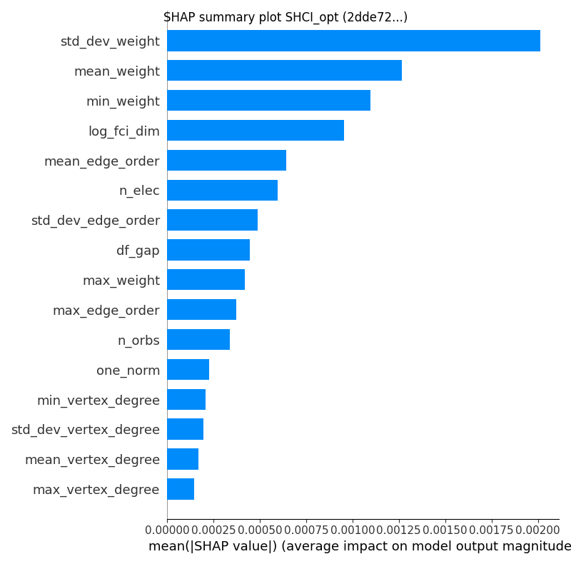
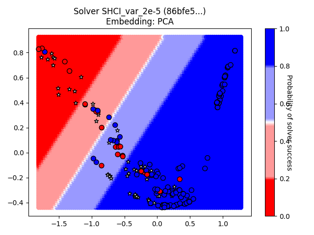
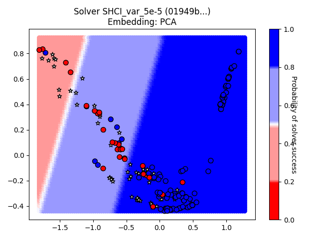
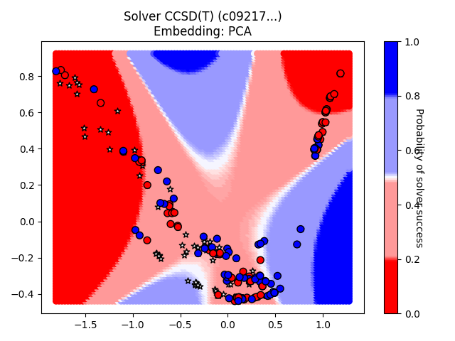
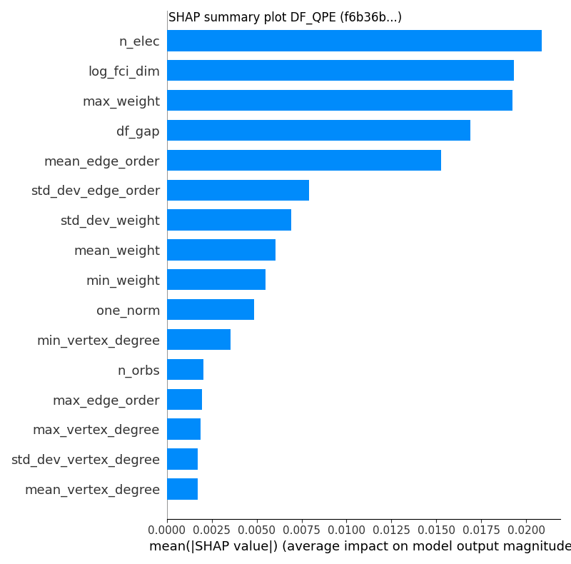

# GSEE Benchmark Standard Report

Report based on data from 2025-02-19T18:26:13.854054+00:00

[https://github.com/isi-usc-edu/qb-gsee-benchmark](https://github.com/isi-usc-edu/qb-gsee-benchmark)

Input data: `Hamiltonian_features.csv`, last modified Wed Feb 19 07:47:55 2025

Input data: `GSEE-HC_utility_estimates_all_instances_task_uuids_v2.csv`, last modified Mon Jan 27 08:10:10 2025

Latest creation time for a `problem_instance.json` file: Wed Feb 19 12:32:46 2025

Latest creation time for a `solution.json` file: Tue Feb 18 15:25:53 2025

# Problem Instance Summary Statistics

number of `problem_instances`: 88.

`problem_instance.json` with the most tasks: 30 (hubbard_square/614c4444-a31a-4348-b24d-01040208651c)

number of Hamiltonians (i.e., tasks) we have features calculated for: 280

minimum number of orbitals: 5

median number of orbitals: 42.0

maximum number of orbitals: 135

# Solver Summary Statistics

number of unique participating solvers: 21

Solver: DF_QPE/2610d8de-bd3a-469e-9a80-473e8988755f, Model could not be calculated.

Solver: SHCI_opt/2dde727e-a881-44fa-aabf-bba6248e4baf, ML Solvability Ratio: {'PCA': 1.0, 'NNMF': 1.0}, F1 Score: [0.69230769 0.97315436]

Solver: DF_QPE/4b07b89f-c66f-4e72-8c24-df3e4222cb41, Model could not be calculated.

Solver: SHCI_pt_1e-4/4ed500f1-0650-41e3-af00-e4d0359394b4, ML Solvability Ratio: {'PCA': 1.0, 'NNMF': 1.0}, F1 Score: [0.66666667 0.96219931]

Solver: SHCI_var_1e-4/7e730dfb-57ee-480b-a8a1-4b73f5f07c54, ML Solvability Ratio: {'PCA': 0.3758, 'NNMF': 0.0115}, F1 Score: [0.95588235 0.96808511]

Solver: SHCI_pt_2e-4/ad964781-302e-4728-a26d-39918e0a6cdb, ML Solvability Ratio: {'PCA': 1.0, 'NNMF': 1.0}, F1 Score: [0.72413793 0.93984962]

Solver: SHCI_pt_2e-5/c71b90bd-3250-4c0c-b4e7-fc9878f141f6, ML Solvability Ratio: {'PCA': 1.0, 'NNMF': 1.0}, F1 Score: [0.3        0.95394737]

Solver: SHCI_pt_5e-5/d626506c-7aae-4ad6-802a-b29af5f2bb93, ML Solvability Ratio: {'PCA': 0.991, 'NNMF': 0.6864}, F1 Score: [0.7        0.95774648]

Solver: SHCI_var_2e-4/0db183e3-a86d-491b-9125-599556e37c7a, ML Solvability Ratio: {'PCA': 0.2602, 'NNMF': 0.452}, F1 Score: [0.96815287 0.97005988]

Solver: SHCI_var_2e-5/86bfe50c-9342-4d54-bb68-abc8abd95688, ML Solvability Ratio: {'PCA': 0.5692, 'NNMF': 0.5177}, F1 Score: [0.83333333 0.96212121]

Solver: SHCI_var_5e-5/01949b95-c427-4693-9134-01f47f688c09, ML Solvability Ratio: {'PCA': 0.5156, 'NNMF': 0.4165}, F1 Score: [0.80952381 0.93333333]

Solver: DF_QPE/5d768520-b3d0-4292-bbb4-9776fa128107, Model could not be calculated.

Solver: DF_QPE/5dad4064-cd11-412f-85cb-d722afe3b3de, Model could not be calculated.

Solver: CISD/418f060e-496b-4024-8d2d-9b1f8791e76d, ML Solvability Ratio: {'PCA': 0.0498, 'NNMF': 0.012}, F1 Score: [0.97526502 0.82926829]

Solver: CCSD(T)/c09217e6-d0f7-4b0f-81c4-79210b7ac878, ML Solvability Ratio: {'PCA': 0.2424, 'NNMF': 0.5231}, F1 Score: [0.92397661 0.91503268]

Solver: HF/5f5e617a-19c2-4d82-bebc-b2d6b3dcb012, ML Solvability Ratio: {'PCA': 0.0, 'NNMF': 0.0}, F1 Score: [0.98709677 0.71428571]

Solver: MP2/b420358b-5def-41e6-8c5d-b9d93b6aecd2, ML Solvability Ratio: {'PCA': 0.0, 'NNMF': 0.0}, F1 Score: [0.98709677 0.71428571]

Solver: CCSD/0a29e54f-bef9-4d19-bafa-d94b1c4b37aa, ML Solvability Ratio: {'PCA': 0.0, 'NNMF': 0.0164}, F1 Score: [0.98529412 0.92307692]

Solver: DMRG_Niagara_cluster_lowest_energy/16537433-9f4c-4eae-a65d-787dc3b35b59, ML Solvability Ratio: {'PCA': 0.6263, 'NNMF': 0.4481}, F1 Score: [0.91836735 0.96460177]

Solver: DF_QPE/6f385080-934b-4cbb-b813-39c2cb61349e, Model could not be calculated.

Solver: DF_QPE/f6b36bde-be4a-4eee-975b-2c5f7e553f5f, Model could not be calculated.

NOTE: only `attempted` tasks are plotted on the chart.  Triangle up/down indicates solved/unsolved.

NOTE: only `attempted` tasks are plotted on the chart.  Triangle up/down indicates solved/unsolved.

NOTE: only `attempted` tasks are plotted on the chart.  Triangle up/down indicates solved/unsolved.

NOTE: only `attempted` tasks are plotted on the chart.  Triangle up/down indicates solved/unsolved.

NOTE: only `attempted` tasks are plotted on the chart.  Triangle up/down indicates solved/unsolved.

## Solver DF_QPE, 2610d8de-bd3a-469e-9a80-473e8988755f

solver_uuid:2610d8de-bd3a-469e-9a80-473e8988755f

solver_short_name:DF_QPE

compute_hardware_type:quantum_computer

algorithm_details:{'algorithm_description': 'Double factorized QPE resource estimates based on methodology of arXiv:2406.06335. Note that the truncation error is not included in the error bounds and that the SCF compute time is not included in the preprocessing time. Ground-state overlap is taken to be that estimated for the dominant CSF as estimated by DMRG and that this DMRG runtime is not included in the classical compute costs.', 'algorithm_parameters': {'overlap_csv': 'overlaps.csv', 'sf_threshold': 1e-12, 'df_threshold': 0.001, 'max_orbitals': 70}}

software_details:[{'software_name': 'pyLIQTR', 'software_version': '1.3.4'}, {'software_name': 'qb-gsee-benchmark', 'software_version': '0.1.0a2.dev193+g879c00d'}, {'software_name': 'Python', 'software_version': '3.10.12 (main, Nov  6 2024, 20:22:13) [GCC 11.4.0]'}, {'software_name': 'qualtran', 'software_version': '0.4.0'}]

quantum_hardware_details:{'quantum_hardware_description': 'Ultra-optimistic hardware model based on the superconducting architecture described in https://arxiv.org/abs/2011.03494.', 'quantum_hardware_parameters': {'num_factories': 4, 'physical_error_rate': 0.0001, 'cycle_time_microseconds': 0.1, 'parallelize_shots': False}}

logical_resource_estimate_solution_uuid:0be09ef6-6f34-4b70-a7e7-580d1c539c7c

logical_resource_estimate_solver_uuid:f2d73e1f-3058-43c4-a634-b6c267c84ff1

performance_metrics_uuid: 0a8978eb-4f5d-4980-a461-41c3658e0bf7

creation_timestamp: 2025-02-19T18:26:13.854054+00:00

number_of_problem_instances: 88

number_of_problem_instances_attempted: 22

number_of_problem_instances_solved: 0

number_of_tasks: 280

number_of_tasks_attempted: 154

number_of_tasks_solved: 1

number_of_tasks_solved_within_run_time_limit: 1

number_of_tasks_solved_within_accuracy_threshold: 154

max_run_time_of_attempted_tasks: 139406856747.7868

sum_of_run_time_of_attempted_tasks: 1565254226637.0498

solvability_ratio: None

f1_score: None

ml_metrics_calculator_version: 1

comment: All labels were either all `True` or all `False` and we cannot create an ML model with only one class.

Note: plot only contains `attempted` tasks.

Note: plot only contains `attempted` tasks.

Note: `attempted` may be `True` or `False`.  Tasks with a `reference_energy` can be labeled as solved or failed-to-solve. A task with a `reference_energy` that was NOT `attempted` is labeled as a failed-to-solve.  White stars indicate Hamiltonians for which we do not have a `reference_energy`.

## Solver SHCI_opt, 2dde727e-a881-44fa-aabf-bba6248e4baf

solver_uuid:2dde727e-a881-44fa-aabf-bba6248e4baf

solver_short_name:SHCI_opt

compute_hardware_type:classical_computer

classical_hardware_details:{'computing_environment_name': 'LCRC Improv (per node)', 'cpu_description': '2x AMD EPYC 7713 64C', 'ram_available_gb': '256GB', 'clock_speed': '2 GHz', 'total_num_cores': 128}

algorithm_details:SHCI with optimized orbitals followed by SHCI+PT

software_details:SHCI Arrow Code (https://github.com/QMC-Cornell/shci).

performance_metrics_uuid: c2d64bfd-66fc-43e0-a278-d4c0ed5be58a

creation_timestamp: 2025-02-19T18:26:13.854054+00:00

number_of_problem_instances: 88

number_of_problem_instances_attempted: 80

number_of_problem_instances_solved: 33

number_of_tasks: 280

number_of_tasks_attempted: 265

number_of_tasks_solved: 153

number_of_tasks_solved_within_run_time_limit: 265

number_of_tasks_solved_within_accuracy_threshold: 153

max_run_time_of_attempted_tasks: 57334.2

sum_of_run_time_of_attempted_tasks: 1553340.6179999998

solvability_ratio: 1.0

comment: solvability ratio based on PCA embedding.

f1_score: [0.6923076923076923, 0.9731543624161074]

ml_metrics_calculator_version: 1

Note: plot only contains `attempted` tasks.

Note: plot only contains `attempted` tasks.

Note: `attempted` may be `True` or `False`.  Tasks with a `reference_energy` can be labeled as solved or failed-to-solve. A task with a `reference_energy` that was NOT `attempted` is labeled as a failed-to-solve.  White stars indicate Hamiltonians for which we do not have a `reference_energy`.

## Solver DF_QPE, 4b07b89f-c66f-4e72-8c24-df3e4222cb41

solver_uuid:4b07b89f-c66f-4e72-8c24-df3e4222cb41

solver_short_name:DF_QPE

compute_hardware_type:quantum_computer

algorithm_details:{'algorithm_description': 'Double factorized QPE resource estimates based on methodology of arXiv:2406.06335. Note that the truncation error is not included in the error bounds and that the SCF compute time is not included in the preprocessing time. Ground-state overlap is taken to be that estimated for the dominant CSF as estimated by DMRG and that this DMRG runtime is not included in the classical compute costs.', 'algorithm_parameters': {'overlap_csv': 'overlaps.csv', 'sf_threshold': 1e-12, 'df_threshold': 0.001, 'max_orbitals': 70}}

software_details:[{'software_name': 'pyLIQTR', 'software_version': '1.3.4'}, {'software_name': 'qb-gsee-benchmark', 'software_version': '0.1.0a2.dev193+g879c00d'}, {'software_name': 'Python', 'software_version': '3.10.12 (main, Nov  6 2024, 20:22:13) [GCC 11.4.0]'}, {'software_name': 'qualtran', 'software_version': '0.4.0'}]

quantum_hardware_details:{'quantum_hardware_description': 'Optimistic superconducting hardware model based on that described in https://arxiv.org/abs/2011.03494. Assumes that enough QPUs are available to run all shots in parallel.', 'quantum_hardware_parameters': {'num_factories': 4, 'physical_error_rate': 0.0001, 'cycle_time_microseconds': 1, 'parallelize_shots': True}}

logical_resource_estimate_solution_uuid:56513b7a-4644-4a2c-9467-46a2ba6ec2a8

logical_resource_estimate_solver_uuid:f2d73e1f-3058-43c4-a634-b6c267c84ff1

performance_metrics_uuid: 72a0df89-1863-4a95-87d8-e5ac46e4fb6d

creation_timestamp: 2025-02-19T18:26:13.854054+00:00

number_of_problem_instances: 88

number_of_problem_instances_attempted: 22

number_of_problem_instances_solved: 0

number_of_tasks: 280

number_of_tasks_attempted: 154

number_of_tasks_solved: 0

number_of_tasks_solved_within_run_time_limit: 0

number_of_tasks_solved_within_accuracy_threshold: 154

max_run_time_of_attempted_tasks: 28597112908.874496

sum_of_run_time_of_attempted_tasks: 502121568076.6234

solvability_ratio: None

f1_score: None

ml_metrics_calculator_version: 1

comment: All labels were either all `True` or all `False` and we cannot create an ML model with only one class.

Note: plot only contains `attempted` tasks.

Note: plot only contains `attempted` tasks.

Note: `attempted` may be `True` or `False`.  Tasks with a `reference_energy` can be labeled as solved or failed-to-solve. A task with a `reference_energy` that was NOT `attempted` is labeled as a failed-to-solve.  White stars indicate Hamiltonians for which we do not have a `reference_energy`.

## Solver SHCI_pt_1e-4, 4ed500f1-0650-41e3-af00-e4d0359394b4

solver_uuid:4ed500f1-0650-41e3-af00-e4d0359394b4

solver_short_name:SHCI_pt_1e-4

compute_hardware_type:classical_computer

classical_hardware_details:{'computing_environment_name': 'LCRC Improv (per node)', 'cpu_description': '2x AMD EPYC 7713 64C', 'ram_available_gb': '256GB', 'clock_speed': '2 GHz', 'total_num_cores': 128}

algorithm_details:SHCI with eps_var 1e-4 + PT

software_details:SHCI Arrow Code (https://github.com/QMC-Cornell/shci).

performance_metrics_uuid: 940b2f10-5718-452b-8f0c-61d4b5faf1ea

creation_timestamp: 2025-02-19T18:26:13.854054+00:00

number_of_problem_instances: 88

number_of_problem_instances_attempted: 83

number_of_problem_instances_solved: 22

number_of_tasks: 280

number_of_tasks_attempted: 275

number_of_tasks_solved: 140

number_of_tasks_solved_within_run_time_limit: 273

number_of_tasks_solved_within_accuracy_threshold: 140

max_run_time_of_attempted_tasks: 77244.15200000002

sum_of_run_time_of_attempted_tasks: 1863349.633000001

solvability_ratio: 1.0

comment: solvability ratio based on PCA embedding.

f1_score: [0.6666666666666666, 0.9621993127147767]

ml_metrics_calculator_version: 1

Note: plot only contains `attempted` tasks.

Note: plot only contains `attempted` tasks.

Note: `attempted` may be `True` or `False`.  Tasks with a `reference_energy` can be labeled as solved or failed-to-solve. A task with a `reference_energy` that was NOT `attempted` is labeled as a failed-to-solve.  White stars indicate Hamiltonians for which we do not have a `reference_energy`.

## Solver SHCI_var_1e-4, 7e730dfb-57ee-480b-a8a1-4b73f5f07c54

solver_uuid:7e730dfb-57ee-480b-a8a1-4b73f5f07c54

solver_short_name:SHCI_var_1e-4

compute_hardware_type:classical_computer

classical_hardware_details:{'computing_environment_name': 'LCRC Improv (per node)', 'cpu_description': '2x AMD EPYC 7713 64C', 'ram_available_gb': '256GB', 'clock_speed': '2 GHz', 'total_num_cores': 128}

algorithm_details:SHCI with eps_var 1e-4

software_details:SHCI Arrow Code (https://github.com/QMC-Cornell/shci).

performance_metrics_uuid: 0de6d309-91f1-44e3-938c-0637a8e4247b

creation_timestamp: 2025-02-19T18:26:13.854054+00:00

number_of_problem_instances: 88

number_of_problem_instances_attempted: 83

number_of_problem_instances_solved: 13

number_of_tasks: 280

number_of_tasks_attempted: 275

number_of_tasks_solved: 95

number_of_tasks_solved_within_run_time_limit: 273

number_of_tasks_solved_within_accuracy_threshold: 95

max_run_time_of_attempted_tasks: 77244.15200000002

sum_of_run_time_of_attempted_tasks: 1863349.633000001

solvability_ratio: 0.3758

comment: solvability ratio based on PCA embedding.

f1_score: [0.9558823529411765, 0.9680851063829787]

ml_metrics_calculator_version: 1

Note: plot only contains `attempted` tasks.

Note: plot only contains `attempted` tasks.

Note: `attempted` may be `True` or `False`.  Tasks with a `reference_energy` can be labeled as solved or failed-to-solve. A task with a `reference_energy` that was NOT `attempted` is labeled as a failed-to-solve.  White stars indicate Hamiltonians for which we do not have a `reference_energy`.

## Solver SHCI_pt_2e-4, ad964781-302e-4728-a26d-39918e0a6cdb

solver_uuid:ad964781-302e-4728-a26d-39918e0a6cdb

solver_short_name:SHCI_pt_2e-4

compute_hardware_type:classical_computer

classical_hardware_details:{'computing_environment_name': 'LCRC Improv (per node)', 'cpu_description': '2x AMD EPYC 7713 64C', 'ram_available_gb': '256GB', 'clock_speed': '2 GHz', 'total_num_cores': 128}

algorithm_details:SHCI with eps_var 2e-4 + PT

software_details:SHCI Arrow Code (https://github.com/QMC-Cornell/shci).

performance_metrics_uuid: f69a261a-fb4d-49bb-a2b6-9127710c71c4

creation_timestamp: 2025-02-19T18:26:13.854054+00:00

number_of_problem_instances: 88

number_of_problem_instances_attempted: 83

number_of_problem_instances_solved: 22

number_of_tasks: 280

number_of_tasks_attempted: 275

number_of_tasks_solved: 137

number_of_tasks_solved_within_run_time_limit: 273

number_of_tasks_solved_within_accuracy_threshold: 137

max_run_time_of_attempted_tasks: 77244.15200000002

sum_of_run_time_of_attempted_tasks: 1863349.633000001

solvability_ratio: 1.0

comment: solvability ratio based on PCA embedding.

f1_score: [0.7241379310344828, 0.9398496240601504]

ml_metrics_calculator_version: 1

Note: plot only contains `attempted` tasks.

Note: plot only contains `attempted` tasks.

Note: `attempted` may be `True` or `False`.  Tasks with a `reference_energy` can be labeled as solved or failed-to-solve. A task with a `reference_energy` that was NOT `attempted` is labeled as a failed-to-solve.  White stars indicate Hamiltonians for which we do not have a `reference_energy`.

## Solver SHCI_pt_2e-5, c71b90bd-3250-4c0c-b4e7-fc9878f141f6

solver_uuid:c71b90bd-3250-4c0c-b4e7-fc9878f141f6

solver_short_name:SHCI_pt_2e-5

compute_hardware_type:classical_computer

classical_hardware_details:{'computing_environment_name': 'LCRC Improv (per node)', 'cpu_description': '2x AMD EPYC 7713 64C', 'ram_available_gb': '256GB', 'clock_speed': '2 GHz', 'total_num_cores': 128}

algorithm_details:SHCI with eps_var 2e-5 + PT

software_details:SHCI Arrow Code (https://github.com/QMC-Cornell/shci).

performance_metrics_uuid: 654ee62d-1812-4a83-bc37-e1c420ac4b53

creation_timestamp: 2025-02-19T18:26:13.854054+00:00

number_of_problem_instances: 88

number_of_problem_instances_attempted: 83

number_of_problem_instances_solved: 26

number_of_tasks: 280

number_of_tasks_attempted: 275

number_of_tasks_solved: 145

number_of_tasks_solved_within_run_time_limit: 273

number_of_tasks_solved_within_accuracy_threshold: 145

max_run_time_of_attempted_tasks: 77244.15200000002

sum_of_run_time_of_attempted_tasks: 1863349.633000001

solvability_ratio: 1.0

comment: solvability ratio based on PCA embedding.

f1_score: [0.3, 0.9539473684210527]

ml_metrics_calculator_version: 1

Note: plot only contains `attempted` tasks.

Note: plot only contains `attempted` tasks.

Note: `attempted` may be `True` or `False`.  Tasks with a `reference_energy` can be labeled as solved or failed-to-solve. A task with a `reference_energy` that was NOT `attempted` is labeled as a failed-to-solve.  White stars indicate Hamiltonians for which we do not have a `reference_energy`.

## Solver SHCI_pt_5e-5, d626506c-7aae-4ad6-802a-b29af5f2bb93

solver_uuid:d626506c-7aae-4ad6-802a-b29af5f2bb93

solver_short_name:SHCI_pt_5e-5

compute_hardware_type:classical_computer

classical_hardware_details:{'computing_environment_name': 'LCRC Improv (per node)', 'cpu_description': '2x AMD EPYC 7713 64C', 'ram_available_gb': '256GB', 'clock_speed': '2 GHz', 'total_num_cores': 128}

algorithm_details:SHCI with eps_var 5e-5 + PT

software_details:SHCI Arrow Code (https://github.com/QMC-Cornell/shci).

performance_metrics_uuid: 1c93c3f6-3af1-448b-a64b-2e9b1c6f4306

creation_timestamp: 2025-02-19T18:26:13.854054+00:00

number_of_problem_instances: 88

number_of_problem_instances_attempted: 83

number_of_problem_instances_solved: 24

number_of_tasks: 280

number_of_tasks_attempted: 275

number_of_tasks_solved: 143

number_of_tasks_solved_within_run_time_limit: 273

number_of_tasks_solved_within_accuracy_threshold: 143

max_run_time_of_attempted_tasks: 77244.15200000002

sum_of_run_time_of_attempted_tasks: 1863349.633000001

solvability_ratio: 0.991

comment: solvability ratio based on PCA embedding.

f1_score: [0.7, 0.9577464788732394]

ml_metrics_calculator_version: 1

Note: plot only contains `attempted` tasks.

Note: plot only contains `attempted` tasks.

Note: `attempted` may be `True` or `False`.  Tasks with a `reference_energy` can be labeled as solved or failed-to-solve. A task with a `reference_energy` that was NOT `attempted` is labeled as a failed-to-solve.  White stars indicate Hamiltonians for which we do not have a `reference_energy`.

## Solver SHCI_var_2e-4, 0db183e3-a86d-491b-9125-599556e37c7a

solver_uuid:0db183e3-a86d-491b-9125-599556e37c7a

solver_short_name:SHCI_var_2e-4

compute_hardware_type:classical_computer

classical_hardware_details:{'computing_environment_name': 'LCRC Improv (per node)', 'cpu_description': '2x AMD EPYC 7713 64C', 'ram_available_gb': '256GB', 'clock_speed': '2 GHz', 'total_num_cores': 128}

algorithm_details:SHCI with eps_var 2e-4

software_details:SHCI Arrow Code (https://github.com/QMC-Cornell/shci).

performance_metrics_uuid: eaa18840-7921-4dc2-ba8f-dea6bd24ee52

creation_timestamp: 2025-02-19T18:26:13.854054+00:00

number_of_problem_instances: 88

number_of_problem_instances_attempted: 83

number_of_problem_instances_solved: 13

number_of_tasks: 280

number_of_tasks_attempted: 275

number_of_tasks_solved: 84

number_of_tasks_solved_within_run_time_limit: 273

number_of_tasks_solved_within_accuracy_threshold: 84

max_run_time_of_attempted_tasks: 77244.15200000002

sum_of_run_time_of_attempted_tasks: 1863349.633000001

solvability_ratio: 0.2602

comment: solvability ratio based on PCA embedding.

f1_score: [0.9681528662420382, 0.9700598802395209]

ml_metrics_calculator_version: 1

Note: plot only contains `attempted` tasks.

Note: plot only contains `attempted` tasks.

Note: `attempted` may be `True` or `False`.  Tasks with a `reference_energy` can be labeled as solved or failed-to-solve. A task with a `reference_energy` that was NOT `attempted` is labeled as a failed-to-solve.  White stars indicate Hamiltonians for which we do not have a `reference_energy`.

## Solver SHCI_var_2e-5, 86bfe50c-9342-4d54-bb68-abc8abd95688

solver_uuid:86bfe50c-9342-4d54-bb68-abc8abd95688

solver_short_name:SHCI_var_2e-5

compute_hardware_type:classical_computer

classical_hardware_details:{'computing_environment_name': 'LCRC Improv (per node)', 'cpu_description': '2x AMD EPYC 7713 64C', 'ram_available_gb': '256GB', 'clock_speed': '2 GHz', 'total_num_cores': 128}

algorithm_details:SHCI with eps_var 2e-5

software_details:SHCI Arrow Code (https://github.com/QMC-Cornell/shci).

performance_metrics_uuid: 18643df5-e1cf-4d9d-857a-c75df1b26491

creation_timestamp: 2025-02-19T18:26:13.854054+00:00

number_of_problem_instances: 88

number_of_problem_instances_attempted: 83

number_of_problem_instances_solved: 18

number_of_tasks: 280

number_of_tasks_attempted: 275

number_of_tasks_solved: 133

number_of_tasks_solved_within_run_time_limit: 273

number_of_tasks_solved_within_accuracy_threshold: 133

max_run_time_of_attempted_tasks: 77244.15200000002

sum_of_run_time_of_attempted_tasks: 1863349.633000001

solvability_ratio: 0.5692

comment: solvability ratio based on PCA embedding.

f1_score: [0.8333333333333334, 0.9621212121212122]

ml_metrics_calculator_version: 1

Note: plot only contains `attempted` tasks.

Note: plot only contains `attempted` tasks.

Note: `attempted` may be `True` or `False`.  Tasks with a `reference_energy` can be labeled as solved or failed-to-solve. A task with a `reference_energy` that was NOT `attempted` is labeled as a failed-to-solve.  White stars indicate Hamiltonians for which we do not have a `reference_energy`.

## Solver SHCI_var_5e-5, 01949b95-c427-4693-9134-01f47f688c09

solver_uuid:01949b95-c427-4693-9134-01f47f688c09

solver_short_name:SHCI_var_5e-5

compute_hardware_type:classical_computer

classical_hardware_details:{'computing_environment_name': 'LCRC Improv (per node)', 'cpu_description': '2x AMD EPYC 7713 64C', 'ram_available_gb': '256GB', 'clock_speed': '2 GHz', 'total_num_cores': 128}

algorithm_details:SHCI with eps_var 5e-5

software_details:SHCI Arrow Code (https://github.com/QMC-Cornell/shci).

performance_metrics_uuid: 52133230-0a24-43db-9244-e19d08808c75

creation_timestamp: 2025-02-19T18:26:13.854054+00:00

number_of_problem_instances: 88

number_of_problem_instances_attempted: 83

number_of_problem_instances_solved: 14

number_of_tasks: 280

number_of_tasks_attempted: 275

number_of_tasks_solved: 120

number_of_tasks_solved_within_run_time_limit: 273

number_of_tasks_solved_within_accuracy_threshold: 120

max_run_time_of_attempted_tasks: 77244.15200000002

sum_of_run_time_of_attempted_tasks: 1863349.633000001

solvability_ratio: 0.5156

comment: solvability ratio based on PCA embedding.

f1_score: [0.8095238095238095, 0.9333333333333333]

ml_metrics_calculator_version: 1

Note: plot only contains `attempted` tasks.

Note: plot only contains `attempted` tasks.

Note: `attempted` may be `True` or `False`.  Tasks with a `reference_energy` can be labeled as solved or failed-to-solve. A task with a `reference_energy` that was NOT `attempted` is labeled as a failed-to-solve.  White stars indicate Hamiltonians for which we do not have a `reference_energy`.

## Solver DF_QPE, 5d768520-b3d0-4292-bbb4-9776fa128107

solver_uuid:5d768520-b3d0-4292-bbb4-9776fa128107

solver_short_name:DF_QPE

compute_hardware_type:quantum_computer

algorithm_details:{'algorithm_description': 'Double factorized QPE resource estimates based on methodology of arXiv:2406.06335. Note that the truncation error is not included in the error bounds and that the SCF compute time is not included in the preprocessing time. Ground-state overlap is taken to be that estimated for the dominant CSF as estimated by DMRG and that this DMRG runtime is not included in the classical compute costs.', 'algorithm_parameters': {'overlap_csv': 'overlaps.csv', 'sf_threshold': 1e-12, 'df_threshold': 0.001, 'max_orbitals': 70}}

software_details:[{'software_name': 'pyLIQTR', 'software_version': '1.3.4'}, {'software_name': 'qb-gsee-benchmark', 'software_version': '0.1.0a2.dev193+g879c00d'}, {'software_name': 'Python', 'software_version': '3.10.12 (main, Nov  6 2024, 20:22:13) [GCC 11.4.0]'}, {'software_name': 'qualtran', 'software_version': '0.4.0'}]

quantum_hardware_details:{'quantum_hardware_description': 'Superconducting hardware model based on that described in https://arxiv.org/abs/2011.03494 with an extremely optimistic physical error rate.', 'quantum_hardware_parameters': {'num_factories': 4, 'physical_error_rate': 1e-06, 'cycle_time_microseconds': 1, 'parallelize_shots': False}}

logical_resource_estimate_solution_uuid:e5377ec1-7a7f-4559-8336-548da65ea6e0

logical_resource_estimate_solver_uuid:f2d73e1f-3058-43c4-a634-b6c267c84ff1

performance_metrics_uuid: 1b8ba5ef-de6e-44ef-8b9c-54a488aec314

creation_timestamp: 2025-02-19T18:26:13.854054+00:00

number_of_problem_instances: 88

number_of_problem_instances_attempted: 24

number_of_problem_instances_solved: 0

number_of_tasks: 280

number_of_tasks_attempted: 166

number_of_tasks_solved: 0

number_of_tasks_solved_within_run_time_limit: 0

number_of_tasks_solved_within_accuracy_threshold: 166

max_run_time_of_attempted_tasks: 3.667583349758134e+17

sum_of_run_time_of_attempted_tasks: 4.0384302123797466e+17

solvability_ratio: None

f1_score: None

ml_metrics_calculator_version: 1

comment: All labels were either all `True` or all `False` and we cannot create an ML model with only one class.

Note: plot only contains `attempted` tasks.

Note: plot only contains `attempted` tasks.

Note: `attempted` may be `True` or `False`.  Tasks with a `reference_energy` can be labeled as solved or failed-to-solve. A task with a `reference_energy` that was NOT `attempted` is labeled as a failed-to-solve.  White stars indicate Hamiltonians for which we do not have a `reference_energy`.

## Solver DF_QPE, 5dad4064-cd11-412f-85cb-d722afe3b3de

solver_uuid:5dad4064-cd11-412f-85cb-d722afe3b3de

solver_short_name:DF_QPE

compute_hardware_type:quantum_computer

algorithm_details:{'algorithm_description': 'Double factorized QPE resource estimates based on methodology of arXiv:2406.06335. Note that the truncation error is not included in the error bounds and that the SCF compute time is not included in the preprocessing time. Ground-state overlap is taken to be that estimated for the dominant CSF as estimated by DMRG and that this DMRG runtime is not included in the classical compute costs.', 'algorithm_parameters': {'overlap_csv': 'overlaps.csv', 'sf_threshold': 1e-12, 'df_threshold': 0.001, 'max_orbitals': 70}}

software_details:[{'software_name': 'pyLIQTR', 'software_version': '1.3.4'}, {'software_name': 'qb-gsee-benchmark', 'software_version': '0.1.0a2.dev193+g879c00d'}, {'software_name': 'Python', 'software_version': '3.10.12 (main, Nov  6 2024, 20:22:13) [GCC 11.4.0]'}, {'software_name': 'qualtran', 'software_version': '0.4.0'}]

quantum_hardware_details:{'quantum_hardware_description': 'Optimistic superconducting hardware model based on that described in https://arxiv.org/abs/2011.03494.', 'quantum_hardware_parameters': {'num_factories': 4, 'physical_error_rate': 0.0001, 'cycle_time_microseconds': 1, 'parallelize_shots': False}}

logical_resource_estimate_solution_uuid:e54dd6a9-6481-452a-a6e9-31c8e53cdb75

logical_resource_estimate_solver_uuid:f2d73e1f-3058-43c4-a634-b6c267c84ff1

performance_metrics_uuid: e14406a3-3271-4d83-b884-3c3631e8dc17

creation_timestamp: 2025-02-19T18:26:13.854054+00:00

number_of_problem_instances: 88

number_of_problem_instances_attempted: 22

number_of_problem_instances_solved: 0

number_of_tasks: 280

number_of_tasks_attempted: 154

number_of_tasks_solved: 0

number_of_tasks_solved_within_run_time_limit: 0

number_of_tasks_solved_within_accuracy_threshold: 154

max_run_time_of_attempted_tasks: 1394068547267.4111

sum_of_run_time_of_attempted_tasks: 15652541022388.93

solvability_ratio: None

f1_score: None

ml_metrics_calculator_version: 1

comment: All labels were either all `True` or all `False` and we cannot create an ML model with only one class.

Note: plot only contains `attempted` tasks.

Note: plot only contains `attempted` tasks.

Note: `attempted` may be `True` or `False`.  Tasks with a `reference_energy` can be labeled as solved or failed-to-solve. A task with a `reference_energy` that was NOT `attempted` is labeled as a failed-to-solve.  White stars indicate Hamiltonians for which we do not have a `reference_energy`.

## Solver CISD, 418f060e-496b-4024-8d2d-9b1f8791e76d

solver_uuid:418f060e-496b-4024-8d2d-9b1f8791e76d

solver_short_name:CISD

compute_hardware_type:classical_computer

classical_hardware_details:{'computing_environment_name': 'LCRC Improv (per node)', 'cpu_description': '2x AMD EPYC 7713 64C', 'ram_available_gb': '256GB', 'clock_speed': '2 GHz', 'total_num_cores': 128}

algorithm_details:CISD

software_details:pyscf (https://github.com/pyscf/pyscf).

performance_metrics_uuid: 7e530c12-a17e-44c1-a57c-432ec044bfa4

creation_timestamp: 2025-02-19T18:26:13.854054+00:00

number_of_problem_instances: 88

number_of_problem_instances_attempted: 84

number_of_problem_instances_solved: 9

number_of_tasks: 280

number_of_tasks_attempted: 276

number_of_tasks_solved: 17

number_of_tasks_solved_within_run_time_limit: 276

number_of_tasks_solved_within_accuracy_threshold: 17

max_run_time_of_attempted_tasks: 62.58296537399292

sum_of_run_time_of_attempted_tasks: 2929.870177745819

solvability_ratio: 0.0498

comment: solvability ratio based on PCA embedding.

f1_score: [0.9752650176678446, 0.8292682926829268]

ml_metrics_calculator_version: 1

Note: plot only contains `attempted` tasks.

Note: plot only contains `attempted` tasks.

Note: `attempted` may be `True` or `False`.  Tasks with a `reference_energy` can be labeled as solved or failed-to-solve. A task with a `reference_energy` that was NOT `attempted` is labeled as a failed-to-solve.  White stars indicate Hamiltonians for which we do not have a `reference_energy`.

## Solver CCSD(T), c09217e6-d0f7-4b0f-81c4-79210b7ac878

solver_uuid:c09217e6-d0f7-4b0f-81c4-79210b7ac878

solver_short_name:CCSD(T)

compute_hardware_type:classical_computer

classical_hardware_details:{'computing_environment_name': 'LCRC Improv (per node)', 'cpu_description': '2x AMD EPYC 7713 64C', 'ram_available_gb': '256GB', 'clock_speed': '2 GHz', 'total_num_cores': 128}

algorithm_details:CCSD(T)

software_details:pyscf (https://github.com/pyscf/pyscf).

performance_metrics_uuid: 862a9612-50aa-4ad5-b803-96c220651957

creation_timestamp: 2025-02-19T18:26:13.854054+00:00

number_of_problem_instances: 88

number_of_problem_instances_attempted: 79

number_of_problem_instances_solved: 19

number_of_tasks: 280

number_of_tasks_attempted: 264

number_of_tasks_solved: 71

number_of_tasks_solved_within_run_time_limit: 264

number_of_tasks_solved_within_accuracy_threshold: 71

max_run_time_of_attempted_tasks: 493.4080808162689

sum_of_run_time_of_attempted_tasks: 13199.317583084106

solvability_ratio: 0.2424

comment: solvability ratio based on PCA embedding.

f1_score: [0.9239766081871345, 0.9150326797385621]

ml_metrics_calculator_version: 1

Note: plot only contains `attempted` tasks.

Note: plot only contains `attempted` tasks.

Note: `attempted` may be `True` or `False`.  Tasks with a `reference_energy` can be labeled as solved or failed-to-solve. A task with a `reference_energy` that was NOT `attempted` is labeled as a failed-to-solve.  White stars indicate Hamiltonians for which we do not have a `reference_energy`.

## Solver HF, 5f5e617a-19c2-4d82-bebc-b2d6b3dcb012

solver_uuid:5f5e617a-19c2-4d82-bebc-b2d6b3dcb012

solver_short_name:HF

compute_hardware_type:classical_computer

classical_hardware_details:{'computing_environment_name': 'LCRC Improv (per node)', 'cpu_description': '2x AMD EPYC 7713 64C', 'ram_available_gb': '256GB', 'clock_speed': '2 GHz', 'total_num_cores': 128}

algorithm_details:Hartree Fock

software_details:pyscf (https://github.com/pyscf/pyscf).

performance_metrics_uuid: 0f5ad36d-f43c-4ffa-b65c-b29f35773a8a

creation_timestamp: 2025-02-19T18:26:13.854054+00:00

number_of_problem_instances: 88

number_of_problem_instances_attempted: 84

number_of_problem_instances_solved: 5

number_of_tasks: 280

number_of_tasks_attempted: 276

number_of_tasks_solved: 5

number_of_tasks_solved_within_run_time_limit: 276

number_of_tasks_solved_within_accuracy_threshold: 5

max_run_time_of_attempted_tasks: 20.338801622390747

sum_of_run_time_of_attempted_tasks: 906.4860525131226

solvability_ratio: 0.0

comment: solvability ratio based on PCA embedding.

f1_score: [0.9870967741935484, 0.7142857142857143]

ml_metrics_calculator_version: 1

Note: plot only contains `attempted` tasks.

Note: plot only contains `attempted` tasks.

Note: `attempted` may be `True` or `False`.  Tasks with a `reference_energy` can be labeled as solved or failed-to-solve. A task with a `reference_energy` that was NOT `attempted` is labeled as a failed-to-solve.  White stars indicate Hamiltonians for which we do not have a `reference_energy`.

## Solver MP2, b420358b-5def-41e6-8c5d-b9d93b6aecd2

solver_uuid:b420358b-5def-41e6-8c5d-b9d93b6aecd2

solver_short_name:MP2

compute_hardware_type:classical_computer

classical_hardware_details:{'computing_environment_name': 'LCRC Improv (per node)', 'cpu_description': '2x AMD EPYC 7713 64C', 'ram_available_gb': '256GB', 'clock_speed': '2 GHz', 'total_num_cores': 128}

algorithm_details:MP2

software_details:pyscf (https://github.com/pyscf/pyscf).

performance_metrics_uuid: 0fe19268-d797-46f3-997d-841eb8ed2e78

creation_timestamp: 2025-02-19T18:26:13.854054+00:00

number_of_problem_instances: 88

number_of_problem_instances_attempted: 81

number_of_problem_instances_solved: 5

number_of_tasks: 280

number_of_tasks_attempted: 268

number_of_tasks_solved: 5

number_of_tasks_solved_within_run_time_limit: 268

number_of_tasks_solved_within_accuracy_threshold: 5

max_run_time_of_attempted_tasks: 2.230440139770508

sum_of_run_time_of_attempted_tasks: 94.7442626953125

solvability_ratio: 0.0

comment: solvability ratio based on PCA embedding.

f1_score: [0.9870967741935484, 0.7142857142857143]

ml_metrics_calculator_version: 1

Note: plot only contains `attempted` tasks.

Note: plot only contains `attempted` tasks.

Note: `attempted` may be `True` or `False`.  Tasks with a `reference_energy` can be labeled as solved or failed-to-solve. A task with a `reference_energy` that was NOT `attempted` is labeled as a failed-to-solve.  White stars indicate Hamiltonians for which we do not have a `reference_energy`.

## Solver CCSD, 0a29e54f-bef9-4d19-bafa-d94b1c4b37aa

solver_uuid:0a29e54f-bef9-4d19-bafa-d94b1c4b37aa

solver_short_name:CCSD

compute_hardware_type:classical_computer

classical_hardware_details:{'computing_environment_name': 'LCRC Improv (per node)', 'cpu_description': '2x AMD EPYC 7713 64C', 'ram_available_gb': '256GB', 'clock_speed': '2 GHz', 'total_num_cores': 128}

algorithm_details:CCSD

software_details:pyscf (https://github.com/pyscf/pyscf).

performance_metrics_uuid: 99cc28f3-fd40-4dd6-9eef-fd8f7da170e1

creation_timestamp: 2025-02-19T18:26:13.854054+00:00

number_of_problem_instances: 88

number_of_problem_instances_attempted: 79

number_of_problem_instances_solved: 10

number_of_tasks: 280

number_of_tasks_attempted: 264

number_of_tasks_solved: 24

number_of_tasks_solved_within_run_time_limit: 264

number_of_tasks_solved_within_accuracy_threshold: 24

max_run_time_of_attempted_tasks: 485.1982181072235

sum_of_run_time_of_attempted_tasks: 12252.72845697403

solvability_ratio: 0.0

comment: solvability ratio based on PCA embedding.

f1_score: [0.9852941176470589, 0.9230769230769231]

ml_metrics_calculator_version: 1

Note: plot only contains `attempted` tasks.

Note: plot only contains `attempted` tasks.

Note: `attempted` may be `True` or `False`.  Tasks with a `reference_energy` can be labeled as solved or failed-to-solve. A task with a `reference_energy` that was NOT `attempted` is labeled as a failed-to-solve.  White stars indicate Hamiltonians for which we do not have a `reference_energy`.

## Solver DMRG_Niagara_cluster_lowest_energy, 16537433-9f4c-4eae-a65d-787dc3b35b59

solver_uuid:16537433-9f4c-4eae-a65d-787dc3b35b59

solver_short_name:DMRG_Niagara_cluster_lowest_energy

compute_hardware_type:classical_computer

classical_hardware_details:{'computing_environment_name': 'Niagara Cluster, Compute Canada', 'cpu_description': '40 Intel "Skylake" cores at 2.4 GHz or 40 Intel "CascadeLake" cores at 2.5 GHz', 'ram_available_gb': '202 GB (188 GiB)', 'clock_speed': '2.4 GHz or 2.5 GHz', 'total_num_cores': 40}

algorithm_details:DMRG with the lowest variational energy obtained so far.

software_details:Block2 v0.5.3rc16 with dmrghandler, commit version d603fdc6409fc194a416aa3a519362d5d91790d9 or later.

performance_metrics_uuid: ec7c30bb-7176-4860-8aab-823e8e7d72bd

creation_timestamp: 2025-02-19T18:26:13.854054+00:00

number_of_problem_instances: 88

number_of_problem_instances_attempted: 84

number_of_problem_instances_solved: 9

number_of_tasks: 280

number_of_tasks_attempted: 276

number_of_tasks_solved: 112

number_of_tasks_solved_within_run_time_limit: 276

number_of_tasks_solved_within_accuracy_threshold: 112

max_run_time_of_attempted_tasks: 80820.729907066

sum_of_run_time_of_attempted_tasks: 2471726.9051446947

solvability_ratio: 0.6263

comment: solvability ratio based on PCA embedding.

f1_score: [0.9183673469387755, 0.9646017699115044]

ml_metrics_calculator_version: 1

Note: plot only contains `attempted` tasks.

Note: plot only contains `attempted` tasks.

Note: `attempted` may be `True` or `False`.  Tasks with a `reference_energy` can be labeled as solved or failed-to-solve. A task with a `reference_energy` that was NOT `attempted` is labeled as a failed-to-solve.  White stars indicate Hamiltonians for which we do not have a `reference_energy`.

## Solver DF_QPE, 6f385080-934b-4cbb-b813-39c2cb61349e

solver_uuid:6f385080-934b-4cbb-b813-39c2cb61349e

solver_short_name:DF_QPE

compute_hardware_type:quantum_computer

algorithm_details:{'algorithm_description': 'Double factorized QPE resource estimates based on methodology of arXiv:2406.06335, as implemented in BenchQ/OpenFermion. Note that the truncation error is not included in the error bounds and that the SCF compute time is not included in the preprocessing time. Ground-state overlap is taken to be that estimated for the dominant CSF as estimated by DMRG and that this DMRG runtime is not included in the classical compute costs. Note that the target accuracy is 1 mHa, which is smaller than required by the problem instances.', 'algorithm_parameters': {'overlap_csv': 'overlaps.csv', 'sf_threshold': 1e-12, 'df_threshold': 0.001, 'max_orbitals': 70}}

software_details:[{'software_name': 'benchq', 'software_version': '0.7.1.dev10+g80b8279.d20250116'}, {'software_name': 'openfermion', 'software_version': '1.6.1'}, {'software_name': 'Python', 'software_version': '3.11.5 (main, Sep 11 2023, 08:31:25) [Clang 14.0.6 ]'}, {'software_name': 'benchq', 'software_version': '0.7.1.dev10+g80b8279.d20250116'}]

quantum_hardware_details:{'quantum_hardware_description': 'Superconducting hardware model based on that described in https://arxiv.org/abs/2011.03494, but with Litinski factories (Quantum 3, 205 (2019)).', 'quantum_hardware_parameters': {'num_factories': 4, 'physical_error_rate': 0.001, 'cycle_time_microseconds': 1}}

logical_resource_estimate_solution_uuid:0b647970-5b30-47f0-bbca-1a83704b9e06

logical_resource_estimate_solver_uuid:f2d73e1f-3058-43c4-a634-b6c267c84ff1

performance_metrics_uuid: e6ebd73e-ec25-4320-a917-e2faddf1c9db

creation_timestamp: 2025-02-19T18:26:13.854054+00:00

number_of_problem_instances: 88

number_of_problem_instances_attempted: 3

number_of_problem_instances_solved: 0

number_of_tasks: 280

number_of_tasks_attempted: 23

number_of_tasks_solved: 0

number_of_tasks_solved_within_run_time_limit: 0

number_of_tasks_solved_within_accuracy_threshold: 23

max_run_time_of_attempted_tasks: 441362513808.82544

sum_of_run_time_of_attempted_tasks: 819346667619.2955

solvability_ratio: None

f1_score: None

ml_metrics_calculator_version: 1

comment: All labels were either all `True` or all `False` and we cannot create an ML model with only one class.

Note: plot only contains `attempted` tasks.

Note: plot only contains `attempted` tasks.

Note: `attempted` may be `True` or `False`.  Tasks with a `reference_energy` can be labeled as solved or failed-to-solve. A task with a `reference_energy` that was NOT `attempted` is labeled as a failed-to-solve.  White stars indicate Hamiltonians for which we do not have a `reference_energy`.

## Solver DF_QPE, f6b36bde-be4a-4eee-975b-2c5f7e553f5f

solver_uuid:f6b36bde-be4a-4eee-975b-2c5f7e553f5f

solver_short_name:DF_QPE

compute_hardware_type:quantum_computer

algorithm_details:{'algorithm_description': 'Double factorized QPE resource estimates based on methodology of arXiv:2406.06335. Note that the truncation error is not included in the error bounds and that the SCF compute time is not included in the preprocessing time. Ground-state overlap is taken to be that estimated for the dominant CSF as estimated by DMRG and that this DMRG runtime is not included in the classical compute costs.', 'algorithm_parameters': {'overlap_csv': 'overlaps.csv', 'sf_threshold': 1e-12, 'df_threshold': 0.001, 'max_orbitals': 70}}

software_details:[{'software_name': 'pyLIQTR', 'software_version': '1.3.4'}, {'software_name': 'qb-gsee-benchmark', 'software_version': '0.1.0a2.dev193+g879c00d'}, {'software_name': 'Python', 'software_version': '3.10.12 (main, Nov  6 2024, 20:22:13) [GCC 11.4.0]'}, {'software_name': 'qualtran', 'software_version': '0.4.0'}]

quantum_hardware_details:{'quantum_hardware_description': 'Ultra-optimistic hardware model based on the superconducting architecture described in https://arxiv.org/abs/2011.03494.', 'quantum_hardware_parameters': {'num_factories': 4, 'physical_error_rate': 1e-06, 'cycle_time_microseconds': 0.1, 'parallelize_shots': False}}

logical_resource_estimate_solution_uuid:98855a22-d8cf-42a7-9a18-35f99e820882

logical_resource_estimate_solver_uuid:f2d73e1f-3058-43c4-a634-b6c267c84ff1

performance_metrics_uuid: fec0829e-be72-4e83-8a3b-d55c8cef4348

creation_timestamp: 2025-02-19T18:26:13.854054+00:00

number_of_problem_instances: 88

number_of_problem_instances_attempted: 24

number_of_problem_instances_solved: 0

number_of_tasks: 280

number_of_tasks_attempted: 166

number_of_tasks_solved: 1

number_of_tasks_solved_within_run_time_limit: 1

number_of_tasks_solved_within_accuracy_threshold: 166

max_run_time_of_attempted_tasks: 3.667583349758435e+16

sum_of_run_time_of_attempted_tasks: 4.03843021239543e+16

solvability_ratio: None

f1_score: None

ml_metrics_calculator_version: 1

comment: All labels were either all `True` or all `False` and we cannot create an ML model with only one class.

Note: plot only contains `attempted` tasks.

Note: plot only contains `attempted` tasks.

Note: `attempted` may be `True` or `False`.  Tasks with a `reference_energy` can be labeled as solved or failed-to-solve. A task with a `reference_energy` that was NOT `attempted` is labeled as a failed-to-solve.  White stars indicate Hamiltonians for which we do not have a `reference_energy`.

# ML Feature Analysis

Features: ['max_vertex_degree', 'min_vertex_degree', 'mean_vertex_degree', 'std_dev_vertex_degree', 'max_weight', 'min_weight', 'mean_weight', 'std_dev_weight', 'max_edge_order', 'mean_edge_order', 'std_dev_edge_order', 'one_norm', 'log_fci_dim', 'n_elec', 'n_orbs', 'df_gap']

NNMF Component 1: [0.35399743 0.3835676  0.3520002  0.35554304 0.51256815 0.
 0.         0.04877227 0.91405015 0.93106994 0.90369122 0.48147271
 0.92382446 0.53848377 0.90084819 0.49628833]

NNMF Component 2: [0.         0.         0.         0.         0.05545497 0.99860891
 0.5229628  0.40516152 0.06735171 0.01538102 0.08181161 0.
 0.16970458 0.1141114  0.06725901 0.        ]

Features: ['max_vertex_degree', 'min_vertex_degree', 'mean_vertex_degree', 'std_dev_vertex_degree', 'max_weight', 'min_weight', 'mean_weight', 'std_dev_weight', 'max_edge_order', 'mean_edge_order', 'std_dev_edge_order', 'one_norm', 'log_fci_dim', 'n_elec', 'n_orbs', 'df_gap']

PCA Component 1: [-0.19606441 -0.19210755 -0.19466848 -0.19785564 -0.16044022  0.36889367
  0.19151328  0.14329659 -0.33728001 -0.35642778 -0.32990174 -0.24968252
 -0.24098618 -0.08184379 -0.3368266  -0.19589773]

PCA Component 2: [ 0.19190723  0.13407095  0.18973626  0.19607885  0.00984172  0.68373267
  0.35862773  0.22441087  0.13916663  0.0865819   0.15316911  0.2317319
 -0.07481991 -0.29008347  0.15152307  0.08636324]

